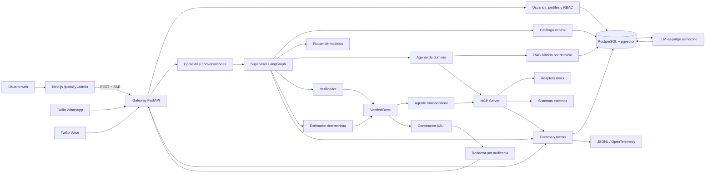
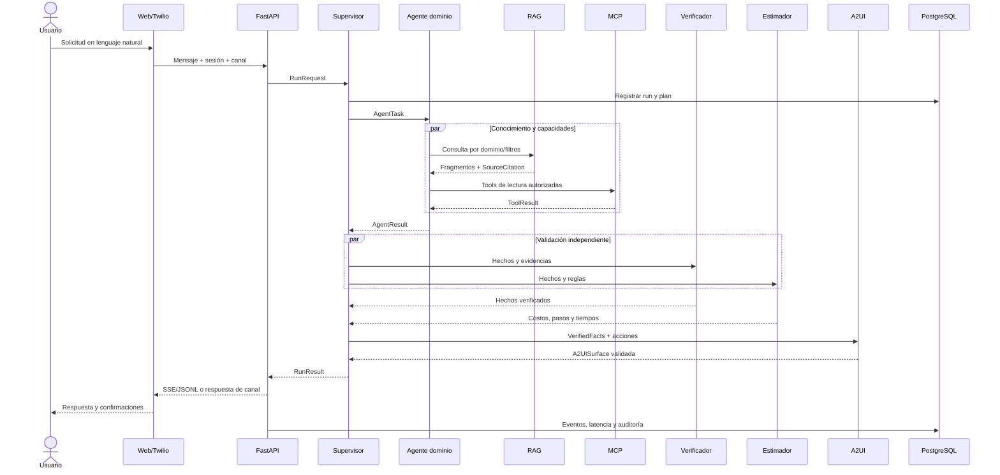
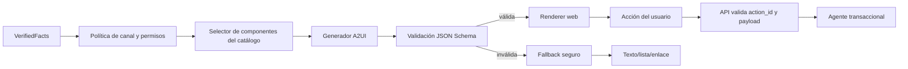
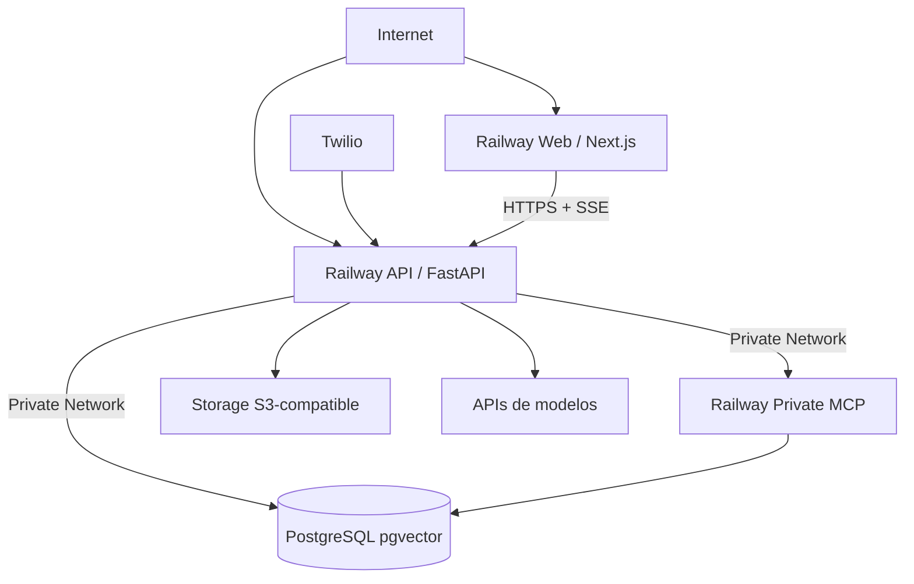
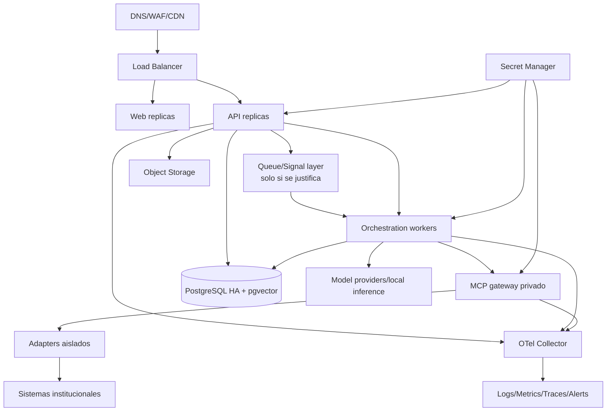

# Nexo IA: arquitectura técnica inicial y plan de implementación

> Documento de arquitectura para un MVP demostrable con evolución gradual a Core, Pro y Extremo.
>
> Fuente canónica: [`Nexo_IA_Propuesta_Completa.md`](./Nexo_IA_Propuesta_Completa.md).
>
> Estado: diseño inicial. Las rutas, contratos y archivos de código descritos en este documento son propuestas; todavía no representan una implementación funcional.

## 1. Resumen ejecutivo

Nexo IA será un hub omnicanal que recibe solicitudes en lenguaje natural desde web, WhatsApp o voz, identifica el dominio y trámite correctos, recupera conocimiento institucional verificado, ejecuta tools autorizadas mediante MCP y entrega una respuesta trazable y adaptada al usuario. Cuando exista una integración, podrá reservar citas, registrar solicitudes o producir un folio, siempre con permisos, confirmación e idempotencia.

La arquitectura inicial será un **monolito modular**: una aplicación Next.js con áreas de portal y administración; una API FastAPI; módulos Python separados para supervisor, agentes, RAG y A2UI; un proceso MCP independiente; y PostgreSQL con pgvector como almacenamiento operativo, vectorial, de auditoría y checkpoints. Esta forma reduce la carga operativa del equipo sin impedir separar procesos en producción.

El MVP implementará dos recorridos completos y reproducibles:

1. **Vehículos:** renovar licencia, consultar adeudo, revisar requisitos, localizar módulos, seleccionar cita, confirmar y obtener folio mock.
2. **Apertura de empresas:** abrir una taquería, ordenar permisos, calcular costos, revisar documentos, consultar cita, iniciar solicitud y obtener folio mock.

Core incorporará registro civil, salud y ganadería para completar los cinco casos de la propuesta. Pro activará voz, integraciones transaccionales reales, MCP Mapper y generación administrativa. Extremo incorporará paralelismo, personalización avanzada, doble verificación, LLM-as-judge y selección de modelos sensible a carga.

### Supuestos explícitos

- “Completo en MVP” significa que el recorrido funcional termina en una acción simulada verificable; no significa que exista acceso a sistemas gubernamentales reales.
- Twilio Sandbox será el proveedor de WhatsApp. Twilio Voice será el proveedor inicial de voz, detrás de un adapter intercambiable.
- La misma aplicación Next.js expondrá `/portal` y `/admin`; no se mantendrán dos frontends independientes.
- A2UI usará la versión 0.9.1 y un catálogo propio cerrado. No se ejecutará código generado por modelos.
- Ollama será un perfil local opcional; el arranque base no descargará modelos pesados.
- Redis no se usará durante MVP, Core, Pro ni Extremo. Se añadirá únicamente si una topología distribuida demuestra que lo necesita.
- Salud se limitará a navegación de servicios; no diagnosticará, prescribirá ni sustituirá atención profesional.

## 2. Requisitos identificados

### 2.1 Requisitos funcionales

| Área | Requisito |
|---|---|
| Canales | Atender web, WhatsApp y llamadas; convertir A2UI a una representación apropiada para cada canal. |
| Clasificación | Detectar intención, dominio, ubicación, perfil, necesidades múltiples, urgencia operativa y datos faltantes. |
| Preguntas mínimas | Reutilizar contexto y preguntar solo cuando falte un dato obligatorio, exista ambigüedad material, se requiera consentimiento o la acción sea sensible. |
| Multiagente | Tener supervisor, clasificador y al menos tres agentes especializados; delegar por dominio y consolidar resultados estructurados. |
| Modelos | Seleccionar el modelo por complejidad, riesgo, privacidad, modalidad, costo, latencia, contexto, carga y disponibilidad. |
| RAG | Recuperar únicamente fuentes verificadas, separadas por dominio, con versión, vigencia, hash, responsable y estado. |
| MCP | Registrar, descubrir y ejecutar tools tipadas; separar lectura/escritura; aplicar permisos, timeouts, reintentos y auditoría. |
| MCP Mapper | Importar OpenAPI o configuración manual, normalizar operaciones, probarlas y publicarlas tras revisión. |
| Transacciones | Reservar citas, crear folios, registrar solicitudes y confirmar únicamente con un resultado verificable. |
| Citas | Mostrar disponibilidad, crear holds, confirmar, expirar y detectar conflictos de forma transaccional. |
| Personalización | Adaptar redacción y presentación al perfil sin introducir hechos nuevos. |
| A2UI | Generar tarjetas, listas, checklists, formularios, tablas, timelines, métricas, gráficas y confirmaciones mediante esquemas declarativos. |
| Workflow | Mostrar la ejecución real como grafo: nodos, ramas, tools, RAG, modelos, latencias, errores y reintentos. |
| Administración | Consultar métricas operativas/técnicas y generar vistas autorizadas a partir de lenguaje natural. |
| Prompts | Generar y mejorar prompts, contratos y casos de prueba sin publicarlos automáticamente. |
| Evaluación | Medir dominio, trámite, tool, fidelidad, completitud, claridad, costo, latencia, permisos y calidad A2UI. |

### 2.2 Requisitos no funcionales

| Categoría | Requisito verificable |
|---|---|
| Ejecución local | Arranque documentado con `docker compose up --build` o `./run.sh`. |
| Modularidad | Frontend, API, agentes, RAG, MCP, integraciones y persistencia se comunican mediante contratos; no mediante acceso incidental a detalles internos. |
| Trazabilidad | Cada solicitud tiene `trace_id`; cada agente, modelo, fuente, tool, decisión, latencia, costo y error genera eventos. |
| Fidelidad | Toda afirmación crítica sobre requisitos, costos, ubicación o vigencia incluye una fuente activa. |
| Seguridad | RBAC, permisos por dominio/tool/operación, secretos externos, cifrado, minimización de PII, consentimiento y separación por institución. |
| Resiliencia | Timeouts, reintentos limitados, circuit breaker, idempotencia, estados parciales y fallbacks seguros. |
| Rendimiento | Paralelizar trabajo independiente y registrar latencia total, por agente, tool y recuperación. |
| Costo | Registrar tokens/costo estimado y aplicar presupuestos por ejecución; no depender de infraestructura costosa para la demo. |
| Auditabilidad | Escrituras, confirmaciones, folios y cambios de configuración quedan en un registro append-only. |
| Calidad | Pruebas automáticas, dataset de evaluación, modelos falsos, fixtures, contratos versionados y criterios de aceptación. |
| Accesibilidad | Portal usable con teclado, estados legibles, etiquetas, contraste y degradación adecuada de interfaces generadas. |

### 2.3 Clasificación por nivel

| Nivel | Alcance comprometido |
|---|---|
| **MVP indispensable** | Web con `/portal` y `/admin` mínimo; autenticación; vehículos y apertura de empresas completos; supervisor básico; clasificador; agentes de dominio, verificador, estimador, transaccional y redactor; PostgreSQL/pgvector; RAG por namespace; MCP con mocks; Twilio WhatsApp Sandbox; A2UI de tarjetas/listas/checklists/botones; citas y folios mock; RBAC inicial; auditoría y JSONL. |
| **Core** | Cinco dominios demostrables; catálogo central; fuentes versionadas; pipeline visual; dashboard básico; herramientas MCP ampliadas; perfiles y permisos completos; mocks reproducibles; pruebas de los cinco casos; documentación y arranque de una línea. |
| **Pro** | Twilio Voice; acciones contra sandboxes o integraciones reales; conflictos/holds de citas endurecidos; MCP Mapper/OpenAPI; router automático por complejidad/riesgo; formularios A2UI; dashboard solicitado en lenguaje natural; OpenTelemetry. |
| **Extremo** | Verificador y estimador paralelos; mini-RAGs; contradicciones; cambio de modelo por salud/carga; personalización avanzada; LLM-as-judge; doble verificación; agente de prompts; actualización controlada del corpus; builder visual y A2UI administrativo seguro. |
| **Posterior** | Alta disponibilidad, workers distribuidos, Redis justificado, almacenamiento S3, múltiples instituciones reales, rotación administrada de secretos, actualización automática de corpus, autoscaling y operación 24/7. |

### 2.4 Dependencias, riesgos y decisiones pendientes

| Elemento | Dependencia o riesgo | Tratamiento inicial |
|---|---|---|
| Información institucional | Fuentes incompletas o desactualizadas | Corpus de demostración versionado; bloquear fuentes vencidas; mostrar que la acción es mock. |
| WhatsApp | Sandbox, ventana de 24 horas, plantillas y credenciales Twilio | Adapter con fixtures; validación de firma; webhook real solo si hay credenciales. |
| Voz | Latencia, interrupciones, STT/TTS y costo | Pro; adapter Twilio Voice; pruebas con eventos grabados y fallback a texto. |
| Integraciones reales | No existen contratos ni acceso institucional confirmados | MCP mocks con contratos iguales a los adapters futuros. |
| Modelos | Costo, rate limits, cambios de proveedor y salidas inválidas | Gateway propio, aliases configurables, presupuestos, fallback y modelos falsos. |
| RAG | Corpus pequeño o recuperación irrelevante | Búsqueda híbrida, metadata obligatoria y evaluación recall@k/citation precision. |
| A2UI | Esquemas inválidos o componentes no soportados | Catálogo cerrado, validación servidor/cliente y fallback estático. |
| Citas | Carrera entre disponibilidad y confirmación | Hold con expiración, transacción y restricción de exclusión en PostgreSQL. |
| Privacidad | Documentos personales, conversaciones y teléfonos | Minimización, masking, retención, consentimiento, acceso por institución y no registrar payloads sensibles completos. |
| Alcance | Cinco dominios completos exceden el MVP | Dos profundos en MVP; tres de orientación en Core. |
| Definición pendiente | Proveedor/modelos concretos y corpus institucional autorizado | Configuración por aliases y datasets de demo; ADR antes de conectar producción. |

## 3. Arquitectura propuesta

### 3.1 Principios

1. **Monolito modular antes que microservicios:** API y módulos de negocio comparten despliegue en MVP, mientras MCP conserva un proceso propio por ser una frontera de protocolo.
2. **Contratos antes que integraciones:** OpenAPI, Pydantic, JSON Schema, eventos y fixtures permiten que las cuatro personas trabajen sin esperar implementaciones completas.
3. **Hechos cerrados antes de redacción:** el redactor solo recibe `VerifiedFacts`; no consulta RAG ni tools.
4. **Código determinista para cálculos:** costos, conflictos, métricas, deduplicación, permisos y transformaciones analíticas no quedan al criterio del LLM.
5. **Escrituras aisladas:** únicamente el agente transaccional puede solicitar tools de escritura y siempre pasa por autorización, consentimiento e idempotencia.
6. **Interfaces declarativas:** A2UI expresa datos y acciones dentro de un catálogo; nunca JavaScript, HTML o SQL arbitrario.
7. **Observabilidad como dato de producto:** el workflow administrativo se deriva de eventos de ejecución reales.

### 3.2 Diagrama de arquitectura



### 3.3 Componentes: responsabilidades y contratos

| Componente | Recibe | Devuelve | Se comunica con | Tecnología y razón | Alternativas | Fase |
|---|---|---|---|---|---|---|
| Web portal/admin | Sesión, mensajes, eventos y A2UI | Mensajes, acciones, confirmaciones y filtros | API por REST/SSE | Next.js + TypeScript; una base compartida, SSR y buen soporte local | React/Vite separado | MVP |
| Gateway/API | HTTP, webhooks y tokens | REST, SSE, TwiML o respuestas WhatsApp | Auth, supervisor, citas, adapters | FastAPI/Pydantic; contratos y async naturales en Python | Django Ninja, NestJS | MVP |
| Usuarios/perfiles/RBAC | Credenciales, claims, institución y preferencias | Identidad y permisos efectivos | API, DB, supervisor, MCP | SQLAlchemy + PostgreSQL; control central y auditable | Supabase Auth, Keycloak | MVP/Core |
| Gestor de contexto | Mensaje, historial permitido, perfil y canal | `RunRequest` normalizado | API, supervisor, DB | Servicio Python tipado | Estado en framework de agentes | MVP |
| Supervisor | `RunRequest`, catálogo y permisos | Plan, tareas, estado consolidado y eventos | Agentes, router, RAG, MCP | LangGraph; grafo explícito, checkpoints y paralelismo | PydanticAI Graph, CrewAI | MVP/Extremo |
| Clasificador | Solicitud y contexto mínimo | Dominio, intención, entidades, faltantes y confianza | Supervisor, router | LLM con salida Pydantic y fallback determinista | Clasificador ML dedicado | MVP |
| Navegadores de dominio | Tarea, perfil y permisos | Hechos candidatos, fuentes y tools propuestas | RAG, catálogo, supervisor | Agentes Python por dominio | Un agente universal | MVP/Core |
| Verificador | Hechos, fuentes y resultados de tools | Hechos aceptados, contradicciones e incertidumbres | Supervisor, RAG, MCP | Agente separado + validaciones deterministas | Reglas únicamente | MVP/Extremo |
| Estimador | Hechos, documentos faltantes y reglas | Pasos, costos, tiempos y dependencias | Supervisor, catálogo | Python determinista con LLM solo para explicación | LLM completo | MVP/Extremo |
| Transaccional | Acción autorizada, consentimiento e idempotencia | Folio/UUID, estado o error verificable | MCP, citas, auditoría | Servicio/agente aislado | Escritura desde cada dominio | MVP/Pro |
| Redactor | `VerifiedFacts`, canal y perfil | Texto sin hechos nuevos | A2UI, gateway | LLM económico con schema y restricciones | Plantillas por canal | MVP |
| Router de modelos | Tipo de tarea, riesgo, tokens, salud, presupuesto y privacidad | Alias/modelo elegido y motivo | Todos los agentes, observabilidad | Política propia + adapters; evita lock-in | LiteLLM Proxy | Pro/Extremo |
| RAG | Consulta, dominio, filtros y permisos | `SourceCitation[]` y fragmentos | Agentes, DB, catálogo | PostgreSQL FTS + pgvector; una operación y un backup | Qdrant, Chroma | MVP |
| Pipeline documental | Archivos/URLs y metadata | Documento versionado, chunks y embeddings | DB, almacenamiento, RAG | Python, hashing y jobs manuales iniciales | LlamaIndex ingestion | Core/Extremo |
| MCP Server | `ToolCall` tipada y contexto de seguridad | Resultado estructurado, metadata y error | Supervisor, adapters, auditoría | SDK oficial MCP Python; protocolo estándar | RPC interno propio | MVP |
| MCP Mapper | OpenAPI/configuración y credenciales referenciadas | Draft de tool, prueba y versión publicable | MCP, prompts, admin | Parser OpenAPI + Pydantic/JSON Schema | Registro manual | Pro |
| Citas | Recurso, rango, usuario, hold y confirmación | Disponibilidad, conflicto, cita o folio | API, agente transaccional, DB | PostgreSQL range + GiST; evita carreras | Bloqueo en aplicación | MVP/Pro |
| A2UI | Hechos, acciones y catálogo permitido | Mensajes A2UI v0.9.1 validados | Supervisor, web, adapters de canal | JSON Schema + catálogo cerrado | Formato declarativo propio | MVP/Extremo |
| Workflow visual | Eventos por `trace_id` | Grafo y timeline | SSE, DB, admin | React Flow o renderer equivalente | Mermaid estático | Core |
| Dashboard/analítica | Consulta autorizada, filtros y agregados | Métricas/tablas/gráficas A2UI | Capa analítica, DB | SQL parametrizado + A2UI | BI externo | Core/Extremo |
| Prompt assistant | Contexto aprobado y objetivo | Draft versionado de prompt/schema/test | Mapper, A2UI, admin | Agente con revisión humana | Plantillas manuales | Extremo |
| LLM-as-judge | Solicitud, respuesta, fuentes y policy | `JudgeResult` y explicación breve | Evaluaciones, DB | Modelo diferente y ejecución asíncrona | Métricas deterministas | Extremo |
| Observabilidad/auditoría | Eventos, spans, métricas y cambios | JSONL, OTLP, alertas y reconstrucción | Todos los componentes | Logging estructurado + OpenTelemetry | LangSmith, Logfire | MVP/Pro |

### 3.4 Límites internos

- `backend` expone HTTP y casos de uso; no contiene prompts ni SQL ad hoc.
- `orchestration` coordina; no conoce Twilio ni renderiza componentes.
- `agents` razona sobre contratos; no abre conexiones de base de datos.
- `rag` recupera documentos; no ejecuta tools.
- `mcp` ejecuta capacidades; no almacena manuales dentro del registro de tools.
- `a2ui` construye/valida superficies; no consulta tablas ni ejecuta acciones.
- `integrations` adapta proveedores; no decide reglas de negocio.
- `database` define migraciones y repositorios; no llama LLMs.

## 4. Diagramas Mermaid, flujos y ejemplos

### 4.1 Flujo de una solicitud



### 4.2 Delegación del supervisor

Solicitud: “Quiero renovar mi licencia y saber si debo algo”.

```json
{
  "run_id": "run_01JNE...",
  "domain": "vehiculos",
  "intents": ["renovar_licencia", "consultar_adeudo"],
  "plan": [
    {"node": "vehiculos_navigator", "needs": ["profile.vehicle", "rag.vehiculos"]},
    {"node": "consultar_adeudo", "tool": "vehiculos.consultar_adeudo", "mode": "read"},
    {"node": "buscar_citas", "tool": "vehiculos.buscar_citas", "mode": "read"},
    {"node": "verify_and_estimate", "parallel": ["verifier", "estimator"]},
    {"node": "a2ui_builder"},
    {"node": "audience_writer"}
  ],
  "requires_confirmation": ["vehiculos.reservar_cita"]
}
```

El supervisor filtra las tools según rol, institución y dominio antes de delegar. El navegador no puede reservar; únicamente propone una acción. Tras la confirmación, el supervisor crea una tarea para el agente transaccional con la misma `idempotency_key`.

### 4.3 Verificador y estimador en paralelo

```python
# Pseudocódigo de arquitectura; no es código implementado.
graph.add_edge("consolidate_candidates", "verifier")
graph.add_edge("consolidate_candidates", "estimator")
graph.add_edge(["verifier", "estimator"], "merge_verified_facts")
```

Ambos reciben una instantánea inmutable de hechos candidatos. `verifier` produce `accepted_facts`, `rejected_facts` y `contradictions`; `estimator` produce cálculos referenciados por `fact_id`. El merge descarta cualquier estimación basada en un hecho rechazado y mantiene un orden estable por `fact_id`.

### 4.4 Selección dinámica de modelo

```json
{
  "task": "verify_critical_cost",
  "signals": {
    "complexity": 0.72,
    "risk": "high",
    "estimated_input_tokens": 7800,
    "contains_sensitive_data": false,
    "requires_vision": false,
    "latency_budget_ms": 8000,
    "provider_health": {"primary": "degraded", "secondary": "healthy"}
  },
  "decision": {
    "requested_alias": "high_accuracy",
    "selected_alias": "high_accuracy_secondary",
    "reason": "primary_provider_degraded",
    "max_cost_usd": 0.08
  }
}
```

Política inicial:

| Tarea | Default | Escalamiento | Fallback |
|---|---|---|---|
| Clasificación simple | `fast_local_or_api` | Confianza `< 0.75` | `general` |
| Extracción JSON | `structured_small` | Dos validaciones fallidas | `general` |
| Supervisor | `general` | Plan con varios dominios o alto riesgo | `reasoning` |
| Verificación crítica | `high_accuracy` | Contradicción o fuente ambigua | Revisión humana |
| Redacción | `economical` | Ninguno; no introduce hechos | Plantilla |
| Judge | Proveedor/modelo distinto | Error de schema | Métricas deterministas |

### 4.5 Generación de una interfaz A2UI



Ejemplo mínimo:

```json
{"version":"v0.9","createSurface":{"surfaceId":"licencia-resultado","catalogId":"https://nexo.local/catalogs/citizen/v1"}}
{"version":"v0.9","updateDataModel":{"surfaceId":"licencia-resultado","path":"/","value":{"title":"Renovación de licencia","documents":[{"id":"identificacion","label":"Identificación oficial","complete":true}],"appointment":{"slotId":"slot_101","label":"31 jul, 10:30"},"actionId":"act_confirm_01"}}}
{"version":"v0.9","updateComponents":{"surfaceId":"licencia-resultado","components":[{"id":"root","component":"Column","children":["title","documents","confirm"]},{"id":"title","component":"Text","text":{"path":"/title"}},{"id":"documents","component":"Checklist","items":{"path":"/documents"}},{"id":"confirm","component":"Button","label":"Confirmar cita","action":{"name":"confirm_action","context":{"actionId":{"path":"/actionId"}}}}]}}
```

## 5. Stack tecnológico

| Capa | Selección | Justificación | Alternativa y cuándo usarla |
|---|---|---|---|
| Frontend | Next.js, React, TypeScript | Un solo portal/admin, streaming, routing, ecosistema de pruebas | Vite si todo fuera SPA sin SSR |
| Estilos/UI | CSS/Tailwind y componentes accesibles propios | Velocidad sin imponer un sistema visual rígido | MUI para reducir diseño custom |
| Workflow | React Flow | Nodos, edges, pan/zoom y actualizaciones incrementales | Mermaid para vistas solo lectura |
| API | FastAPI + Pydantic 2 | Async, OpenAPI automático y tipos compartibles | NestJS si el backend fuera TypeScript |
| Persistencia | SQLAlchemy 2 + Alembic | Unit of Work, migraciones y PostgreSQL | SQLModel para un MVP más pequeño |
| Orquestación | LangGraph | Estado, ramas, checkpoints, interrupciones y paralelismo explícito | PydanticAI Graph si se prioriza menor ecosistema |
| Base de datos | PostgreSQL 17 + pgvector | Operación, vectores, FTS, rangos y auditoría en un solo motor | Supabase administrado; Qdrant a gran escala |
| MCP | SDK oficial Python | Interoperabilidad y schemas tipados | RPC privado solo para sistemas legados |
| WhatsApp/voz | Twilio adapters | Sandbox rápido y un proveedor inicial para ambos canales | Meta Cloud API/otro proveedor de voz |
| Modelos | Gateway propio con aliases; APIs externas y Ollama opcional | Routing controlado sin acoplar agentes a un proveedor | LiteLLM Proxy al distribuir proveedores |
| A2UI | v0.9.1 + catálogo Nexo + JSON Schema | UI generativa sin código arbitrario | Formato interno si A2UI cambia de forma incompatible |
| Observabilidad | JSONL primero; OpenTelemetry + OTLP en Pro | Demo local simple y evolución estándar | Logfire/LangSmith como SaaS |
| Pruebas | pytest, Vitest/RTL, Playwright, modelos falsos | Cubre Python, UI, contratos y E2E | Cypress en lugar de Playwright |
| Tooling | `uv`, `pnpm`, Ruff, mypy, ESLint | Instalaciones reproducibles y checks rápidos | pip-tools/npm |
| Infra local | Docker Compose | Un comando y paridad razonable | Dev Containers |
| Demo | Railway | Monorepo, servicios Docker, red privada y pgvector | Render o Vercel + Supabase |

### Por qué no otras opciones inicialmente

- **Microservicios:** multiplican despliegues, contratos y observabilidad antes de validar el producto.
- **Redis:** PostgreSQL y LangGraph pueden cubrir checkpoints y trabajo inicial; no hay carga que justifique otro datastore.
- **Chroma local:** simplifica una prueba aislada, pero duplica persistencia y backups.
- **CrewAI:** facilita prototipos conversacionales, pero ofrece menos control explícito para este grafo auditable.
- **Código UI generado:** contradice el requisito de seguridad y dificulta validar permisos y accesibilidad.

## 6. Estructura inicial del repositorio

```text
nexo-ai/
├── README.md
├── Nexo_IA_Propuesta_Completa.md
├── Nexo_IA_Arquitectura_y_Plan.md
├── .env.example                         # futuro
├── compose.yaml                         # futuro
├── run.sh                               # futuro
├── pyproject.toml                       # futuro: workspace Python
├── pnpm-workspace.yaml                  # futuro
├── apps/
│   ├── README.md
│   └── web/
│       ├── README.md
│       ├── app/(portal)/                # futuro
│       ├── app/admin/                   # futuro
│       └── src/{components,lib,features}/
├── backend/
│   ├── README.md
│   └── src/nexo_api/{api,auth,users,appointments,services}/
├── agents/
│   ├── README.md
│   └── src/nexo_agents/{classifier,verifier,estimator,transactional,writer}/
├── orchestration/
│   ├── README.md
│   └── src/nexo_orchestration/{graph,supervisor,model_router,state}/
├── rag/
│   ├── README.md
│   └── src/nexo_rag/{ingestion,retrieval,chunking,embeddings}/
├── mcp/
│   ├── README.md
│   └── src/nexo_mcp/{server,registry,tools,mapper,security}/
├── a2ui/
│   ├── README.md
│   ├── catalogs/                        # futuro
│   ├── schemas/
│   └── src/nexo_a2ui/{builder,validator,fallbacks}/
├── contracts/
│   ├── README.md
│   ├── openapi/
│   ├── jsonschema/
│   ├── events/
│   └── examples/
├── domains/
│   ├── README.md
│   ├── vehiculos/
│   ├── ayuntamiento_empresas/
│   ├── registro_civil/
│   ├── salud/
│   └── ganaderia/
├── database/
│   ├── README.md
│   ├── migrations/
│   ├── seeds/
│   └── queries/
├── integrations/
│   ├── README.md
│   └── src/nexo_integrations/{twilio,models,storage,institutional}/
├── evaluations/
│   ├── README.md
│   ├── datasets/
│   ├── rubrics/
│   └── reports/
├── observability/
│   ├── README.md
│   ├── dashboards/
│   └── otel/
├── infrastructure/
│   ├── README.md
│   ├── docker/
│   ├── railway/
│   └── production/
├── tests/
│   ├── README.md
│   ├── contract/
│   ├── integration/
│   ├── e2e/
│   ├── security/
│   └── fixtures/
├── docs/
│   ├── README.md
│   ├── architecture/
│   ├── adr/
│   └── team/
├── scripts/
│   └── README.md
├── data/
│   ├── README.md
│   ├── documents/
│   ├── mocks/
│   └── assets/
└── config/
    └── README.md
```

### 6.1 Propiedad y dependencias por carpeta

| Carpeta | Propósito / archivos iniciales | Responsable | Dependencias permitidas | Fase |
|---|---|---|---|---|
| `apps/web` | Portal, admin, renderer A2UI, workflow; `package.json`, rutas y tests | Cris | `contracts`, API pública | MVP |
| `backend` | FastAPI, auth, usuarios, citas, casos de uso; `main.py`, routers | Dani | contratos, orquestación, repositorios, integraciones | MVP |
| `agents` | Agentes transversales y salidas tipadas | Diego | contratos, RAG/MCP mediante interfaces | MVP |
| `orchestration` | LangGraph, supervisor, estado y model router | Diego | agentes, contratos, observabilidad | MVP/Extremo |
| `rag` | Ingesta, chunking, embeddings y recuperación | Diego | contratos y repositorios | MVP |
| `mcp` | Server, tools, registry, mapper y seguridad | Diego | contratos, integraciones, auditoría | MVP/Pro |
| `a2ui` | Catálogos, schemas, builder y fallbacks | Diego; Cris apoya renderer | contratos | MVP |
| `contracts` | OpenAPI, JSON Schema, eventos y ejemplos | Dani custodio; equipo aprueba | Ninguna lógica de negocio | Fase 0 |
| `domains` | Configuración, prompts, fuentes y tools por dominio | Diego; expertos/revisores | agentes, RAG, MCP | MVP/Core |
| `database` | Migraciones, seeds, constraints y consultas aprobadas | Daher | contratos de persistencia | Fase 0 |
| `integrations` | Adapters Twilio, modelos, storage y sistemas | Dani; Diego apoya MCP/modelos | SDK externos, contratos | MVP/Pro |
| `evaluations` | Dataset, rúbricas, judge y reportes | Diego; todos aportan casos | contratos y fixtures | Core/Extremo |
| `observability` | Convenciones, OTel, dashboards y alertas | Dani; Daher apoya SQL | eventos y despliegue | MVP/Pro |
| `infrastructure` | Docker, Railway y topología futura | Dani | apps y configuración | Fase 0 |
| `tests` | Contrato, integración, E2E, seguridad y fixtures | Compartido | APIs públicas | Fase 0 |
| `docs` | Arquitectura, ADR y planes de equipo | Compartido | Referencias al repo | Fase 0 |
| `scripts` | Arranque, seeds, ingestión, checks y demo | Dani | interfaces CLI públicas | Fase 0 |
| `data` | Documentos verificados, mocks y assets de demo | Daher/Diego | Sin secretos ni PII real | MVP |
| `config` | Policies, aliases, registros y ejemplos sin secretos | Dani/Diego | Contratos versionados | Fase 0 |

## 7. Contenido propuesto para los README

Esta sección conserva dentro del documento maestro el contenido operativo de los README materializados. En caso de divergencia accidental, el README ubicado en cada carpeta se considera la guía local y este documento conserva la decisión arquitectónica.

### 7.1 `README.md` (raíz)

- **Objetivo:** orientar instalación futura, arquitectura, fases, demo, contratos y contribución.
- **Debe contener:** estado real del proyecto, enlaces a propuesta/arquitectura, comando de arranque cuando exista, servicios, rutas y criterios del capstone.
- **No debe contener:** claves, afirmaciones de funcionalidad no implementada ni documentación interna de un único módulo.
- **Convenciones:** español técnico; comandos verificables; marcar `planeado`, `mock` o `implementado`.
- **Dependencias:** resume todos los módulos sin acoplarlos.
- **Responsable:** Dani mantiene instalación; el equipo valida estado y demo.
- **Archivos ejemplo:** `compose.yaml`, `.env.example`, `run.sh`.
- **Tareas iniciales:** bootstrap, healthchecks, seed e2e y guion de demo.
- **Terminado cuando:** una persona nueva puede comprender el alcance y ejecutar/verificar el proyecto sin ayuda.

### 7.2 `apps/README.md` y `apps/web/README.md`

**`apps`**

- Objetivo: agrupar interfaces desplegables orientadas a personas.
- Incluye: aplicaciones web o móviles completas; inicialmente solo `web`.
- Excluye: reglas de agentes, SQL y adapters institucionales.
- Convención: nombre por superficie, no por equipo; dependencias siempre vía contratos.
- Responsable: Cris.
- Ejemplos: `web/package.json`, `web/app/(portal)`, `web/app/admin`.
- Tareas: crear workspace, scripts y boundary de variables públicas.
- Terminado: cada app compila y tiene health/smoke test documentado.

**`apps/web`**

- Objetivo: entregar portal ciudadano y panel administrativo con una sola base Next.js.
- Incluye: rutas, componentes, estado de sesión, cliente API/SSE, renderer A2UI, workflow y pruebas UI.
- Excluye: llamadas directas a PostgreSQL, secretos, prompts, decisiones de permisos y ejecución de tools.
- Convenciones: componentes `PascalCase`, hooks `useX`, features por capacidad; `/portal` y `/admin`; accesibilidad WCAG como baseline.
- Dependencias: OpenAPI/JSON Schema de `contracts` y endpoints de `backend`.
- Responsable: Cris; Dani apoya auth/API y Diego A2UI/eventos.
- Ejemplos: `src/features/chat`, `src/features/workflow`, `src/lib/api`.
- Tareas: shell, login, chat, streaming, catálogo A2UI, admin básico y Playwright.
- Terminado: ambos recorridos MVP funcionan por navegador, los roles bloquean rutas y A2UI inválido degrada de forma segura.

### 7.3 `backend/README.md`

- **Objetivo:** exponer la API, webhooks y casos de uso del sistema.
- **Incluye:** routers `/api/v1`, autenticación, perfiles, citas, confirmaciones, validación, DI, healthchecks y coordinación con orquestación.
- **Excluye:** prompts de dominio, SQL fuera de repositorios, lógica de render y SDKs externos fuera de `integrations`.
- **Convenciones:** routers delgados; casos de uso explícitos; UTC interno; UUID/ULID; Problem Details; Pydantic en fronteras.
- **Dependencias:** `contracts`, `orchestration`, `database`, `integrations`, `observability`.
- **Responsable:** Dani.
- **Ejemplos:** `src/nexo_api/main.py`, `api/v1/runs.py`, `services/confirm_action.py`.
- **Tareas:** health/readiness, auth/RBAC, conversaciones, SSE, webhooks, citas e idempotencia.
- **Terminado:** OpenAPI estable, tests de permisos/errores y ningún acceso externo evita los adapters.

### 7.4 `agents/README.md`

- **Objetivo:** definir agentes transversales con entradas, salidas y herramientas restringidas.
- **Incluye:** clasificador, verificador, estimador, transaccional, redactor, judge y prompt assistant.
- **Excluye:** servidor HTTP, conexiones DB, secretos, UI y acceso libre a tools/RAG.
- **Convenciones:** un agente por módulo; salida Pydantic; prompt versionado; autoverificación; presupuesto y timeout declarados.
- **Dependencias:** `contracts`; interfaces de `rag` y `mcp` inyectadas por `orchestration`.
- **Responsable:** Diego.
- **Ejemplos:** `classifier.py`, `verifier.py`, `outputs.py`, `prompts/v1.md`.
- **Tareas:** modelos falsos, agentes MVP, guardrails, redactor cerrado y fixtures.
- **Terminado:** cada agente pasa contrato, permisos, ausencia de hechos inventados y tests deterministas sin API real.

### 7.5 `orchestration/README.md`

- **Objetivo:** convertir una solicitud en un grafo observable, reanudable y seguro.
- **Incluye:** `RunState`, supervisor, edges, merge, checkpoints, router de modelos, timeouts y eventos.
- **Excluye:** reglas de presentación, consultas SQL ad hoc y adapters de proveedor.
- **Convenciones:** nodos idempotentes; estado serializable; fan-out explícito; reducers deterministas; escrituras tras interrupt/confirmación.
- **Dependencias:** `contracts`, `agents`, interfaces RAG/MCP y `observability`.
- **Responsable:** Diego.
- **Ejemplos:** `graph.py`, `state.py`, `nodes/verify.py`, `model_router.py`.
- **Tareas:** grafo secuencial MVP, checkpoints, eventos, paralelismo Extremo y pruebas de reanudación.
- **Terminado:** una traza reconstruye decisiones; reintentar/reanudar no duplica efectos; ramas paralelas consolidan igual en cualquier orden.

### 7.6 `rag/README.md`

- **Objetivo:** ingerir y recuperar evidencia institucional vigente y autorizada.
- **Incluye:** validación de metadata, hashing, chunking, embeddings, FTS/vector search, filtros y citas.
- **Excluye:** tools, credenciales institucionales, respuestas finales y documentos sin procedencia.
- **Convenciones:** `domain`, `source_id`, `version`, `valid_from/to`, `status`, `checksum`; conservar texto original; no mezclar namespaces.
- **Dependencias:** repositorios de `database`, modelos de `contracts`, archivos de `data/documents`.
- **Responsable:** Diego; Daher apoya índices y migraciones.
- **Ejemplos:** `ingestion.py`, `retriever.py`, `metadata.py`.
- **Tareas:** corpus MVP, búsqueda híbrida, fuente vencida, evaluación recall@5 y reindexación idempotente.
- **Terminado:** todo resultado incluye citas activas y repetir ingesta no duplica chunks.

### 7.7 `mcp/README.md`

- **Objetivo:** publicar y ejecutar capacidades normalizadas para agentes autorizados.
- **Incluye:** server MCP, registro, schemas, tools mock/reales, seguridad, timeouts, resultados y Mapper.
- **Excluye:** documentos RAG, prompts de respuesta, secretos hardcodeados y ejecución arbitraria.
- **Convenciones:** tool `dominio.verbo_objeto`; metadata `mode/risk/roles/timeout`; resultado estructurado; error estable; idempotencia en writes.
- **Dependencias:** `contracts`, `integrations`, auditoría y policies de `config`.
- **Responsable:** Diego; Dani apoya adapters y seguridad de red.
- **Ejemplos:** `tools/vehiculos.py`, `registry.py`, `mapper/openapi.py`.
- **Tareas:** FastMCP, tools MVP, permisos, inspector/tests, Mapper Pro.
- **Terminado:** listar/ejecutar tools respeta schemas y roles; ninguna escritura se confirma sin identificador verificable.

### 7.8 `a2ui/README.md`

- **Objetivo:** transformar hechos y acciones en superficies seguras y multicanal.
- **Incluye:** catálogos versionados, schemas, builder, validator, fallbacks y ejemplos.
- **Excluye:** HTML/JS generado, consultas DB, autorización y ejecución directa de acciones.
- **Convenciones:** A2UI v0.9.1; `catalogId` inmutable por versión; componentes allowlist; `actionId` opaco; datos separados de componentes.
- **Dependencias:** `contracts`; Cris implementa el renderer equivalente en `apps/web`.
- **Responsable:** Diego para generación; Cris para render/accesibilidad.
- **Ejemplos:** `catalogs/citizen/v1`, `schemas/surface.json`, `examples/license.jsonl`.
- **Tareas:** catálogo MVP, validación de dos fases, degradación WhatsApp/voz, formularios Pro.
- **Terminado:** 100% de fixtures válidos renderizan y cualquier componente/action inválido produce fallback sin ejecución.

### 7.9 `contracts/README.md`

- **Objetivo:** mantener interfaces que desbloqueen trabajo paralelo.
- **Incluye:** OpenAPI versionado, JSON Schema, eventos, estados, ejemplos y reglas de compatibilidad.
- **Excluye:** lógica de negocio, secretos, fixtures que contradigan el schema y tipos duplicados sin generación.
- **Convenciones:** snake_case en wire format; ISO 8601 UTC; IDs opacos; cambios incompatibles requieren `/v2` o migración.
- **Dependencias:** ninguna lógica; todos los módulos dependen de esta carpeta.
- **Responsable:** Dani custodio; Cris, Daher y Diego aprueban fronteras propias.
- **Ejemplos:** `openapi/v1.yaml`, `jsonschema/verified_facts.json`, `events/run.schema.json`.
- **Tareas:** congelar MVP, generar cliente TS, contract tests y changelog.
- **Terminado:** frontend/backend/agentes/MCP pasan los mismos fixtures sin interpretación adicional.

### 7.10 `domains/README.md` y dominios

**`domains`**

- Objetivo: reunir configuración y conocimiento específico sin duplicar infraestructura transversal.
- Incluye: descriptor, prompts, fuentes, schemas adicionales, tools permitidas, fixtures y tests por dominio.
- Excluye: credenciales, framework del supervisor y datos personales reales.
- Convención: slug estable; mismas subcarpetas; manifest versionado.
- Responsable: Diego; Daher valida seeds/fuentes.
- Dependencias: contratos y APIs públicas de agentes/RAG/MCP.
- Tareas: dos dominios MVP y tres Core.
- Terminado: cada dominio resuelve su caso oficial con fuentes y tools autorizadas.

**`domains/vehiculos` — MVP**

- Objetivo: renovación de licencia, adeudo, módulos y citas.
- No incluye: multas o procesos no documentados.
- Convenciones: tool prefix `vehiculos`; fixtures sin placas reales.
- Responsable: Diego; Dani apoya citas/adapters.
- Archivos: `domain.yaml`, `prompts/`, `sources.yaml`, `fixtures/`.
- Dependencias: RAG vehículos y tools vehiculares.
- Tareas: caso doble intención, confirmación, folio y fuente.
- Terminado: E2E oficial completo y escritura mock idempotente.

**`domains/ayuntamiento_empresas` — MVP**

- Objetivo: ordenar permisos para apertura de negocios y calcular ruta/costos.
- No incluye: asesoría legal/fiscal ni permisos no sustentados.
- Convenciones: tool prefix `ayuntamiento`; cálculos deterministas.
- Responsable: Diego; Daher apoya catálogo relacional.
- Archivos: `domain.yaml`, `permit_graph.yaml`, `fixtures/`.
- Dependencias: RAG municipal, estimador y tools de citas/solicitud.
- Tareas: taquería en Durango, dependencias, costos, documentos y folio.
- Terminado: flujo ordenado, cada costo citado y acción mock confirmada.

**`domains/registro_civil` — Core**

- Objetivo: distinguir copia, aclaración y corrección de acta.
- No incluye: resolución jurídica ni modificación real de actas.
- Convenciones: preguntar solo el diferenciador indispensable.
- Responsable: Diego.
- Archivos: `domain.yaml`, `decision_rules.yaml`, `fixtures/`.
- Dependencias: RAG y tools de oficialías/disponibilidad.
- Tareas: fuentes, clasificador de corrección y solicitud mock.
- Terminado: el caso oficial no mezcla procedimientos.

**`domains/salud` — Core**

- Objetivo: navegar servicios y localizar unidades/canales apropiados.
- No incluye: diagnóstico, triage improvisado, prescripción ni interpretación clínica.
- Convenciones: lenguaje prudente; protocolos autorizados; escalamiento explícito.
- Responsable: Diego; Dani valida mensajes de seguridad.
- Archivos: `domain.yaml`, `safety_policy.yaml`, `fixtures/`.
- Dependencias: RAG de servicios y tools de ubicación/horarios.
- Tareas: caso sin IMSS, unidad, requisitos, horarios y fuente.
- Terminado: orientación útil sin afirmaciones clínicas.

**`domains/ganaderia` — Core**

- Objetivo: historial sanitario, registro de vacuna y reglas de movilización.
- No incluye: diagnóstico veterinario ni alertas inventadas.
- Convenciones: tool prefix `ganaderia`; animal mock; writes auditables.
- Responsable: Diego; Daher apoya consistencia del historial.
- Archivos: `domain.yaml`, `movement_rules.yaml`, `fixtures/`.
- Dependencias: RAG sanitario y tools de historial/vacuna.
- Tareas: consulta, regla, registro mock, confirmación y alerta autorizada.
- Terminado: registro obtiene folio y movilización se basa en reglas citadas.

### 7.11 `database/README.md`

- **Objetivo:** definir persistencia relacional/vectorial, migraciones, seeds y garantías de integridad.
- **Incluye:** Alembic, extensiones, tablas, constraints, índices, repositorios y queries administrativas aprobadas.
- **Excluye:** lógica LLM, credenciales, dumps con PII y cambios manuales no migrados.
- **Convenciones:** snake_case; UUID/ULID; `timestamptz`; migraciones reversibles cuando sea seguro; expand/contract.
- **Dependencias:** PostgreSQL/pgvector y contratos de persistencia.
- **Responsable:** Daher.
- **Ejemplos:** `migrations/versions`, `seeds/demo.py`, `queries/dashboard.sql`.
- **Tareas:** ERD, usuarios/RBAC, catálogo, RAG, runs/eventos, citas GiST, auditoría, índices y backup.
- **Terminado:** migración desde cero y upgrade funcionan; constraints resisten concurrencia; seeds no duplican datos.

### 7.12 `integrations/README.md`

- **Objetivo:** aislar proveedores externos detrás de puertos estables.
- **Incluye:** Twilio, modelos/embeddings, almacenamiento y sistemas institucionales mock/reales.
- **Excluye:** reglas de negocio, selección de permisos y secretos versionados.
- **Convenciones:** protocolo/ABC por adapter; timeout obligatorio; errores normalizados; mock equivalente; firma de webhooks.
- **Dependencias:** SDKs externos y `contracts`.
- **Responsable:** Dani; Diego apoya modelos/MCP.
- **Ejemplos:** `twilio/whatsapp.py`, `models/gateway.py`, `institutional/mock.py`.
- **Tareas:** fixtures, WhatsApp Sandbox, health/circuit breaker, Voice Pro.
- **Terminado:** cambiar mock por sandbox no modifica casos de uso y los fallos producen errores estables.

### 7.13 `evaluations/README.md`

- **Objetivo:** medir calidad y regresiones del sistema agente.
- **Incluye:** datasets, expected facts/tools, rúbricas, evaluadores deterministas, judge y reportes.
- **Excluye:** datos personales, prompts secretos y métricas sin método reproducible.
- **Convenciones:** caso con ID/versión; separar generación y evaluación; judge distinto; guardar seed/config.
- **Dependencias:** contratos y fixtures de dominio.
- **Responsable:** Diego; todos aportan aceptación de sus módulos.
- **Ejemplos:** `datasets/capstone_v1.jsonl`, `rubrics/faithfulness.yaml`.
- **Tareas:** cinco casos, adversariales, baseline, judge Extremo y reporte.
- **Terminado:** una orden produce métricas comparables y detecta regresiones conocidas.

### 7.14 `observability/README.md`

- **Objetivo:** reconstruir ejecuciones sin filtrar secretos o PII.
- **Incluye:** taxonomía de eventos, JSONL, OTel, dashboards, alertas y reglas de redacción.
- **Excluye:** payloads completos sensibles, tokens/credenciales y métricas calculadas por LLM.
- **Convenciones:** `trace_id/run_id/span_id`; eventos append-only; atributos de baja cardinalidad; masking antes de exportar.
- **Dependencias:** `contracts/events` y plataforma de despliegue.
- **Responsable:** Dani; Daher apoya auditoría/queries.
- **Ejemplos:** `otel/collector.yaml`, `dashboards/agent-latency.json`.
- **Tareas:** logger MVP, eventos del grafo/MCP, OTel Pro y alertas.
- **Terminado:** una solicitud puede reconstruirse y buscarse sin revelar contenido sensible.

### 7.15 `infrastructure/README.md`

- **Objetivo:** describir imágenes, Compose, Railway y topología futura.
- **Incluye:** Dockerfiles, healthchecks, redes, volúmenes, IaC y runbooks.
- **Excluye:** secretos, lógica de aplicación y recursos manuales no documentados.
- **Convenciones:** imágenes inmutables/non-root; health/readiness; versiones fijadas; configuración por entorno.
- **Dependencias:** entrypoints públicos de apps y variables documentadas.
- **Responsable:** Dani.
- **Ejemplos:** `docker/api.Dockerfile`, `railway/README.md`, `production/topology.md`.
- **Tareas:** Compose, perfiles opcionales, Railway, backups y rollback.
- **Terminado:** entorno limpio arranca, pasa healthchecks y se puede destruir/recrear sin pérdida no documentada.

### 7.16 `tests/README.md`

- **Objetivo:** organizar pruebas que cruzan módulos.
- **Incluye:** contratos, integración, E2E, seguridad, concurrencia y fixtures.
- **Excluye:** unit tests privados que deben vivir junto al módulo y pruebas dependientes de datos personales.
- **Convenciones:** Arrange/Act/Assert; reloj/IDs congelables; no depender de proveedor real por default; tags `unit/integration/e2e/eval`.
- **Dependencias:** interfaces públicas, Compose de test y mocks.
- **Responsable:** compartido; cada dueño mantiene sus escenarios.
- **Ejemplos:** `contract/test_openapi.py`, `e2e/test_vehicle_flow.py`.
- **Tareas:** smoke, cinco casos, citas concurrentes, RBAC, A2UI, routing y fallos.
- **Terminado:** CI ejecuta suites por nivel y conserva reportes útiles.

### 7.17 `docs/README.md`

- **Objetivo:** concentrar decisiones duraderas, diagramas, runbooks y coordinación.
- **Incluye:** arquitectura, ADR, planes del equipo y guion de demo.
- **Excluye:** documentación que contradiga código sin marcar estado o secretos operativos.
- **Convenciones:** fecha/estado/decisor en ADR; enlaces relativos; actualizar al cambiar contratos.
- **Dependencias:** todas las áreas pueden enlazar documentación.
- **Responsable:** equipo; Dani coordina documentación de release.
- **Ejemplos:** `architecture/overview.md`, `adr/0001-modular-monolith.md`, `team/*.md`.
- **Tareas:** ADR principales, onboarding, demo y seguridad.
- **Terminado:** decisiones no obvias tienen contexto, consecuencias y owner.

### 7.18 `scripts/README.md`, `data/README.md` y `config/README.md`

**`scripts`**

- Objetivo: comandos repetibles de arranque, seed, ingesta, evaluación y demo.
- Excluye: lógica reusable, secretos y operaciones destructivas sin confirmación.
- Convención: idempotentes, `--help`, fail-fast y códigos de salida.
- Responsable: Dani; Diego mantiene ingesta/evals.
- Dependencias: CLIs públicas.
- Ejemplos: `run.sh`, `seed_demo.sh`, `ingest_demo.sh`.
- Tareas: arranque de una línea y checks.
- Terminado: funcionan desde raíz y documentan precondiciones.

**`data`**

- Objetivo: documentos, mocks y assets de demostración versionables.
- Excluye: PII real, credenciales, stores generados y archivos con licencia incierta.
- Convención: manifest/origen/licencia/checksum; datos sintéticos claramente marcados.
- Responsable: Daher para mocks; Diego para corpus.
- Dependencias: RAG, seeds y tests consumen; nada de producción escribe aquí.
- Ejemplos: `documents/vehiculos`, `mocks/twilio`, `assets/demo`.
- Tareas: corpus/fixtures de cinco casos.
- Terminado: demo se reconstruye sin servicios externos salvo los explícitos.

**`config`**

- Objetivo: configuración versionada no secreta de aliases, tools, permisos y policies.
- Excluye: API keys, passwords y valores específicos de producción.
- Convención: YAML/JSON validado; defaults seguros; override por variables.
- Responsable: Dani/Diego.
- Dependencias: `contracts` define schemas.
- Ejemplos: `model_router.yaml`, `tool_registry.yaml`, `permissions.yaml`.
- Tareas: schemas, ejemplos y validación en startup.
- Terminado: configuración inválida detiene arranque con error accionable.

## 8. División del trabajo para cuatro personas

### 8.1 Cris — frontend

1. **Objetivo general:** entregar una experiencia web accesible para ciudadanos y administradores que consuma contratos estables y represente A2UI/trazas sin replicar reglas del backend.
2. **Responsabilidades:** shell Next.js, `/portal`, `/admin`, sesión, chat/SSE, uploads, renderer A2UI, workflow, dashboards, estados de error y pruebas UI.
3. **Carpetas:** principal `apps/web`; apoyo en `a2ui`, `contracts/examples`, `tests/e2e` y `docs`.
4. **MVP:** login; chat; fuentes; checklist/costos/citas; confirmación; historial mínimo; renderer de catálogo MVP; dos recorridos E2E.
5. **Core:** workflow en vivo; dashboard básico; cinco dominios; perfiles; filtros y estados parciales.
6. **Pro:** formularios A2UI, vistas administrativas desde lenguaje natural, experiencia de voz/WhatsApp vinculada al portal.
7. **Extremo:** builder visual, comparación costo/latencia/modelo, personalización avanzada y surfaces administrativas seguras.
8. **Entregables:** app compilable, catálogo visual, componentes accesibles, cliente API generado, tests Vitest/RTL/Playwright y documentación.
9. **Dependencias:** Dani entrega OpenAPI/auth/SSE; Diego schemas A2UI/eventos; Daher seeds y datos administrativos.
10. **Contratos:** no acceder a DB; enviar `action_id` opaco; propagar `trace_id`; tratar datos del servidor como no confiables; respetar estados/error Problem Details.
11. **Riesgos/coordinación:** cambios de catálogo, SSE fuera de orden, diferencias portal/WhatsApp, autorización visible vs real y gráficas con datos escasos.
12. **Pruebas:** componentes, accesibilidad, contract fixtures, reconexión SSE, RBAC de rutas, A2UI inválido, acciones duplicadas y E2E.
13. **Aceptación:** portal/admin responsivos; teclado/labels; cero ejecución de código A2UI; acción deshabilitada mientras confirma; fuentes visibles.
14. **Orden:** workspace → shell/auth → cliente contrato → chat/SSE → A2UI → citas → admin → workflow → tests.
15. **Checklist:** rutas, loading/error/empty, roles, masking, catálogo, analytics, responsive, tests y README.
16. **Paralelo/bloqueos:** puede crear UI con fixtures desde Fase 0; integración real se bloquea por OpenAPI/SSE; workflow por schema de eventos; dashboards por seeds/queries.

### 8.2 Dani — servicios base y backend

1. **Objetivo general:** proporcionar API, seguridad, canales e infraestructura local estables para que frontend y agentes evolucionen independientemente.
2. **Responsabilidades:** FastAPI, auth/RBAC, perfiles, conversaciones, runs, SSE, citas, confirmaciones, Twilio, adapters base, configuración, Compose, healthchecks y CI/CD.
3. **Carpetas:** `backend`, `integrations`, `infrastructure`, `observability`, `scripts`; custodia `contracts`.
4. **MVP:** bootstrap API; OAuth2/JWT o sesión segura; roles; conversaciones; endpoints de runs; SSE; idempotencia; Twilio WhatsApp; healthchecks; Compose propuesto.
5. **Core:** catálogo/administración básica, webhooks robustos, perfiles, pipeline events, métricas API y documentación de un comando.
6. **Pro:** Twilio Voice, adapters reales, circuit breaker, OTel, consultas administrativas autorizadas y soporte Mapper.
7. **Extremo:** workers separables, routing por salud/carga, políticas de retención, alertas y preparación para escalamiento.
8. **Entregables:** OpenAPI, API, webhooks, adapters, health/readiness, configuración, imágenes, pipeline CI/CD y runbooks.
9. **Dependencias:** Daher entrega repositorios/migraciones; Diego servicio de orquestación/MCP; Cris valida experiencia del contrato.
10. **Contratos:** API `/api/v1`; Problem Details; eventos ordenados por secuencia; writes con `idempotency_key`; webhook firmado; UTC.
11. **Riesgos/coordinación:** auth duplicada en frontend, webhooks repetidos, streaming interrumpido, migraciones durante deploy, secretos y límites Twilio.
12. **Pruebas:** API, auth/RBAC, webhook signature/replay, SSE reconnect, timeouts, idempotencia, health y contract tests.
13. **Aceptación:** OpenAPI sin drift; permisos server-side; webhook repetido no duplica runs; logs sin secretos; servicios fallan de forma explícita.
14. **Orden:** config → health → contratos → auth → conversaciones/runs → SSE → citas → Twilio → Compose → observabilidad/CI.
15. **Checklist:** env, masking, CORS/CSRF, rate limit, request ID, errors, retries, shutdown, docs y fixtures.
16. **Paralelo/bloqueos:** API mock desde Fase 0; persistencia final bloqueada por esquema; SSE por eventos Diego; citas por constraint Daher; Twilio puede avanzar con fixtures.

### 8.3 Daher — base de datos

1. **Objetivo general:** garantizar un modelo consistente, seguro y reproducible para operación, RAG, citas, trazas, auditoría y analítica.
2. **Responsabilidades:** ERD, PostgreSQL/pgvector, Alembic, repositorios, constraints, índices, seeds, consultas, aislamiento institucional, backups y rendimiento.
3. **Carpetas:** `database`, apoyo en `data`, `tests/integration`, `observability/dashboards` y contratos de persistencia.
4. **MVP:** usuarios/perfiles/RBAC; instituciones; conversaciones/runs/eventos; fuentes/documentos/chunks; tool registry; citas/holds; idempotencia; auditoría y seeds de dos dominios.
5. **Core:** catálogo completo, cinco namespaces, métricas, retención, búsqueda híbrida e índices.
6. **Pro:** Mapper/versiones de integración, voz, folios reales, consultas analíticas permitidas y backup/restore.
7. **Extremo:** judge, prompts versionados, contradicciones, versiones de corpus, particionamiento/optimización y controles institucionales avanzados.
8. **Entregables:** ERD, migraciones, constraints, repositorios, seed idempotente, diccionario de datos, queries, plan de backup y pruebas concurrentes.
9. **Dependencias:** Dani define casos de uso; Diego metadata RAG/eventos/MCP; Cris define agregados visibles.
10. **Contratos:** IDs opacos; `institution_id`; `timestamptz`; money en minor units + currency; vector dimension configurada; eventos append-only; no borrar auditoría.
11. **Riesgos/coordinación:** schema cambiante, embeddings incompatibles, locks GiST, PII en auditoría, dashboards costosos y migraciones irreversibles.
12. **Pruebas:** migración vacía/upgrade, seeds repetidos, constraints, dos reservas concurrentes, filtros por institución, índices/EXPLAIN y backup smoke.
13. **Aceptación:** cero solapamientos; migraciones reproducibles; query RAG filtra dominio/vigencia; auditoría conserva actores/acción sin secretos.
14. **Orden:** glosario/ERD → extensiones/base → identidad → catálogo/RAG → runs → citas → auditoría → índices/seeds → analítica.
15. **Checklist:** PK/FK, unique/check/exclude, índices, timestamps, tenancy, retention, rollback, seed, backup y diccionario.
16. **Paralelo/bloqueos:** ERD/fixtures desde Fase 0; contratos finales dependen de Dani/Diego; dashboards dependen de Cris; optimización espera datos de carga.

### 8.4 Diego — agentes, RAG, MCP y orquestación

1. **Objetivo general:** construir el núcleo inteligente como grafo tipado, verificable y desacoplado de modelos y sistemas externos.
2. **Responsabilidades:** LangGraph, supervisor, agentes, model gateway/router, RAG, MCP, dominios, A2UI server-side, evals, guardrails y eventos.
3. **Carpetas:** `agents`, `orchestration`, `rag`, `mcp`, `a2ui`, `domains`, `evaluations`; apoyo en `config` e `integrations/models`.
4. **MVP:** RunState; clasificador; dos navegadores; verificador/estimador secuenciales; transaccional mock; redactor; RAG; tools; A2UI; modelos falsos.
5. **Core:** cinco dominios, catálogo, tool permissions, workflow events, evaluación de casos y corpus versionado.
6. **Pro:** model router, MCP Mapper, Voice context adapter, formularios/admin A2UI y adapters reales con Dani.
7. **Extremo:** paralelismo, contradicciones, mini-RAGs, judge, prompt assistant, doble verificación y load-aware routing.
8. **Entregables:** grafos, agents, prompts versionados, corpus/ingesta, server/tools MCP, catálogo A2UI, schemas, datasets/evaluadores y documentación.
9. **Dependencias:** Dani expone ejecución/webhooks y adapters; Daher repositorios/vector schema; Cris renderer/event viewer.
10. **Contratos:** agentes solo reciben/retornan Pydantic; tool access allowlist; facts con `source_id`; redactor cerrado; eventos con secuencia; writes solo transaccional.
11. **Riesgos/coordinación:** alucinaciones, prompts frágiles, cambios de modelo, estado no serializable, tools peligrosas, corpus pobre y judge sesgado.
12. **Pruebas:** modelos falsos, golden outputs estructurales, tool selection, source coverage, reanudación, paralelismo, fallback, injection y evals.
13. **Aceptación:** 4/5 dominios correctos; facts críticos citados; tool correcta; grafo reanudable; A2UI válido; ningún agente no autorizado escribe.
14. **Orden:** contratos/fixtures → model adapter falso → RAG → agentes MVP → MCP → grafo → A2UI → dominios Core → router/Mapper → Extremo.
15. **Checklist:** schemas, prompts, budgets, timeouts, allowlists, citations, events, mocks, evals, injection y README.
16. **Paralelo/bloqueos:** agentes y corpus avanzan con mocks; DB real depende de Daher; streaming/webhooks de Dani; renderer de Cris; integración institucional requiere acceso externo.

### 8.5 Matriz de colaboraciones compartidas

| Funcionalidad | Principal | Apoyo | Contrato | Entregable compartido | Integración |
|---|---|---|---|---|---|
| Chat/SSE | Dani | Cris, Diego | OpenAPI + event schema | Conversación web con traza | MVP, al cerrar contratos |
| A2UI | Diego | Cris | Catálogo + fixtures JSONL | Builder, validator y renderer | MVP antes de E2E |
| Citas | Dani | Daher, Cris, Diego | Appointment/Action schemas | Hold/confirmación/folio | MVP |
| RAG | Diego | Daher | Source/Chunk schemas | Corpus, índice y eval | MVP/Core |
| MCP | Diego | Dani | Tool metadata/result/error | Server y adapters mock | MVP |
| WhatsApp | Dani | Cris, Diego | ChannelMessage/RunRequest | Webhook y fallback | MVP |
| Workflow | Cris | Diego, Daher | Event stream | Grafo/timeline | Core |
| Dashboard | Cris | Daher, Dani | Métricas autorizadas | Panel operativo/técnico | Core |
| Voz | Dani | Diego, Cris | VoiceTurn/ChannelResponse | Twilio Voice adapter | Pro |
| LLM-as-judge | Diego | Daher | JudgeResult | Dataset, scoring y reporte | Extremo |

## 9. Contratos entre módulos

### 9.1 Reglas generales

- JSON en `snake_case`, UTF-8 y fechas ISO 8601 en UTC.
- IDs opacos con prefijo: `usr_`, `conv_`, `run_`, `act_`, `apt_`, `src_`, `tool_`, `trace_`.
- Cada respuesta incluye o propaga `trace_id`.
- Cambios aditivos son compatibles; eliminar/renombrar campos requiere nueva versión.
- Montos: `{ "amount_minor": 125000, "currency": "MXN" }`.
- Toda deducción registra `value`, `source`, `confidence`, `confirmed_by_user` y `write_eligible`.
- El frontend no interpreta errores de texto: usa `type`, `code`, `status` y `retryable`.

### 9.2 Frontend ↔ backend

Endpoints MVP:

| Método y ruta | Propósito | Respuesta |
|---|---|---|
| `POST /api/v1/auth/login` | Autenticar demo | Sesión/cookie segura y perfil |
| `GET /api/v1/users/me` | Perfil y permisos efectivos | `UserProfile` |
| `POST /api/v1/conversations` | Crear conversación | `Conversation` |
| `POST /api/v1/conversations/{id}/messages` | Iniciar ejecución | `202 RunAccepted` |
| `GET /api/v1/runs/{run_id}` | Snapshot | `RunResult` |
| `GET /api/v1/runs/{run_id}/events` | SSE reanudable | `RunEvent` con `sequence` |
| `POST /api/v1/actions/{action_id}/confirm` | Confirmar escritura | `ActionResult` |
| `GET /api/v1/appointments/availability` | Consultar slots | `AppointmentSlot[]` |
| `POST /api/v1/appointments/holds` | Bloquear temporalmente | `AppointmentHold` |
| `GET /api/v1/admin/metrics` | Métricas autorizadas | `MetricSet` |
| `POST /webhooks/twilio/whatsapp` | Entrada Twilio firmada | TwiML/ack |
| `POST /webhooks/twilio/status` | Estado de entrega/llamada | `204` |
| `POST /webhooks/twilio/voice` | Turno de voz Pro | TwiML |

Solicitud:

```json
POST /api/v1/conversations/conv_01/messages
{
  "client_message_id": "web_1742",
  "content": [{"type": "text", "text": "Quiero renovar mi licencia y saber si debo algo"}],
  "context": {
    "channel": "web",
    "locale": "es-MX",
    "location": {"municipality": "Durango", "confirmed": true}
  }
}
```

Respuesta:

```json
{
  "run_id": "run_01JNE8ZP",
  "trace_id": "trace_01JNE8ZP",
  "status": "queued",
  "events_url": "/api/v1/runs/run_01JNE8ZP/events",
  "created_at": "2026-07-30T15:00:00Z"
}
```

Confirmación idempotente:

```json
POST /api/v1/actions/act_reserve_01/confirm
Idempotency-Key: 824a2b5c-1389-4ef5-a346-b00270fd1b42
{
  "consent": true,
  "input": {"slot_id": "slot_101"},
  "expected_version": 1
}
```

```json
{
  "action_id": "act_reserve_01",
  "status": "succeeded",
  "confirmation": {
    "appointment_id": "apt_01JNE9",
    "folio": "NEXO-MOCK-2026-000101",
    "is_mock": true
  },
  "trace_id": "trace_01JNE8ZP"
}
```

### 9.3 Backend ↔ agentes/orquestación

`RunRequest`:

```json
{
  "run_id": "run_01JNE8ZP",
  "trace_id": "trace_01JNE8ZP",
  "conversation_id": "conv_01",
  "user_message": "Quiero abrir una taquería en Durango",
  "channel": "web",
  "identity": {
    "user_id": "usr_demo",
    "institution_id": "inst_demo",
    "roles": ["citizen"],
    "permissions": ["domain:ayuntamiento:read", "appointment:create"]
  },
  "profile": {"audience": "citizen", "locale": "es-MX"},
  "deduced_context": [],
  "budgets": {"deadline_ms": 20000, "max_cost_usd": 0.20}
}
```

`RunResult` entrega `status`, `verified_facts`, `answer`, `a2ui_messages`, `sources`, `available_actions`, `warnings` y métricas. El backend trata la orquestación como un caso de uso Python en el monolito; no agrega un salto HTTP hasta que exista necesidad de escalarla por separado.

### 9.4 Supervisor ↔ subagentes

```json
{
  "task_id": "task_verify_01",
  "run_id": "run_01JNE8ZP",
  "agent": "verifier",
  "objective": "Validar requisitos, costos, ubicaciones y vigencia",
  "input_refs": ["fact_req_01", "fact_cost_01"],
  "allowed_sources": ["src_licencias_v3"],
  "allowed_tools": [],
  "deadline_ms": 6000,
  "model_policy": "high_accuracy",
  "attempt": 1
}
```

```json
{
  "task_id": "task_verify_01",
  "status": "succeeded",
  "facts": [
    {
      "fact_id": "fact_cost_01",
      "claim": "El costo de demostración es de $1,250 MXN",
      "value": {"amount_minor": 125000, "currency": "MXN"},
      "citations": [{"source_id": "src_licencias_v3", "fragment_id": "frag_12"}],
      "verification": "accepted",
      "confidence": 0.97
    }
  ],
  "contradictions": [],
  "self_check": {"schema_valid": true, "unsupported_claims": 0}
}
```

### 9.5 Agentes ↔ MCP

Metadata mínima de tool:

```json
{
  "name": "vehiculos.reservar_cita",
  "version": "1.0.0",
  "domain": "vehiculos",
  "mode": "write",
  "risk": "medium",
  "allowed_roles": ["citizen", "operator"],
  "requires_confirmation": true,
  "requires_idempotency_key": true,
  "timeout_ms": 5000,
  "max_attempts": 1,
  "input_schema_ref": "contracts://tools/vehiculos.reservar_cita.input.v1",
  "output_schema_ref": "contracts://tools/vehiculos.reservar_cita.output.v1"
}
```

Definición básica:

```python
# Ejemplo de contrato futuro.
@mcp.tool(name="vehiculos.reservar_cita")
async def reservar_cita(input: ReservarCitaInput, ctx: Context) -> ReservarCitaOutput:
    """Reserva un slot autorizado; requiere confirmación e idempotency_key."""
    ...
```

Resultado:

```json
{
  "tool_call_id": "tc_01",
  "status": "succeeded",
  "data": {
    "appointment_id": "apt_01JNE9",
    "folio": "NEXO-MOCK-2026-000101",
    "is_mock": true
  },
  "provider": "mock",
  "duration_ms": 84,
  "idempotency_replayed": false
}
```

### 9.6 Agentes ↔ RAG

Consulta:

```json
{
  "query": "requisitos vigentes para renovar licencia",
  "domain": "vehiculos",
  "filters": {
    "institution_id": "inst_demo",
    "status": ["active"],
    "valid_at": "2026-07-30T00:00:00Z"
  },
  "top_k": 5,
  "retrieval_mode": "hybrid"
}
```

Respuesta:

```json
{
  "results": [
    {
      "source_id": "src_licencias_v3",
      "fragment_id": "frag_12",
      "title": "Renovación de licencia — versión demo 3",
      "text": "Presentar identificación oficial...",
      "origin_url": "https://example.invalid/demo/licencias",
      "version": "3",
      "valid_from": "2026-01-01",
      "valid_to": null,
      "verified_at": "2026-07-20T18:00:00Z",
      "score": 0.91
    }
  ],
  "corpus_version": "vehiculos-demo-2026-07-20"
}
```

Un resultado con `status != active`, `valid_to` anterior o institución no autorizada no llega al agente.

### 9.7 Backend ↔ base de datos

El backend usa repositorios y una Unit of Work, no SQL desde routers. Operaciones mínimas:

- `ConversationRepository.create/get_for_user`
- `RunRepository.create/append_event/complete`
- `SourceRepository.search_active`
- `AppointmentRepository.create_hold/confirm/expire`
- `IdempotencyRepository.claim/complete/replay`
- `AuditRepository.append`

Entidades iniciales: `institutions`, `users`, `profiles`, `roles`, `permissions`, `user_roles`, `conversations`, `messages`, `runs`, `run_events`, `agent_tasks`, `sources`, `documents`, `document_chunks`, `tools`, `tool_versions`, `tool_calls`, `appointments`, `appointment_holds`, `actions`, `idempotency_keys`, `audit_log`, `model_invocations`, `a2ui_surfaces` y posteriormente `judge_results`, `prompt_versions`, `integrations`.

Constraint conceptual de citas:

```sql
EXCLUDE USING gist (
  institution_id WITH =,
  resource_id WITH =,
  tstzrange(starts_at, ends_at, '[)') WITH &&
)
WHERE (status IN ('held', 'confirmed'));
```

### 9.8 A2UI ↔ frontend

- El cliente negocia un `catalog_id` conocido.
- El servidor emite `createSurface`, `updateDataModel` y `updateComponents`.
- El renderer valida versión, catálogo, componentes, bindings y acciones.
- La acción envía solo `action_id`, versión esperada y campos definidos por schema.
- HTML, scripts, URLs no permitidas o propiedades desconocidas causan `a2ui.validation_failed` y fallback.

Fallback por canal:

| Componente | Web | WhatsApp | Voz |
|---|---|---|---|
| Checklist | Interactivo | Lista numerada con marcas | Lectura resumida |
| Tabla | Tabla accesible | Pares clave/valor paginados | Resumen + enlace |
| Date picker | Calendario | Lista de slots/botones | Opciones numeradas |
| Confirm button | Botón | Respuesta/botón interactivo | Confirmación verbal explícita |
| Sources panel | Panel colapsable | Enlaces numerados | Mención + resumen enviado |

### 9.9 Integraciones ↔ servicios internos

Entrada normalizada de canal:

```json
{
  "provider": "twilio",
  "channel": "whatsapp",
  "provider_message_id": "SM123",
  "sender": "pii_ref:phone_01",
  "recipient": "whatsapp:+14155238886",
  "content": [{"type": "text", "text": "Necesito una cita"}],
  "received_at": "2026-07-30T15:00:00Z",
  "signature_verified": true
}
```

Los adapters verifican firma, normalizan y deduplican por `provider_message_id`. La API decide permisos, conversación y respuesta. Status callbacks actualizan entrega, no reejecutan agentes.

### 9.10 Judge ↔ respuesta

```json
{
  "evaluation_id": "eval_01",
  "run_id": "run_01JNE8ZP",
  "generator_model": "provider_a:general",
  "judge_model": "provider_b:judge",
  "rubric_version": "capstone-v1",
  "scores": {
    "domain_accuracy": 1.0,
    "tool_selection": 1.0,
    "faithfulness": 0.95,
    "completeness": 0.90,
    "clarity": 0.92,
    "a2ui_quality": 0.88,
    "permission_compliance": 1.0
  },
  "unsupported_claims": [],
  "passed": true
}
```

El judge corre después de responder o dentro de evaluaciones offline. No autoriza escrituras, no modifica hechos y no es la única barrera de calidad.

### 9.11 Estados, eventos y errores

Estados de run: `queued → planning → running → waiting_confirmation → running → succeeded|partial|failed`; `cancelled` puede ocurrir antes de finalizar.

Evento:

```json
{
  "event_id": "evt_01",
  "trace_id": "trace_01JNE8ZP",
  "run_id": "run_01JNE8ZP",
  "sequence": 14,
  "type": "tool.completed",
  "timestamp": "2026-07-30T15:00:04.120Z",
  "actor": {"type": "tool", "name": "vehiculos.consultar_adeudo"},
  "status": "succeeded",
  "duration_ms": 320,
  "data": {"tool_call_id": "tc_01", "is_mock": true}
}
```

Problem Details:

```json
{
  "type": "https://nexo.local/problems/appointment-conflict",
  "title": "El horario ya no está disponible",
  "status": 409,
  "code": "APPOINTMENT_CONFLICT",
  "detail": "Selecciona otro horario.",
  "trace_id": "trace_01JNE8ZP",
  "retryable": true,
  "errors": [{"field": "slot_id", "reason": "conflict"}]
}
```

| HTTP | Código | Uso |
|---:|---|---|
| 400 | `VALIDATION_ERROR` | Payload o schema inválido |
| 401 | `AUTHENTICATION_REQUIRED` | Sesión ausente/inválida |
| 403 | `PERMISSION_DENIED` | Rol, dominio o tool no autorizado |
| 404 | `RESOURCE_NOT_FOUND` | ID no visible/existente |
| 409 | `APPOINTMENT_CONFLICT` / `VERSION_CONFLICT` | Carrera o versión obsoleta |
| 422 | `ACTION_CONFIRMATION_REQUIRED` | Falta consentimiento/dato obligatorio |
| 429 | `RATE_LIMITED` / `BUDGET_EXCEEDED` | Límite proveedor/usuario/costo |
| 502 | `PROVIDER_ERROR` | Integración falló |
| 503 | `MODEL_UNAVAILABLE` | Fallback agotado |
| 504 | `TOOL_TIMEOUT` / `RUN_TIMEOUT` | Deadline agotado |

## 10. Plan de implementación

### Fase 0 — preparación

- **Objetivo:** crear una base reproducible y contratos que permitan trabajo paralelo.
- **Funcionalidades:** workspace, convenciones, OpenAPI/JSON Schema, eventos, modelo de datos, fixtures, modelo falso, Compose, healthchecks y CI inicial.
- **Responsables:** Dani coordina; Cris cliente/fixtures; Daher ERD/migraciones; Diego schemas de agentes/MCP/A2UI.
- **Dependencias:** aprobación de contratos y corpus demo.
- **Entregables:** ADR, árbol, `.env.example`, locks, skeletons, seed y test smoke.
- **Pruebas:** build, lint, tipos, contrato, migración vacía y health.
- **Riesgos:** diseñar demasiado antes del primer vertical slice.
- **Finalización:** frontend y backend intercambian fixtures; DB migra; un modelo falso recorre un grafo mínimo.

### Fase 1 — MVP

- **Objetivo:** demostrar dos recorridos completos por web y WhatsApp sin depender de sistemas institucionales.
- **Funcionalidades:** auth/RBAC; chat/SSE; vehículos; apertura de empresas; RAG; MCP mocks; citas/folios; A2UI limitado; auditoría; Twilio Sandbox.
- **Responsables:** Cris web; Dani API/canales; Daher datos/citas; Diego núcleo agente.
- **Dependencias:** Fase 0, corpus y cuenta Twilio opcional.
- **Entregables:** portal/admin mínimo, API, grafo, tools, fuentes, seeds, casos E2E y guion.
- **Pruebas:** ambos recorridos, fuente vencida, cita concurrente, idempotencia, permiso denegado, timeout/fallback y webhook duplicado.
- **Riesgos:** exceso de agentes para la demo; se permiten implementaciones deterministas simples detrás del mismo contrato.
- **Finalización:** una persona completa ambos casos, ve fuentes, confirma acción mock, obtiene folio y reconstruye traza.

### Fase 2 — Core

- **Objetivo:** cumplir el baseline del capstone con cinco dominios y visibilidad operativa.
- **Funcionalidades:** registro civil, salud, ganadería, catálogo central, workflow visual, dashboard básico, perfiles, corpus versionado y tools adicionales.
- **Responsables:** mismos dueños; integración semanal por caso.
- **Dependencias:** vertical slice MVP estable.
- **Entregables:** cinco datasets/casos, grafo/timeline, métricas, README de ejecución y assets.
- **Pruebas:** matriz 5×intención; seguridad salud; tool selection; RAG por namespace; renderer multicanal; 4/5 mínimo.
- **Riesgos:** dominios superficiales; cada uno debe devolver ruta, fuente y al menos una tool mock cuando aplique.
- **Finalización:** los cinco casos son demostrables y el repositorio cumple entregables Core.

### Fase 3 — Pro

- **Objetivo:** demostrar integraciones y generación dinámica controlada.
- **Funcionalidades:** Twilio Voice, MCP Mapper/OpenAPI, adapters sandbox/real, router automático, formularios A2UI, analytics NL y OTel.
- **Responsables:** Dani voz/integraciones/OTel; Diego router/Mapper/A2UI; Cris formularios/admin; Daher versiones/analítica.
- **Dependencias:** contratos Core estables y credenciales/sandboxes.
- **Entregables:** llamada de demo, importación de una integración, prueba controlada, panel generado y trazas.
- **Pruebas:** firma/latencia de voz, OpenAPI malicioso/inválido, aprobación de tool, routing policy y SQL allowlist.
- **Riesgos:** latencia/costos/credenciales; mantener fixtures grabados y ruta demo sin red.
- **Finalización:** integración nueva pasa draft→test→approval→published y un canal real conserva la misma trazabilidad.

### Fase 4 — Extremo

- **Objetivo:** añadir capacidades diferenciales sin comprometer seguridad.
- **Funcionalidades:** fan-out verifier/estimator, contradicciones, mini-RAGs, load-aware routing, perfiles, judge, prompt assistant, doble verificación, builder visual.
- **Responsables:** Diego núcleo; Cris interfaces; Daher historial/analítica; Dani runtime/observabilidad.
- **Dependencias:** baselines y trazas Pro.
- **Entregables:** comparación secuencial/paralela, scorecards, cambio de modelo, prompt draft aprobado y A2UI admin seguro.
- **Pruebas:** solapamiento real, merge determinista, reanudación, provider failure, judge distinto, prompt injection y catálogo inválido.
- **Riesgos:** demos no deterministas; congelar dataset/config y separar pruebas estructurales de scores probabilísticos.
- **Finalización:** criterios Extremo reproducibles y métricas de costo/latencia/precisión comparables.

### Fase 5 — estabilización

- **Objetivo:** convertir prototipo en entrega defendible.
- **Funcionalidades:** corrección, seguridad, performance, observabilidad, backup/restore, documentación, ensayo y release.
- **Responsables:** todos; Dani release owner.
- **Dependencias:** feature freeze.
- **Entregables:** release candidate, reporte de pruebas/evals, SBOM/scan, video/guion, checklist y rollback.
- **Pruebas:** suite completa, carga moderada, recuperación, fresh install y ensayo de demo.
- **Riesgos:** corregir tarde; reservar capacidad explícita y bloquear features nuevas.
- **Finalización:** checklist verde, riesgos aceptados documentados y demo reproducible desde cero.

### Dependencias y trabajo paralelo

| Entregable | Requiere | Desbloquea | Trabajo paralelo |
|---|---|---|---|
| Contratos v1 | Decisiones Fase 0 | Todo el vertical slice | Cris usa fixtures; Dani/Diego implementan producer/consumer |
| ERD/migraciones | Entidades/contratos | Repositorios, RAG, citas | UI/agentes con memoria fake |
| Event schema | RunState | SSE/workflow/observabilidad | Cris crea grafo con replay fixture |
| Catálogo A2UI | Casos MVP | Builder/renderer | Diego genera; Cris renderiza |
| Tools MCP mock | Schemas/actions | Transacciones E2E | Dani expone confirmación; Diego tools |
| Corpus MVP | Fuentes demo | RAG/agentes | Daher prepara metadata; Diego ingesta |
| Vertical vehículos | Todos los anteriores | Patrón segundo dominio | Apertura avanza en corpus/UI |
| Cinco dominios | Patrón MVP | Core/evals | Un dominio por fixture independiente |

Cadencia recomendada: contrato/fixture al inicio de cada funcionalidad, integración por vertical slice al menos dos veces por semana y demo interna al cierre de cada fase.

## 11. Plan de pruebas y evaluación

### 11.1 Pirámide

| Nivel | Herramienta | Qué valida |
|---|---|---|
| Unitarias Python | pytest | Policies, reducers, cálculos, adapters, validadores y repositorios aislados |
| Unitarias web | Vitest + Testing Library | Componentes, estados, renderer y accesibilidad |
| Contrato | OpenAPI/JSON Schema + fixtures | Compatibilidad frontend/API/agentes/MCP/A2UI/eventos |
| Integración | pytest + PostgreSQL/Compose | Migraciones, RAG, MCP, citas, auditoría y webhooks |
| Agentes | Modelo falso/recorded responses | Tool selection, schemas, fuentes, self-check y budgets |
| Evaluaciones | Dataset JSONL + evaluadores | Calidad, fidelidad, completitud y regresión |
| E2E | Playwright | Recorridos web completos y RBAC |
| Seguridad | Tests + scanners | Inyección, permisos, webhook replay, secretos y dependencias |
| Rendimiento | k6/Locust opcional | Latencia, streaming, pool DB y concurrencia de citas |

### 11.2 Casos oficiales y datos mock

| ID | Solicitud | Dominio esperado | Tool/acción clave | Resultado mínimo |
|---|---|---|---|---|
| `CAP-VEH-01` | Renovar licencia y consultar adeudo | vehículos | `consultar_adeudo`, `reservar_cita` | Dos intenciones, requisitos citados, cita y folio mock |
| `CAP-RC-01` | Corregir error en acta | registro civil | `clasificar_tipo_correccion` | Una pregunta diferenciadora, ruta/fuente |
| `CAP-EMP-01` | Abrir taquería en Durango | ayuntamiento | `calcular_costos`, `registrar_solicitud` | Permisos ordenados, costos, documentos y folio |
| `CAP-SAL-01` | Sin IMSS, consulta para hija | salud | `localizar_unidad_salud` | Orientación, unidad, horario, fuente; sin diagnóstico |
| `CAP-GAN-01` | Registrar vacuna y movilizar animal | ganadería | `registrar_vacuna`, `validar_movilizacion` | Historial, regla citada, confirmación y folio |

Mocks mínimos: usuarios por rol; dos instituciones; documentos activos/vencidos; disponibilidad con un slot competido; Twilio inbound/status; proveedores de modelos healthy/degraded/down; tool success/timeout/schema-error; A2UI válido/inválido; animal/vehículo sintéticos.

### 11.3 Escenarios críticos

1. Dos clientes confirman el mismo slot simultáneamente: uno obtiene cita y otro `409`.
2. Se repite confirmación con la misma key: se reproduce el primer resultado sin segunda escritura.
3. Tool write devuelve timeout sin confirmación verificable: estado `partial`, nunca “reservado”.
4. Fuente vencida aparece con alta similitud: no se recupera.
5. Usuario sin permiso invoca action ID válido: `403` y auditoría.
6. Webhook Twilio repetido: no crea dos mensajes/runs.
7. Provider principal cae: router cambia alias, registra motivo y respeta presupuesto.
8. Verificador rechaza un costo usado por estimador: merge elimina total dependiente.
9. Evento SSE se reconecta con `Last-Event-ID`: continúa desde siguiente secuencia.
10. A2UI incluye componente/script no permitido: no renderiza ni ejecuta; muestra fallback.
11. Documento contiene prompt injection: se trata como dato y no cambia tools/policies.
12. Judge discrepa con reglas deterministas: se registra la discrepancia, no altera operación.

### 11.4 Métricas y umbrales iniciales

| Métrica | Método | Aceptación |
|---|---|---|
| Precisión de dominio | Exact match en cinco casos | ≥ 4/5 |
| Precisión de trámite | Etiqueta esperada | ≥ 4/5 |
| Cobertura de citas críticas | Claims críticos con `SourceCitation` | 100% |
| Claims críticos inventados | Revisión determinista/humana | 0 |
| Recall RAG@5 | Fragmento esperado recuperado | ≥ 0.80 |
| Citation precision | Citas que soportan el claim | ≥ 0.90 |
| Tool selection | Tool esperada en dataset | ≥ 0.90 |
| Mock tool success | Corridas sin fault injection | ≥ 0.95 |
| Escrituras verificadas | Write success con folio/UUID | 100% |
| Conflictos aceptados | Reservas solapadas persistidas | 0 |
| A2UI schema validity | Fixtures/surfaces | 100% |
| Trazabilidad | Runs con secuencia completa | 100% |
| Latencia | p95 end-to-end demo externa | ≤ 20 s; primer evento ≤ 2 s |
| Judge | Promedio rúbrica 1–5 | ≥ 4, sin sustituir gates deterministas |
| Costo | Runs con tokens/costo/presupuesto | 100% registrados |

## 12. Plan de despliegue

### 12.1 Entorno local

Servicios base futuros:

- `web`: Next.js, puerto 3000.
- `api`: FastAPI, puerto 8000.
- `mcp`: servidor privado, puerto 8001.
- `postgres`: imagen pgvector, puerto interno 5432 y volumen.
- Perfil `local-models`: Ollama.
- Perfil `observability`: OTel Collector, Prometheus/Grafana o backend equivalente.

`./run.sh` validará Docker, copiará/indicará `.env.example`, construirá, iniciará, esperará healthchecks, migrará/sembrará de forma idempotente y mostrará URLs. `docker compose up --build` seguirá siendo válido; los pasos previos vivirán en entrypoints/controlados.

Variables agrupadas:

- App: `APP_ENV`, `PUBLIC_BASE_URL`, `LOG_LEVEL`.
- DB: `DATABASE_URL`.
- Auth: `SESSION_SECRET`/JWT keys y expiraciones.
- Modelos: aliases y keys opcionales.
- Twilio: SID, token, sender, webhook base; nunca valores reales en `.env.example`.
- OTel: endpoint/exporter.

Health:

- `/health/live`: proceso responde.
- `/health/ready`: DB, migrations y catálogo mínimo disponibles.
- MCP: initialize/list tools.
- Web: página health estática o request de servidor.
- Smoke: login demo → crear conversación → run con modelo falso.

### 12.2 Entorno de demostración

Opción recomendada: **Railway**.



- Servicios separados desde el monorepo, cada uno con Dockerfile/healthcheck.
- Web y API públicos; MCP y DB privados.
- Template PostgreSQL con pgvector; backups antes de demo.
- Bucket/volumen para archivos, no filesystem efímero.
- Twilio apunta a API HTTPS y valida firmas.
- Fixtures permiten una demo offline parcial si APIs de modelos fallan.
- Costo cualitativo: bajo para demo, compuesto por 3 servicios pequeños, DB, storage y uso de Twilio/modelos. Apagar entornos no usados y limitar presupuestos.

| Entorno | Infraestructura | Consumo variable | Estimación cualitativa |
|---|---|---|---|
| Local | Equipo del desarrollador y contenedores | APIs de modelo/Twilio opcionales | Casi cero fuera de las APIs utilizadas |
| Demo | Web, API, MCP, pgvector y bucket pequeños | Tokens, embeddings, mensajes y minutos | Bajo; decenas de USD al mes más uso, sujeto a planes vigentes |
| Producción inicial | Servicios con redundancia, DB administrada, backups y monitoreo | Tráfico, storage, egress y modelos | Medio y altamente dependiente del volumen |
| Producción institucional | HA, workers, observabilidad/retención y soporte | Modelos, voz, documentos e integraciones | Alto/variable; requiere presupuestos por institución y alertas |

No se fijan precios monetarios exactos en arquitectura porque cambian por región/proveedor. Antes de cada despliegue se registrará una estimación vigente y límites duros de gasto.

Alternativas:

- **Render:** Docker y private services adecuados; persistent disk impide escalar ese servicio y puede afectar zero-downtime.
- **Vercel + Railway/Supabase:** excelente frontend, pero añade proveedores y configuración.
- **Fly.io/VM:** más control y potencial menor costo estable, con mayor carga operativa.
- **Supabase:** buena DB/Auth/Storage/pgvector; útil si se decide externalizar identidad, pero cambia el diseño local.

### 12.3 Producción futura



- API y workers stateless; autoscaling separado por requests y profundidad de cola.
- PostgreSQL administrado Multi-AZ, PITR, réplicas de lectura si analítica lo exige y PgBouncer.
- Redis/cola solo al separar workers; no almacena el registro autoritativo.
- MCP gateway privado, adapters por nivel de confianza, egress allowlist y credenciales por institución.
- Secrets manager, rotación, TLS, WAF/rate limiting, imágenes non-root y escaneo.
- Backups DB y object storage; restore probado; RPO/RTO definidos con cada institución.
- Presupuestos por usuario/institución/modelo y límites de concurrencia.

### 12.4 CI/CD y ramas

Estrategia trunk-based:

1. Rama corta `feat/*`, `fix/*`, `docs/*`.
2. PR obligatorio a `main`, al menos una revisión del dueño del contrato afectado.
3. Checks: formato, lint, tipos, unit, contract, integration, migrations, eval smoke, web build y container build/scan.
4. Preview/demo para PR cuando sea costeable.
5. Merge despliega automáticamente demo/staging.
6. Tag `vX.Y.Z` crea imágenes inmutables y SBOM.
7. Producción requiere aprobación, backup y migration plan.
8. Smoke/canary; promover o rollback.

Migraciones: expandir primero, desplegar código compatible, backfill, verificar y contraer en release posterior. Evitar down migrations destructivas; preferir forward fix. Rollback de aplicación usa imagen previa. Rollback de datos usa restauración solo tras evaluar pérdida y RPO.

Checklist previo:

- CI/evals verdes y artefactos firmados.
- Variables/secrets/URLs verificados.
- Migración ensayada y backup confirmado.
- Healthchecks, límites y alertas activos.
- Corpus, catálogo, prompts y tools con versiones aprobadas.
- Twilio/modelos con presupuesto y fallback.
- Guion/fixtures de demo probados.

Checklist posterior:

- Health/smoke y recorrido sintético.
- Errores, p95, conexiones DB, costo y cola dentro de rango.
- Migración y versión del corpus verificadas.
- Webhooks recibidos/firmados.
- No hay secretos/PII en logs.
- Registrar release, decisión de mantener o revertir y observaciones.

## 13. Riesgos y mitigaciones

| Riesgo | Prob. | Impacto | Indicador | Mitigación / fallback | Dueño |
|---|---|---|---|---|---|
| Fuente desactualizada | Alta | Alto | Vigencia/hash cambia | Estados/versiones; bloquear vencidas; revisión | Diego/Daher |
| Alucinación | Media | Alto | Claim sin cita | Facts tipados, verificador, judge y fallback | Diego |
| Escritura incorrecta | Media | Crítico | Falta folio/consent | Agente único, idempotencia, confirmación, audit | Dani/Diego |
| Cita duplicada | Media | Alto | Constraint conflict | Hold, GiST, transacción y 409 | Daher/Dani |
| Prompt injection | Media | Alto | Documento intenta instruir | Separar datos/instrucciones, allowlists | Diego |
| Fuga de PII | Media | Crítico | Dato en log/eval | Masking, minimización, retention y tests | Dani/Daher |
| Tool insegura | Media | Crítico | OpenAPI/write amplio | Sandbox, schema, roles, aprobación y egress | Diego/Dani |
| Modelo caído/caro | Alta | Medio | Error/rate/costo | aliases, budgets, fake/template fallback | Diego |
| Latencia alta | Alta | Medio | p95 > objetivo | paralelismo, timeout, modelo menor, partial | Diego/Dani |
| A2UI inválido | Media | Medio | Validation failed | catálogo/schema/fallback estático | Cris/Diego |
| Scope excesivo | Alta | Alto | vertical slice incompleto | dos dominios MVP, feature freeze y mocks | Todos |
| Demo depende de red | Media | Alto | sandbox no responde | fixtures/replay/modelo falso | Dani |
| Judge sesgado | Media | Medio | score inestable | modelo distinto, rúbrica, revisión y gates | Diego |
| Migración fallida | Baja | Alto | deploy unhealthy | ensayo, backup, expand/contract, rollback | Daher |

## 14. Checklist general

### Arquitectura y contratos

- [ ] ADR de monolito modular, A2UI y pgvector aprobados.
- [ ] OpenAPI, eventos, estados, errores y schemas versionados.
- [ ] Mocks equivalentes a adapters reales.
- [ ] Límites entre módulos verificados en revisión.

### MVP

- [ ] Vehículos y apertura de empresas completan E2E.
- [ ] Fuentes críticas visibles y vigentes.
- [ ] Citas no se solapan; writes tienen consentimiento, idempotencia y folio.
- [ ] WhatsApp Sandbox funciona o replay equivalente está documentado.
- [ ] A2UI válido y fallback seguro.
- [ ] Trace completo y logs sin secretos.

### Core/Pro/Extremo

- [ ] Cinco casos alcanzan ≥4/5 dominio/trámite.
- [ ] Workflow y dashboard usan eventos/datos reales.
- [ ] Mapper prueba y aprueba antes de publicar.
- [ ] Voz tiene firma, timeout y fallback.
- [ ] Paralelismo es medido, no solo dibujado.
- [ ] Judge usa modelo distinto y no autoriza acciones.

### Capstone y entrega

- [ ] Código funcional y frontend accesible.
- [ ] README, dependencias fijadas y `.env.example`.
- [ ] Arranque de una línea y healthchecks.
- [ ] Assets/corpus/mocks con origen/licencia.
- [ ] Pruebas/reportes y guion/video de demo.
- [ ] Checklist de seguridad, costos y rollback.

## 15. Próximos pasos recomendados

1. Aprobar este documento y crear ADR para monolito modular, PostgreSQL/pgvector, LangGraph, A2UI y Twilio.
2. Congelar contratos MVP y fixtures de los dos dominios antes de implementar UI o agentes.
3. Crear ERD y corpus demo con fuentes claramente sintéticas/verificadas.
4. Implementar un vertical slice con modelo falso: mensaje → eventos → A2UI → confirmación mock.
5. Sustituir componentes fake uno por uno: PostgreSQL, RAG, MCP y modelo externo.
6. Integrar Twilio Sandbox después de estabilizar el mismo flujo por web.
7. Ejecutar baseline de pruebas/evals y solo entonces ampliar a Core.

## 16. Archivos que deben crearse

### 16.1 Materializados en esta entrega documental

```text
README.md
Nexo_IA_Arquitectura_y_Plan.md
apps/README.md
apps/web/README.md
backend/README.md
agents/README.md
orchestration/README.md
rag/README.md
mcp/README.md
a2ui/README.md
contracts/README.md
domains/README.md
domains/vehiculos/README.md
domains/ayuntamiento_empresas/README.md
domains/registro_civil/README.md
domains/salud/README.md
domains/ganaderia/README.md
database/README.md
integrations/README.md
evaluations/README.md
observability/README.md
infrastructure/README.md
tests/README.md
docs/README.md
docs/architecture/README.md
docs/adr/README.md
docs/team/README.md
docs/team/cris_frontend.md
docs/team/dani_servicios_base.md
docs/team/daher_base_de_datos.md
docs/team/diego_agentes.md
scripts/README.md
data/README.md
data/documents/README.md
data/mocks/README.md
data/assets/README.md
config/README.md
```

### 16.2 Propuestos para Fase 0/MVP, no creados todavía

```text
.env.example
compose.yaml
run.sh
pyproject.toml
uv.lock
pnpm-workspace.yaml
pnpm-lock.yaml
.github/workflows/ci.yml
apps/web/package.json
apps/web/next.config.ts
apps/web/app/(portal)/page.tsx
apps/web/app/admin/page.tsx
apps/web/src/lib/api/generated.ts
apps/web/src/features/a2ui/
apps/web/src/features/workflow/
backend/Dockerfile
backend/src/nexo_api/main.py
backend/src/nexo_api/api/v1/
backend/src/nexo_api/auth/
backend/src/nexo_api/appointments/
agents/src/nexo_agents/
orchestration/src/nexo_orchestration/
rag/src/nexo_rag/
mcp/Dockerfile
mcp/src/nexo_mcp/
a2ui/catalogs/citizen/v1/catalog.json
a2ui/schemas/
contracts/openapi/v1.yaml
contracts/jsonschema/
contracts/events/
contracts/examples/
domains/*/domain.yaml
database/alembic.ini
database/migrations/
database/seeds/
integrations/src/nexo_integrations/
evaluations/datasets/capstone_v1.jsonl
evaluations/rubrics/capstone_v1.yaml
observability/otel/collector.yaml
infrastructure/railway/
tests/contract/
tests/integration/
tests/e2e/
tests/security/
scripts/seed_demo.sh
scripts/ingest_demo.sh
config/model_router.yaml
config/tool_registry.yaml
config/permissions.yaml
```

---

Este diseño prioriza un recorrido funcional, verificable y reproducible. La complejidad distribuida se introduce únicamente cuando una medición o integración real la justifique.
