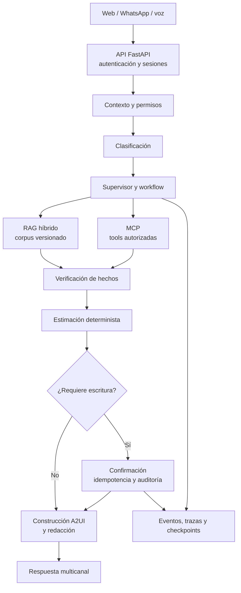

# Nexo IA

Plataforma modular para asistentes institucionales que ayuda a las personas a
encontrar información, entender trámites y ejecutar acciones autorizadas desde
web, mensajería y voz. El sistema combina conocimiento documental versionado,
orquestación de agentes, herramientas con permisos y superficies de interfaz
declarativas.

## Qué resuelve

Nexo IA convierte una solicitud en lenguaje natural en un recorrido verificable:
clasifica el dominio y la intención, recupera fuentes vigentes, valida los
hechos, calcula pasos o requisitos, solicita confirmación cuando corresponde y
devuelve una respuesta trazable. Las acciones de escritura son idempotentes,
requieren autorización y pueden ejecutarse contra adaptadores mock o sistemas
externos.

El MVP incluye recorridos reproducibles para vehículos y apertura de empresas.
El catálogo también contiene registro civil, salud y ganadería para la
expansión Core. Los datos institucionales incluidos en el repositorio son
sintéticos o de demostración; no representan una integración productiva.

## Estado actual

| Área | Estado |
| --- | --- |
| Contratos, JSON Schema y eventos versionados | Implementado |
| API FastAPI, autenticación, conversaciones, SSE, citas y acciones | Implementado |
| Portal web y consola administrativa Next.js | Implementado |
| Orquestación, agentes, RAG híbrido, MCP y A2UI | Implementado con dobles reproducibles |
| Integraciones institucionales | Mock; adaptadores preparados |
| Worker durable y ejecución distribuida | Pendiente |
| MCP Mapper, router de modelos productivo y formularios A2UI dinámicos | Roadmap Pro |
| Paralelismo avanzado, mini-RAGs y evaluación LLM-as-judge | Roadmap Extremo |

## Arquitectura



El repositorio usa un monolito modular: los paquetes se separan por frontera
de capacidad y se conectan mediante contratos tipados. PostgreSQL concentra la
persistencia operativa, auditoría y vectores cuando se habilita el perfil de
base de datos local.

## Tecnologías

- Python 3.12, `uv`, Pydantic, FastAPI y SQLAlchemy.
- Next.js, React, TypeScript y Tailwind CSS.
- PostgreSQL, pgvector, Supabase Auth y migraciones SQL.
- LangGraph para estado, checkpoints y workflows.
- Retrieval híbrido léxico-semántico y corpus documental versionado.
- MCP para catálogo, autorización y ejecución de herramientas.
- A2UI v0.9.1 con catálogos cerrados, validación y fallback seguro.
- Docker Compose, Railway, logging JSONL y contratos preparados para OpenTelemetry.

## Estructura del repositorio

| Ruta | Contenido |
| --- | --- |
| `backend/` | API HTTP, SSE, autenticación, citas, acciones y webhooks |
| `apps/web/` | Portal ciudadano, administración y renderer A2UI |
| `contracts/` | Modelos, eventos, OpenAPI, JSON Schema y ejemplos |
| `orchestration/` | Grafo, estado, checkpoints, puertos y eventos |
| `agents/` | Clasificador, navegadores, verificador, estimador, transaccional y redactor |
| `rag/` | Ingesta, chunking, embeddings, retrieval y evaluación |
| `mcp/` | Catálogo, permisos, ejecución y herramientas |
| `a2ui/` | Builders, validadores, catálogos y fallbacks |
| `domains/` | Manifiestos, fuentes, skills y fixtures por dominio |
| `database/`, `supabase/` | Esquema, migraciones y seeds |
| `integrations/` | Adaptadores de proveedores y sistemas externos |
| `data/` | Corpus sintético, mocks y assets de demostración |
| `evaluations/`, `tests/` | Evaluaciones, pruebas unitarias, contract, integración y E2E |
| `docs/` | Producto, arquitectura, ADRs, onboarding, runbooks y roadmap |

## Rutas web

`/` · `/login` · `/portal` · `/portal/chat` · `/portal/tramite` ·
`/portal/citas` · `/portal/seguimiento` · `/admin` · `/admin/runs` ·
`/admin/panel` · `/admin/workflow` · `/admin/catalogo` · `/admin/integraciones` ·
`/admin/a2ui-lab` · `/agente-voz`.

## API y canales

- Health: `/health/live`, `/health/ready`.
- Auth y usuarios: `/api/v1/auth/*`, `/api/v1/users/me`.
- Conversaciones y runs: `/api/v1/conversations`, `/api/v1/runs/*` y SSE en
  `/api/v1/runs/{run_id}/events`.
- Acciones y citas: `/api/v1/actions/*`, `/api/v1/appointments/*`.
- Voz y administración: `/api/v1/voice/turn`, `/api/v1/admin/*`.
- Twilio: `/webhooks/twilio/whatsapp` y `/webhooks/twilio/status`.

La especificación completa se publica en `contracts/openapi/` y en el OpenAPI
generado por la API.

## Inicio rápido

Requisitos: Python 3.12, `uv`, Node.js/npm y Docker opcional para PostgreSQL.

```bash
uv sync --all-packages --frozen
uv run pytest
cd apps/web && npm install && npm run dev
```

Para el flujo local completo, variables de entorno, Supabase, Compose y seeds,
consulta [la guía de desarrollo local](docs/getting-started/local-development.md).
La colección para explorar la API está disponible en
[Postman](<postman/Nexo IA API.postman_collection.json>).

## Documentación

- [Descripción del producto](docs/product/project-overview.md)
- [Arquitectura técnica](docs/architecture/technical-architecture.md)
- [Estado y roadmap](docs/roadmap/implementation-status.md)
- [Roadmap por capacidades](docs/roadmap/README.md)
- [Decisiones de arquitectura](docs/adr/README.md)
- [Contratos y convenciones](docs/architecture/conventions.md)
- [Runbook de arranque](docs/runbooks/arranque.md)
- [Integración de WhatsApp](docs/runbooks/twilio_whatsapp.md)
- [Colección Postman](<postman/Nexo IA API.postman_collection.json>)
- [Evaluaciones](evaluations/README.md)

## Principios de operación

- No versionar secretos ni PII real.
- No presentar datos mock como integraciones institucionales reales.
- Toda escritura requiere permiso, confirmación, idempotencia y auditoría.
- Las afirmaciones críticas deben conservar fuente, vigencia y trazabilidad.
- Los cambios incompatibles de contratos y catálogos requieren nueva versión.

## Código abierto y licencia

Nexo IA es un proyecto de código abierto distribuido bajo la [licencia MIT](LICENSE).
Puedes usar, estudiar, modificar y redistribuir el software de acuerdo con sus
condiciones.

Antes de integrar un cambio, ejecuta las pruebas del área afectada, actualiza
los contratos o la documentación correspondiente y verifica que no se
introduzcan secretos ni datos personales. Los documentos y datos de
demostración pueden tener condiciones adicionales de procedencia o licencia,
que deben respetarse cuando se reutilicen fuera del repositorio.
