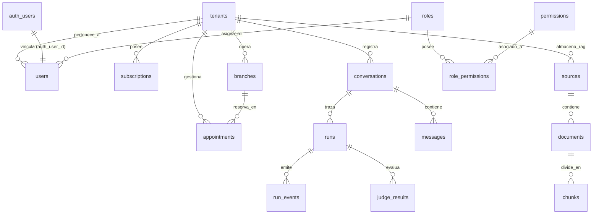

# Documentación de la Base de Datos Nexo IA (Supabase / PostgreSQL)

Este documento contiene la especificación completa, arquitectura, esquema de tablas, funciones almacenadas, seguridad (RLS), índices y datos de inicialización (seeds) de la base de datos de **Nexo IA**, derivados directamente de las migraciones oficiales de Supabase en [`supabase/migrations`].

---

## 1. Vista General y Arquitectura

La persistencia de **Nexo IA** está construida sobre **PostgreSQL (vía Supabase)** y sigue un modelo **Multi-tenant aislado dinámicamente mediante Row Level Security (RLS)**.



### Principios Fundamentales
1. **Multi-Tenancy por Columna (`tenant_id`)**: Cada recurso pertenece a un `tenant_id`. La función RLS `current_tenant_id()` asegura aislamiento estricto en el motor SQL.
2. **Integración con Supabase Auth**: La tabla `public.users` se sincroniza automáticamente con `auth.users` mediante triggers PL/pgSQL (`on_auth_user_created` y `on_auth_user_updated`).
3. **Búsqueda Vectorial Nativa (`pgvector`)**: Extensión `vector` instalada para almacenar embeddings de 1536 dimensiones con un índice **HNSW** (`vector_cosine_ops`).
4. **Control Estricto de Empalmes de Citas (`btree_gist`)**: Constraint de exclusión `appointments_no_overlap` utilizando tipos `tstzrange` para prevenir solapamientos temporales en reservas concurrentes.
5. **Auditoría e Idempotencia Append-Only**: Registro inmutable de trazabilidad de runs de IA (`runs`, `run_events`), acciones transaccionales (`actions`) con `idempotency_key` y logs de auditoría (`audit_logs`).

---

## 2. Extensiones de PostgreSQL

| Extensión | Modulo / Uso | Justificación Técnica |
|---|---|---|
| `vector` | RAG & Vector Store | Soporte nativo para vectores denso de 1536 dimensiones (`vector(1536)`) e índices HNSW para búsqueda rápida por similitud de coseno. |
| `btree_gist` | Citas / Appointments | Permite crear índices y constraints GiST sobre campos escalares (`tenant_id`, `branch_id`) combinados con rangos temporales (`tstzrange`). |

---

## 3. Resumen de Migraciones Supabase

| Archivo de Migración | Módulo / Componente | Descripción General |
|---|---|---|
| [`20260504094442_initial_schema.sql`]| Core SaaS Multi-Tenant & RBAC | Estructura base de Tenants, Planes, Módulos, Suscripciones, Sucursales, Usuarios (vinculados a `auth.users`), Permisos RBAC, Invitaciones, Auditoría, Archivos y Facturación. Políticas RLS iniciales. |
| [`20260504100000_rag_vector_store.sql`]
 | RAG & Vector Store | Fuentes documentales (`sources`), Documentos (`documents`) y Chunks vectoriales (`chunks`) con pgvector 1536d. Índice HNSW Coseno y función RPC `match_chunks`. |
| [`20260504110000_appointments_gist.sql`]| Citas & Pre-reservas (Holds) | Control de disponibilidad sin solapamiento vía constraint GiST sobre `tstzrange`. Holds temporales de 15 min con auto-limpieza RPC `cleanup_expired_holds`. |
| [`20260504120000_conversations_runs_events.sql`]| Multi-canal, Trazabilidad & Idempotencia | Conversaciones, Mensajes (con payload A2UI), Runs del Supervisor Multiagente, Eventos granulares de nodos, Acciones idempotentes y Checkpoints de LangGraph. |
| [`20260504130000_evaluations_judge.sql`] | Evaluaciones LLM-as-Judge | Registro de evaluaciones de fidelidad, completitud, claridad y calidad visual A2UI por cada ejecución de agente. |
| [`20260504140000_seeds_demo.sql`] | Seeds Demostración | Datos idempotentes iniciales: Tenant demo (`gobierno-demo`), Plan `enterprise`, los 5 módulos core, roles de sistema y fuentes documentales RAG para prueba E2E. |

---

## 4. Diccionario de Datos por Módulo

### 4.1. Core Multi-tenant y Subscripciones

#### Tabla `public.tenants`
Almacena las instituciones o entidades gubernamentales registradas.
- `id` (bigint, PK, identity): Identificador único del tenant.
- `name` (text, NOT NULL): Nombre de la institución.
- `slug` (text, UNIQUE, NOT NULL): Identificador amigable para URLs y subdominios.
- `status` (text, CHECK in `'active'`, `'trial'`, `'suspended'`, `'canceled'`): Estado operativo del tenant.
- `metadata` (jsonb, default `'{}'`): Configuraciones o datos flexibles del tenant.
- `created_at`, `updated_at` (timestamptz): Fechas de auditoría.

#### Tabla `public.tenant_domains`
Dominios y subdominios asociados a cada tenant.
- `id` (bigint, PK, identity)
- `tenant_id` (bigint, FK -> `tenants.id` ON DELETE CASCADE)
- `domain` (text, UNIQUE, NOT NULL): FQDN del tenant.
- `is_primary` (boolean, default `false`)
- `created_at`, `updated_at` (timestamptz)

#### Tabla `public.plans`
Planes de comercialización y límites del SaaS.
- `id` (bigint, PK, identity)
- `code` (text, UNIQUE, NOT NULL): Código técnico del plan (ej. `'enterprise'`).
- `name` (text, NOT NULL): Nombre visible del plan.
- `description` (text): Descripción del alcance.
- `max_users` (int, NULL = ilimitado): Máximo de usuarios concurrentes.
- `max_modules` (int, NULL = ilimitado): Máximo de módulos activables.
- `price_monthly`, `price_yearly` (numeric(10,2), default `0`): Precios del plan.
- `is_default` (boolean, default `false`): Indica si es el plan asignado por defecto.
- `metadata` (jsonb): Datos complementarios.

#### Tabla `public.modules`
Catálogo de módulos funcionales disponibles en la plataforma.
- `id` (bigint, PK, identity)
- `code` (text, UNIQUE, NOT NULL): Namespace del módulo (ej. `'vehiculos'`, `'ayuntamiento_empresas'`, `'registro_civil'`, `'salud'`, `'ganaderia'`).
- `name` (text, NOT NULL): Nombre del módulo.
- `description` (text): Resumen funcional.
- `is_core` (boolean, default `false`): Si se incluye en todas las instalaciones base.
- `config_schema` (jsonb): Esquema JSON de configuración requerida.

#### Tabla `public.plan_modules`
Relación N:M entre planes y módulos incluidos.
- `plan_id` (bigint, FK -> `plans.id` ON DELETE CASCADE)
- `module_id` (bigint, FK -> `modules.id` ON DELETE CASCADE)
- `is_required` (boolean, default `false`)
- **PK Primaria**: `(plan_id, module_id)`

#### Tabla `public.subscriptions`
Estado de suscripción activa de un tenant a un plan determinado.
- `id` (bigint, PK, identity)
- `tenant_id` (bigint, FK -> `tenants.id` ON DELETE CASCADE)
- `plan_id` (bigint, FK -> `plans.id`)
- `status` (text, CHECK in `'active'`, `'trialing'`, `'canceled'`, `'past_due'`, `'unpaid'`)
- `period_start`, `period_end`, `renews_at`, `canceled_at` (timestamptz)
- `seats` (int, CHECK > 0, default `1`)
- **Índice Único Parcial**: `subscriptions_tenant_active_idx` garantiza solo 1 suscripción activa/trialing por tenant a la vez.

#### Tabla `public.tenant_modules`
Módulos efectivamente habilitados y configurados por tenant.
- `id` (bigint, PK, identity)
- `tenant_id` (bigint, FK -> `tenants.id` ON DELETE CASCADE)
- `module_id` (bigint, FK -> `modules.id` ON DELETE CASCADE)
- `status` (text, CHECK in `'enabled'`, `'disabled'`, `'pending_config'`)
- `activated_at`, `deactivated_at` (timestamptz)
- `config` (jsonb): Parámetros específicos de la sucursal/tenant.
- **Constraint Única**: `(tenant_id, module_id)`

---

### 4.2. Control de Acceso RBAC, Sucursales y Usuarios

#### Tabla `public.roles`
Roles de sistema y personalizados por tenant.
- `id` (bigint, PK, identity)
- `tenant_id` (bigint, NULL para roles de sistema, FK -> `tenants.id` ON DELETE CASCADE)
- `code` (text, NOT NULL): Identificador del rol (`'admin'`, `'citizen'`, etc.).
- `name` (text, NOT NULL)
- `is_system` (boolean, default `false`)
- **Índice Único Parcial**: `roles_system_code_idx` (para roles globales) y `roles_tenant_code_idx` (para roles institucionales).

#### Tabla `public.permissions`
Permisos finos por módulo y acción.
- `id` (bigint, PK, identity)
- `code` (text, UNIQUE, NOT NULL): Formato `{modulo}.{accion}` (ej. `vehiculos.renovar_licencia`).
- `module_id` (bigint, FK -> `modules.id` ON DELETE CASCADE)
- `description` (text)

#### Tabla `public.role_permissions`
Asignación de permisos a roles.
- `role_id` (bigint, FK -> `roles.id` ON DELETE CASCADE)
- `permission_id` (bigint, FK -> `permissions.id` ON DELETE CASCADE)
- **PK Primaria**: `(role_id, permission_id)`

#### Tabla `public.branches`
Sucursales, oficinas de atención o módulos físicos del tenant.
- `id` (bigint, PK, identity)
- `tenant_id` (bigint, FK -> `tenants.id` ON DELETE CASCADE)
- `code` (text, NOT NULL): Código de sucursal (ej. `'MOD-CENTRO'`).
- `name` (text, NOT NULL)
- `address` (text)
- `status` (text, CHECK in `'active'`, `'inactive'`)
- **Constraint Única**: `(tenant_id, code)`

#### Tabla `public.users`
Perfil de usuario dentro del SaaS, enlazado directamente a `auth.users`.
- `id` (bigint, PK, identity)
- `auth_user_id` (uuid, UNIQUE, FK -> `auth.users.id` ON DELETE CASCADE): Vínculo con Supabase Auth.
- `tenant_id` (bigint, FK -> `tenants.id` ON DELETE CASCADE)
- `branch_id` (bigint, NULLABLE, FK -> `branches.id` ON DELETE SET NULL)
- `role_id` (bigint, FK -> `roles.id`)
- `email` (text, NOT NULL)
- `name` (text, NOT NULL)
- `status` (text, CHECK in `'active'`, `'invited'`, `'suspended'`)
- `is_owner` (boolean, default `false`)
- `last_login_at` (timestamptz)
- **Constraint Única**: `(tenant_id, email)`

#### Tabla `public.invites`
Invitaciones pendientes enviadas por correo.
- `id` (bigint, PK, identity)
- `tenant_id` (bigint, FK -> `tenants.id` ON DELETE CASCADE)
- `email` (text, NOT NULL)
- `role_id`, `branch_id` (FKs)
- `token` (text, UNIQUE, default `gen_random_uuid()::text`)
- `expires_at` (timestamptz, default `now() + 7 days`)
- `accepted_at` (timestamptz, NULLABLE)

---

### 4.3. RAG y Almacenamiento Vectorial (`pgvector`)

#### Tabla `public.sources`
Fuentes documentales oficiales (reglamentos, leyes, normas).
- `id` (bigint, PK, identity)
- `tenant_id` (bigint, FK -> `tenants.id` ON DELETE CASCADE)
- `domain` (text, CHECK in `'vehiculos'`, `'ayuntamiento_empresas'`, `'registro_civil'`, `'salud'`, `'ganaderia'`, `'general'`): Dominio temático.
- `name` (text, NOT NULL): Título de la norma o fuente.
- `publisher`, `source_url` (text): Emisor y URL original.
- `version` (text, default `'v1.0'`): Versión de la norma.
- `source_key` (text): ID estable del contrato (`Source.source_id`).
- `institution_id` (text): institución/tenant lógico que autoriza la evidencia.
- `status` (text, CHECK in `'active'`, `'expired'`, `'superseded'`, `'draft'`)
- `valid_from`, `valid_to` (timestamptz): Ventana temporal de vigencia de la norma.
- `checksum` (text, NOT NULL): Hash para verificar cambios.

#### Tabla `public.documents`
Documentos o capítulos pertenecientes a una fuente documental.
- `id` (bigint, PK, identity)
- `tenant_id`, `source_id` (FKs ON DELETE CASCADE)
- `title` (text, NOT NULL)
- `document_key` (text): ID estable del contrato (`Document.document_id`).
- `document_version` (text): versión inmutable usada en citas.
- `content_raw` (text): Contenido crudo extraído del archivo.
- `file_id` (bigint, NULLABLE, FK -> `files.id` ON DELETE SET NULL)

#### Tabla `public.chunks`
Segmentos procesados con embeddings vectoriales de 1536 dimensiones (OpenAI / pgvector).
- `id` (bigint, PK, identity)
- `tenant_id`, `document_id` (FKs ON DELETE CASCADE)
- `domain` (text, NOT NULL)
- `chunk_index` (int, default `0`)
- `chunk_key`, `fragment_key`, `source_key`, `document_key` (text): IDs estables del contrato.
- `content` (text, NOT NULL): Texto del fragmento.
- `heading`, `char_start`, `char_end`, `chunk_checksum`: linaje citable exacto.
- `source_status`, `valid_from`, `valid_to`, `institution_id`: filtros canónicos aplicados antes de puntuar.
- `embedding_model`, `embedding_dimension`: metadatos del vector usado en ingesta.
- `embedding` (`vector(1536)`): Vector denso de 1536 dimensiones.
- **Índice HNSW**: `idx_chunks_embedding_hnsw` indexa mediante `vector_cosine_ops` para recuperaciones sub-milisegundo.

---

### 4.4. Citas y Control GiST de Sobrerreservas

#### Tabla `public.appointments`
Gestión de citas y trámites presenciales o virtuales con soporte para Holds temporales.
- `id` (bigint, PK, identity)
- `tenant_id` (bigint, FK -> `tenants.id` ON DELETE CASCADE)
- `branch_id` (bigint, FK -> `branches.id` ON DELETE CASCADE)
- `user_id` (bigint, NULLABLE, FK -> `users.id` ON DELETE SET NULL)
- `module_code` (text, NOT NULL): Módulo del trámite (ej. `'vehiculos'`).
- `service_name` (text, NOT NULL): Nombre del servicio.
- `time_range` (`tstzrange`, NOT NULL): Rango estricto de inicio y fin de la cita con zona horaria.
- `status` (text, CHECK in `'hold'`, `'confirmed'`, `'canceled'`, `'expired'`, default `'hold'`)
- `hold_expires_at` (timestamptz, default `now() + 15 minutes`): Expiración del apartado temporal de la cita.
- `confirmation_folio` (text): Folio asignado al confirmar.
- **Exclusion Constraint GiST (`appointments_no_overlap`)**:
  ```sql
  constraint appointments_no_overlap exclude using gist (
    tenant_id with =,
    branch_id with =,
    time_range with &&
  ) where (status in ('hold', 'confirmed'))
  ```
  Garantiza matemáticamente a nivel de base de datos que dos citas para la misma sucursal e institución jamás se traslapen mientras su estado sea `'hold'` o `'confirmed'`.

---

### 4.5. Sistema Conversacional, Trazo de Agentes (Runs) e Idempotencia

#### Tabla `public.conversations`
Hilos de interacción entre usuarios y la plataforma multiagente.
- `id` (bigint, PK, identity)
- `tenant_id`, `user_id` (FKs)
- `channel` (text, CHECK in `'web'`, `'whatsapp'`, `'voice'`, `'admin'`, default `'web'`)
- `title` (text)
- `status` (text, CHECK in `'active'`, `'archived'`, `'closed'`, default `'active'`)

#### Tabla `public.messages`
Mensajes individuales dentro de una conversación.
- `id` (bigint, PK, identity)
- `conversation_id` (bigint, FK -> `conversations.id` ON DELETE CASCADE)
- `sender_type` (text, CHECK in `'user'`, `'assistant'`, `'system'`)
- `content` (text, NOT NULL)
- `a2ui_payload` (jsonb): Superficie declarativa A2UI v0.9.1 (componentes interactivos).

#### Tabla `public.runs`
Trazo de ejecución de nivel superior de un ciclo del Supervisor de Nexo IA.
- `id` (bigint, PK, identity)
- `trace_id` (text, UNIQUE, NOT NULL): Identificador de trazabilidad distribuida (OpenTelemetry compatible).
- `tenant_id`, `conversation_id` (FKs)
- `domain` (text): Dominio identificado (ej. `'vehiculos'`).
- `intents`, `plan` (jsonb, default `'[]'`)
- `status` (text, CHECK in `'running'`, `'completed'`, `'failed'`, `'requires_action'`)
- `model_selected` (text): Modelo LLM invocado.
- `latency_ms` (int): Latencia de ejecución en milisegundos.
- `total_cost_usd` (numeric(10,6), default `0`): Costo total estimado.

#### Tabla `public.run_events`
Eventos paso a paso emitidos por el grafo multiagente.
- `id` (bigint, PK, identity)
- `run_id` (bigint, FK -> `runs.id` ON DELETE CASCADE)
- `trace_id` (text, NOT NULL)
- `event_type` (text, NOT NULL): Ej. `'node_start'`, `'node_end'`, `'mcp_call'`, `'rag_retrieval'`, `'error'`.
- `node_name` (text, NOT NULL): Nombre del nodo en LangGraph, conservado por compatibilidad.
- `event_id` (text): ID opaco canónico de `nexo_contracts.RunEvent`.
- `sequence` (int): Posición monotónica por run; `Last-Event-ID` del SSE usa este valor.
- `actor_type`, `actor_name`, `status`, `visibility`, `correlation_id`, `parent_event_id`: campos expandidos del contrato.
- `public_data` (jsonb): carga segura para clientes; `payload`/`canonical_event.data` quedan para auditoría.
- `canonical_event` (jsonb): `RunEvent` completo validado por contrato antes de persistir.
- `payload` (jsonb): Parámetros de entrada/salida del nodo.

#### Tabla `public.actions`
Registro transaccional de operaciones ejecutadas por agentes con garantía de Idempotencia.
- `id` (bigint, PK, identity)
- `tenant_id`, `user_id` (FKs)
- `idempotency_key` (text, UNIQUE, NOT NULL): Clave única enviada por el cliente o agente para evitar llamadas duplicadas.
- `action_name` (text, NOT NULL): Nombre de la herramienta u operación (ej. `'vehiculos.reservar_cita'`).
- `payload` (jsonb)
- `status` (text, CHECK in `'pending'`, `'completed'`, `'failed'`)
- `result_folio`, `result_payload` (text / jsonb)

#### Tabla `public.langgraph_checkpoints`
Persistencia de estado del grafo para reanudación de ejecuciones asíncronas y Human-in-the-Loop.
- `thread_id` (text, PK)
- `checkpoint_id`, `parent_id` (text)
- `checkpoint` (jsonb, NOT NULL)

---

### 4.6. Evaluaciones LLM-as-Judge y Soporte

#### Tabla `public.judge_results`
Evaluación automatizada de calidad por el agente evaluador (Judge).
- `id` (bigint, PK, identity)
- `run_id` (bigint, FK -> `runs.id` ON DELETE CASCADE)
- `trace_id` (text, NOT NULL)
- `tenant_id` (bigint, FK -> `tenants.id` ON DELETE CASCADE)
- `judge_model` (text, NOT NULL): Modelo evaluador usado.
- `domain_correctness_score` (numeric(3,2), CHECK 0..1)
- `fidelity_score` (numeric(3,2), CHECK 0..1)
- `completeness_score` (numeric(3,2), CHECK 0..1)
- `clarity_score` (numeric(3,2), CHECK 0..1)
- `a2ui_quality_score` (numeric(3,2), CHECK 0..1)
- `hallucinations_detected` (boolean, default `false`)
- `feedback` (text): Explicación cualitativa del evaluador.

#### Tablas Complementarias
- `public.audit_logs`: Registro append-only de auditoría administrativa (`create`, `update`, `delete`, `login`).
- `public.files`: Metadatos de archivos adjuntos cargados a Supabase Storage.
- `public.invoices` y `public.payments`: Registro y cobros de suscripciones SaaS.

---

## 5. Funciones Almacenadas (RPC) y Triggers

### 5.1. Funciones Helper de Autenticación y RBAC

```sql
-- Obtener el ID numérico en public.users del usuario autenticado en Supabase Auth
create function public.current_user_id() returns bigint;

-- Obtener el tenant_id de la institución a la que pertenece el usuario autenticado
create function public.current_tenant_id() returns bigint;

-- Verificar si el usuario autenticado posee un código de permiso en su rol
create function public.has_permission(permission_code text) returns boolean;
```

### 5.2. Triggers de Sincronización Automática con Supabase Auth

```sql
-- Sincroniza la fecha de último inicio de sesión en public.users al ingresar vía auth.users
trigger on_auth_user_updated on auth.users -> execute procedure public.handle_auth_user_updated();

-- Crea automáticamente el registro en public.users al aceptar una invitación
trigger on_auth_user_created on auth.users -> execute procedure public.handle_auth_user_created();

-- Actualiza automáticamente el campo updated_at al modificar filas en tablas con timestamp
trigger set_updated_at before update on [tablas] -> execute procedure public.set_updated_at();
```

### 5.3. Búsqueda Vectorial por Similitud de Coseno (RAG)

```sql
create function public.match_chunks(
  query_embedding vector(1536),
  match_threshold float default 0.6,
  match_count int default 5,
  filter_domain text default null,
  filter_tenant_id bigint default null,
  filter_valid_at date default current_date,
  filter_status text[] default array['active']::text[],
  allowed_source_ids text[] default null
)
returns table (
  id bigint,
  document_id bigint,
  domain text,
  content text,
  metadata jsonb,
  similarity float,
  source_id text,
  chunk_id text,
  fragment_id text,
  document_version text,
  chunk_checksum text,
  valid_from timestamptz,
  valid_to timestamptz,
  source_status text,
  institution_id text,
  embedding_model text,
  embedding_dimension int
);
```
*Filtra por tenant/institución, dominio, status, allowlist de fuentes y vigencia antes de puntuar.*

### 5.4. Limpieza Automática de Holds Expirados de Citas

```sql
create function public.cleanup_expired_holds() returns int;
```
*Actualiza las citas con estado `'hold'` y fecha `hold_expires_at <= now()` al estado `'expired'`, liberando la ventana temporal.*

---

## 6. Seguridad y Políticas RLS (Row Level Security)

RLS está **activado de forma obligatoria** en las 22 tablas del esquema `public`. La regla principal de aislamiento exige que los usuarios solo puedan acceder a los registros pertenecientes a su propia institución (`tenant_id = public.current_tenant_id()`).

### Ejemplos de Políticas Aplicadas:
- **`tenants`**: `select` permitido si `id = public.current_tenant_id()`.
- **`users`**: `select` para usuarios del mismo tenant; `update` restringido al propio perfil (`auth_user_id = auth.uid()`).
- **`appointments`**, **`sources`**, **`documents`**, **`chunks`**, **`conversations`**, **`runs`**, **`judge_results`**: Filtrados por `tenant_id = public.current_tenant_id()`.
- **`plans`**, **`modules`**, **`permissions`**: Visibles para todos los usuarios autenticados (`select to authenticated using (true)`).
- **`roles`**: Visibles si son de sistema (`tenant_id IS NULL`) o pertenecen al propio tenant.

---

## 7. Estrategia de Índices de Rendimiento

| Tabla | Índice | Tipo / Campos | Propósito |
|---|---|---|---|
| `chunks` | `idx_chunks_embedding_hnsw` | **HNSW** (`embedding vector_cosine_ops`) | Búsquedas vectoriales sub-milisegundo de embeddings. |
| `appointments` | `appointments_no_overlap` | **GiST Constraint** (`tenant_id`, `branch_id`, `time_range`) | Prevención garantizada de citas solapadas. |
| `subscriptions` | `subscriptions_tenant_active_idx` | **B-Tree Único Parcial** (`tenant_id`) WHERE `status IN ('active', 'trialing')` | Unicidad de suscripción activa por tenant. |
| `roles` | `roles_system_code_idx` | **B-Tree Único Parcial** (`code`) WHERE `tenant_id IS NULL` | Unicidad de roles globales de sistema. |
| `audit_logs` | `idx_audit_logs_tenant_date` | **B-Tree** (`tenant_id`, `created_at DESC`) | Consultas eficientes de logs de auditoría más recientes. |
| `runs` | `idx_runs_tenant_trace` | **B-Tree** (`tenant_id`, `trace_id`) | Búsqueda rápida de trazas por tenant. |
| `actions` | `idx_actions_idempotency` | **B-Tree Único** (`idempotency_key`) | Validación instantánea de idempotencia. |

---

## 8. Verificación y Ejecución Local

Para aplicar estas migraciones en un entorno de desarrollo local con Supabase CLI:

```bash
# Iniciar Supabase local
npx supabase start

# Aplicar todas las migraciones en orden secuencial
npx supabase db reset
```

Para verificar que las funciones y seeds cargaron correctamente:

```sql
-- Verificar número de tablas creadas
select count(*) from information_schema.tables where table_schema = 'public';

-- Probar búsqueda RAG (RPC)
select * from public.match_chunks(
  query_embedding := array_fill(0.0, ARRAY[1536])::vector(1536),
  match_threshold := 0.0,
  match_count := 1
);
```
