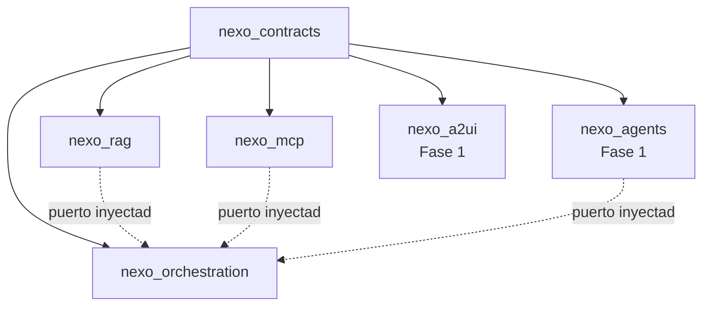

# Inventario de módulos y matriz de propiedad

> **Tarea:** `DIE-F0-001`. **Fecha:** 2026-07-30. **Mantiene:** Diego.
>
> Objetivo: que cada responsabilidad tenga un único dueño y que ninguna frontera
> quede sin nombre. Complementa la tabla §6.1 de `Nexo_IA_Arquitectura_y_Plan.md`
> con el estado real tras Fase 0.

## 1. Módulos bajo responsabilidad de Diego

| Módulo | Responsabilidad | Estado tras Fase 0 |
|---|---|---|
| `contracts` | Contratos tipados de §5, JSON Schema, ejemplos y fixtures | **Implementado**: 56 contratos, 149 artefactos generados |
| `orchestration` | `RunState`, grafo, reducers, eventos, checkpoints, puertos de ejecución | **Parcial**: grafo mínimo, puertos y dobles; nodos MVP en F1.11 |
| `rag` | Puertos de recuperación e ingesta | **Parcial**: puertos y dobles; ingesta y retriever real en F1.2/F1.3 |
| `mcp` | Puertos de registro y ejecución de tools | **Parcial**: puertos y dobles; server y tools en F1.8/F1.9 |
| `a2ui` | Builder, validator, catálogos y fallbacks | **No iniciado**: solo contratos; builder en F1.13 |
| `agents` | Agentes transversales | **No iniciado**: contratos listos; agentes en F1.4–F1.12 |
| `domains` | Manifests, prompts, fuentes y fixtures por dominio | **Parcial**: fixtures de los dos recorridos MVP |
| `evaluations` | Datasets, evaluadores y judge | **No iniciado**: contratos listos; dataset en F2.9 |
| `config` | Policies, aliases y registros no secretos | **Implementado**: 5 archivos validados al arranque |

## 2. Responsabilidad única por capacidad

Cada fila tiene exactamente un dueño. «Apoya» significa que revisa y consume,
no que decide.

| Capacidad | Dueño | Apoya | Frontera |
|---|---|---|---|
| Contratos de agentes, hechos, RAG, MCP, A2UI y eventos | Diego | Dani custodia la carpeta; todos aprueban su frontera | `contracts` |
| Grafo, estado y checkpoints lógicos | Diego | Daher persiste | `orchestration` |
| Persistencia física, migraciones e índices | Daher | Diego define el schema lógico | `database` |
| API HTTP, auth, RBAC de aplicación, SSE y webhooks | Dani | Diego entrega puertos y eventos | `backend` |
| Adapters de proveedor y de canal | Dani | Diego apoya modelos y MCP | `integrations` |
| Renderer A2UI, portal y workflow viewer | Cris | Diego entrega catálogos y fixtures | `apps/web` |
| Generación y validación A2UI en servidor | Diego | Cris consume | `a2ui` |
| Corpus, ingesta y retrieval | Diego | Daher aporta índices y constraints | `rag`, `data/documents` |
| Registro, permisos y ejecución de tools | Diego | Dani aporta adapters y red | `mcp`, `config` |
| Citas, holds y concurrencia | Dani y Daher | Diego consume por contrato | `backend`, `database` |
| Datasets, evaluadores y judge | Diego | Todos aportan casos | `evaluations` |
| Deploy, healthchecks, CI/CD y release | Dani | — | `infrastructure`, `scripts` |

## 3. Fronteras que deben permanecer protegidas

Estas reglas están verificadas por pruebas, no solo documentadas:

- `agents` razona sobre modelos Pydantic; no abre DB, no conoce FastAPI y no
  importa SDKs de canal ni de proveedor.
- `orchestration` coordina y emite eventos; no renderiza UI, no contiene SQL y
  no llama a Twilio. Es el **único** módulo que importa LangGraph.
- `rag` recupera evidencia; no ejecuta tools ni redacta respuestas.
- `mcp` publica capacidades; no almacena conocimiento documental ni decide el
  plan del run.
- `a2ui` construye y valida superficies; no consulta tablas ni autoriza acciones.
- `domains` contiene configuración y conocimiento; no duplica infraestructura.
- `evaluations` mide salidas congeladas; no forma parte del camino de
  autorización de ninguna escritura.
- `config` contiene políticas versionadas y no secretas; una configuración
  inválida detiene el arranque.

## 4. Dependencias permitidas entre paquetes Python

`nexo_contracts` no depende de nada del proyecto. Las flechas punteadas indican
inyección por puerto: `orchestration` conoce los `Protocol` de `rag` y `mcp`,
nunca sus implementaciones. Ningún paquete importa `nexo_orchestration` salvo
las pruebas de integración.

## 5. Decisiones abiertas con dueño y fecha

| # | Decisión pendiente | Dueño | Se resuelve en |
|---|---|---|---|
| 1 | Ratificar que el paquete Pydantic viva en `contracts/src/nexo_contracts/` | Dani | Antes de Fase 1 |
| 2 | Nombres definitivos de eventos para el workflow viewer | Cris y Diego | F2.8 |
| 3 | Schema físico de checkpoints y `run_events` | Daher | Prerrequisito de Fase 1 |
| 4 | Contrato de `RunRequest`/`RunResult` en la API HTTP | Dani | Prerrequisito de Fase 1 |
| 5 | Catálogo A2UI ciudadano mínimo definitivo | Cris | F1.13 |
| 6 | Adopción de `uv` y publicación de `uv.lock` | Dani | Antes de CI |
| 7 | Prefijo `ayuntamiento` para el dominio `ayuntamiento_empresas` | Diego | Ratificado en Fase 0 |
