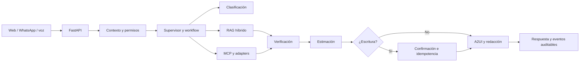

# Arquitectura técnica

## Resumen

Nexo IA se implementa como un monolito modular con fronteras explícitas entre
interfaz, API, contratos, orquestación, agentes, recuperación documental,
herramientas, persistencia e integraciones. Esta topología permite ejecutar la
demostración offline y separar procesos cuando la carga o la disponibilidad lo
requieran.

## Flujo de una solicitud

Principios centrales:

1. Los contratos tipados son la frontera entre módulos.
2. El redactor recibe hechos verificados y no inventa información.
3. Las escrituras se concentran en herramientas autorizadas, con confirmación,
   idempotencia y auditoría.
4. Los cálculos, permisos, deduplicación y estados críticos son deterministas.
5. A2UI usa un catálogo cerrado; no se ejecuta código generado por modelos.
6. Las fuentes tienen versión, vigencia, checksum y estado de publicación.

## Módulos

| Módulo | Función | Estado |
| --- | --- | --- |
| `apps/web` | Portal, administración, chat, workflow y renderer A2UI | Implementado |
| `backend` | HTTP, SSE, auth, citas, acciones, health y webhooks | Implementado |
| `contracts` | Pydantic, OpenAPI, eventos, JSON Schema y ejemplos | Implementado |
| `orchestration` | Grafo, estado, checkpoints, puertos y eventos | Implementado |
| `agents` | Clasificador, navegadores, verificador, estimador, transaccional y redactor | Implementado |
| `rag` | Ingesta, chunking, embeddings, retrieval y suficiencia | Implementado |
| `mcp` | Registro, autorización, ejecución y catálogo de herramientas | Implementado |
| `a2ui` | Builders, validación, catálogos y fallback | Implementado |
| `domains` | Manifiestos, skills, fuentes, prompts y fixtures por dominio | Implementado/parcial |
| `database`, `supabase` | Esquema, migraciones, RLS, índices y seeds | Implementado |
| `integrations` | Adaptadores de Twilio, modelos, storage y sistemas externos | Parcial/mock |
| `evaluations` | Datasets, rúbricas, baselines y reportes | Implementado/parcial |
| `observability` | Eventos, logging, métricas y trazas | Implementado/parcial |
| `infrastructure` | Docker, Compose, Railway y recuperación | Implementado/parcial |

## Contratos y eventos

Los modelos públicos viven en `contracts/src/nexo_contracts/`. Los artefactos
derivados se exportan a `contracts/jsonschema/`, `contracts/events/` y
`contracts/openapi/`. Cada ejecución usa un `trace_id`, eventos ordenados y una
proyección pública separada de los datos restringidos de auditoría.

Las superficies A2UI se validan contra catálogos versionados. El catálogo
ciudadano `citizen:v1` está congelado; cualquier cambio incompatible debe
publicarse como una nueva versión.

## Persistencia y seguridad

PostgreSQL almacena usuarios, tenants, conversaciones, runs, eventos, acciones,
citas, auditoría y corpus. pgvector permite recuperar embeddings cuando se
habilita el índice semántico. Supabase aporta autenticación y capacidades de
base de datos configurables por entorno.

Las políticas relevantes son:

- RBAC y aislamiento por tenant.
- Permisos por dominio, herramienta y operación.
- Secretos fuera del repositorio.
- Minimización y enmascaramiento de PII.
- Validación de firmas en webhooks.
- Timeouts, reintentos limitados, estados parciales y fallbacks seguros.

## Canales y rutas

### Web

`/`, `/login`, `/portal`, `/portal/chat`, `/portal/tramite`, `/portal/citas`,
`/portal/seguimiento`, `/admin`, `/admin/panel`, `/admin/runs`, `/admin/workflow`,
`/admin/catalogo`, `/admin/integraciones`, `/admin/a2ui-lab` y `/agente-voz`.

### API

- `/health/live`, `/health/ready`
- `/api/v1/auth/*`, `/api/v1/users/me`
- `/api/v1/conversations`, `/api/v1/conversations/{conversation_id}/messages`
- `/api/v1/runs`, `/api/v1/runs/{run_id}`, `/api/v1/runs/{run_id}/events`
- `/api/v1/actions/{action_id}/confirm`
- `/api/v1/appointments/availability`, `/api/v1/appointments/holds`
- `/api/v1/voice/turn`
- `/api/v1/admin/*`
- `/webhooks/twilio/whatsapp`, `/webhooks/twilio/status`

## Fases de evolución

| Fase | Entregables principales |
| --- | --- |
| MVP | Dos recorridos E2E, web, auth, API, agentes, RAG, MCP mock, citas mock y A2UI |
| Core | Cinco dominios, catálogo central, workflow, administración y evaluación |
| Pro | Voz, adaptadores externos, MCP Mapper, routing productivo y formularios dinámicos |
| Extremo | Paralelismo, mini-RAGs, personalización, judge y actualización controlada |

## Deuda técnica conocida

- Los runs activos se mantienen en proceso; falta una cola o worker durable.
- Los adaptadores institucionales son deterministas y requieren contratos
  externos autorizados antes de conectarse a producción.
- El MVP ejecuta algunos nodos secuencialmente.
- El router de modelos y el almacenamiento semántico productivo requieren
  configuración de proveedores.
- La cobertura frontend y algunos recorridos Core deben endurecerse con pruebas
  de navegador y contratos cruzados.

## Referencias

- [Convenciones de contratos](conventions.md)
- [Esquema de base de datos](database_schema.md)
- [Inventario de adaptadores](institutional_adapters_inventory.md)
- [Propiedad de módulos](module_ownership.md)
- [Mapeo de eventos del workflow](workflow-event-mapping-v1.md)
- [ADRs](../adr/README.md)
