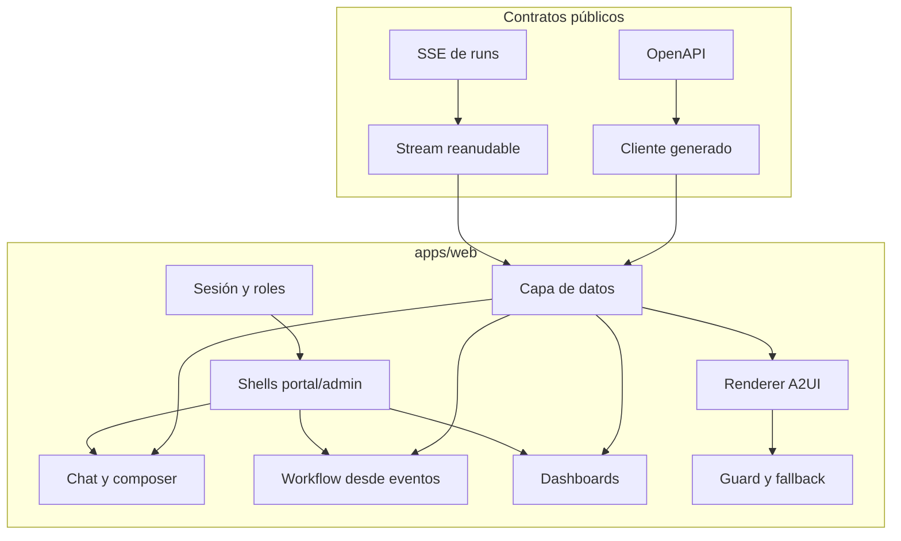
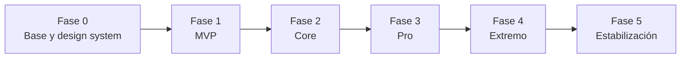

# Plan de implementación por fases de Cris hasta nivel Extremo

> **Estado:** plan de trabajo. Las casillas marcadas `[x]` sí representan funcionalidad implementada y verificada; las vacías son trabajo futuro.
>
> **Alcance:** `apps/web` — shell, rutas, sesión, cliente de contratos, chat y streaming, renderer A2UI, workflow visual, dashboards, accesibilidad y pruebas de interfaz.
>
> **Responsable principal:** Cris.
>
> **Fecha base del plan:** 2026-07-31.
>
> **Fuentes de alcance:** [`cris_frontend.md`](./cris_frontend.md), [`Nexo_IA_Propuesta_Completa.md`](../../Nexo_IA_Propuesta_Completa.md) y [`Nexo_IA_Arquitectura_y_Plan.md`](../../Nexo_IA_Arquitectura_y_Plan.md).

## 1. Propósito del documento

Este documento convierte el alcance asignado a Cris en una secuencia implementable y verificable, ordenada por dependencias, e inventaría con evidencia qué está hecho a la fecha base.

A diferencia del plan de Diego, este parte de una base **con código funcionando**: existen doce rutas, un sistema de diseño completo y el renderer A2UI del catálogo ciudadano. El inventario de §2.3 separa lo entregado de lo pendiente para que el resto del plan no repita trabajo ya hecho.

El resultado final esperado es una aplicación web que:

- sirva `/portal` y `/admin` desde un solo shell accesible y responsive;
- consuma exclusivamente contratos públicos, nunca la base de datos;
- reciba streaming reanudable y sobreviva a desconexiones sin duplicar efectos;
- renderice superficies A2UI declarativas sin ejecutar jamás código recibido;
- degrade a texto equivalente cuando una superficie no valide;
- reconstruya visualmente un run desde sus eventos;
- muestre métricas de operación sobre datos reales;
- proteja rutas por rol sin fingir que ocultar un botón es un permiso;
- se demuestre por completo sin proveedores externos, contra fixtures congelados.

## 2. Precedencia, supuestos y estado base

### 2.1 Precedencia usada para resolver ambigüedades

1. `docs/team/cris_frontend.md` define propiedad, entregables y criterios mínimos de Cris.
2. `Nexo_IA_Arquitectura_y_Plan.md` define fronteras modulares, contratos, fases y umbrales.
3. `Nexo_IA_Propuesta_Completa.md` amplía comportamiento de producto y casos de demostración.
4. Ante una decisión abierta se elegirá la alternativa más segura, accesible y reversible, y se documentará en un ADR.

### 2.2 Supuestos no negociables

- El frontend **nunca** ejecuta HTML, JavaScript, SQL ni código generado por un modelo. A2UI se trata como entrada no confiable.
- El frontend **nunca** abre la base de datos ni contiene prompts ni secretos. Todo pasa por la API.
- Ocultar un botón no reemplaza un permiso server-side; los roles en cliente son presentación, no autorización.
- A2UI queda fijo en v0.9.1 y en catálogos cerrados publicados por `a2ui/`.
- El catálogo del cliente es copia byte a byte del que publica `a2ui/`; la deriva falla en CI, no en producción.
- Los estados loading, empty, error, partial y offline son explícitos, no implícitos.
- WCAG 2.2 AA, operable por teclado, foco visible y `prefers-reduced-motion` son línea base, no fase final.
- Los montos llegan formateados desde el servidor; el frontend nunca suma ni recalcula dinero.
- La demo debe correr sin red contra fixtures congelados.

### 2.3 Estado base observado — inventario con evidencia

Verificado sobre `feat/a2ui-renderer` el 2026-07-31.

**Avance por fase — 35 de 167 tareas (21%):**

| Fase | Hechas | Total | Lectura |
|---|---:|---:|---|
| F0 · Base y sistema de diseño | 19 | 28 | casi completa; falta toda la base de pruebas |
| F1 · MVP | 16 | 58 | el renderer A2UI está entero; nada más toca la API |
| F2 · Core | 0 | 28 | bloqueada por eventos y métricas |
| F3 · Pro | 0 | 22 | bloqueada por F1 |
| F4 · Extremo | 0 | 16 | bloqueada por F2 |
| F5 · Estabilización | 0 | 18 | — |

El 21% engaña en dos direcciones. Hacia arriba: lo entregado es la parte visible y define el sistema de diseño de todo lo demás. Hacia abajo: **no hay una sola prueba**, así que nada de eso está protegido, y la Fase 1 avanzada es exactamente el trozo que no dependía de nadie.

**Entregado y funcionando:**

| Capacidad | Evidencia |
|---|---|
| Workspace Next.js 16 · React 19 · TS estricto | `apps/web/`, `tsc --noEmit` limpio |
| Sistema de diseño Tailwind v4, claro/oscuro, tokens oklch | `src/app/globals.css`, sin `tailwind.config.ts` |
| Shell del portal y shell de administración con navegación | `components/nexo/portal-shell.tsx`, `admin-shell.tsx` |
| 13 rutas compilando estáticas | `next build` |
| Chat con 12 estados de interfaz seleccionables | `app/portal/chat/`, `features/chat/chat-mock.ts` |
| Agente de voz con llamada real (ElevenLabs, WebRTC) | `features/voice-agent/VoiceAgent.tsx` |
| **Renderer A2UI del catálogo ciudadano** | `features/a2ui/` — 10 componentes |
| Guard de seguridad con 15 reglas verificadas una a una | `features/a2ui/guard.ts` + 15 fixtures hostiles |
| Fallback seguro que no revela el payload | `features/a2ui/Fallback.tsx`, verificado en navegador |
| Banco de medición de time-to-first-surface | `app/admin/a2ui-lab/` |
| Exportador de fixtures desde el builder real | `a2ui/scripts/export_fixtures.py` |
| Guardia de deriva del catálogo | `npm run check:catalog` |

**No existe todavía:**

| Hueco | Consecuencia |
|---|---|
| **Cero pruebas y cero dependencias de testing** | Nada protege ninguna regresión |
| **Cero llamadas al backend** — no hay cliente de API ni SSE | Todo el contenido es fixture |
| **Sin sesión, roles ni expiración** | `/admin` es público |
| Confirmaciones no envían nada | `ConfirmButton` dispara un callback vacío |
| Workflow es un arreglo con coordenadas fijas | `app/admin/workflow/page.tsx` |
| Dashboard sobre datos inventados | `lib/mock.ts` |
| Sin masking de PII | Nada distingue dato sensible de dato público |
| El agente de voz vive aislado del run | No comparte conversación ni trazabilidad |
| **CI no revisa el frontend** | `.github/workflows/ci.yml` solo corre Python |

### 2.4 Fuera del alcance directo de Cris

Cris consume estos contratos pero no los posee:

- OpenAPI, autenticación, RBAC efectivo, SSE, webhooks y canales: **Dani**.
- Esquemas A2UI, catálogos, builder, validator, eventos y fixtures de origen: **Diego**.
- Persistencia, seeds, métricas y consultas administrativas: **Daher**.

Cuando una dependencia no esté lista se usará un fixture con **exactamente el wire shape** del contrato futuro, para que conectar el real sea cambiar el origen del dato y nada más.

## 3. Definición global de terminado

| Área | Condición de aceptación |
|---|---|
| Rutas y roles | `/portal` y `/admin` operables por teclado; toda ruta protegida rechaza en servidor, no ocultando UI. |
| Contratos | El cliente se genera desde OpenAPI; una respuesta fuera de contrato produce error tipado, no `undefined` silencioso. |
| Streaming | SSE reanuda con `Last-Event-ID`, deduplica por id y jamás aplica eventos a un run eliminado. |
| A2UI | 100% de superficies válidas renderizan; el 100% de las inválidas producen fallback sin render parcial ni ejecución. |
| Trazabilidad | `trace_id` se propaga en toda petición y es visible en cada estado de error. |
| Acciones | Confirmación envía `action_id`, versión e `idempotency_key`; el botón se bloquea durante el envío y se recupera tras error. |
| Idempotencia | Doble clic, reintento y reanudación no producen dos efectos. |
| Estados | Loading, empty, error, partial y offline existen y son distinguibles en las cinco vistas principales. |
| Accesibilidad | Cero violaciones críticas de axe; contraste AA; navegación completa por teclado; zoom 200% sin pérdida. |
| Responsive | Usable desde 360 px; ninguna vista provoca scroll horizontal del documento. |
| Workflow | El grafo se construye desde `RunEvent` reales, tolera eventos fuera de orden y marca estados parciales. |
| Dashboard | Las métricas provienen de la API; sin datos suficientes se dice, no se dibuja una gráfica vacía. |
| Pruebas | Unit, componente, contrato y accesibilidad en CI; dos E2E en MVP, cinco en Core. |
| CI | El pipeline ejecuta typecheck, lint, tests y build del frontend en cada PR. |
| Reproducibilidad | La demo completa corre sin red contra fixtures congelados. |
| Rendimiento | Primer evento visible ≤ 2 s y recorrido de demo ≤ 20 s en el perfil acordado. |

## 4. Arquitectura objetivo bajo responsabilidad de Cris

### 4.1 Fronteras que deben quedar protegidas

- `features/a2ui` valida y dibuja; no decide el plan del run ni conoce la API.
- `lib/api` habla HTTP y contratos; no contiene JSX ni reglas de negocio.
- `features/chat` compone conversación; no interpreta A2UI por su cuenta.
- `components/nexo` son primitivas del sistema de diseño; no hacen fetch.
- Ningún componente recibe `className` ni estilos desde un payload externo.

## 5. Contratos que Cris consume

Cris no define ninguno; los revisa y bloquea si son ambiguos.

- **Ejecución:** `RunRequest`, `RunResult` (incluye `surface`, `fallback`, `verified_facts`, `available_actions`), `RunEvent`, `EventSequence`.
- **A2UI:** `CatalogDescriptor`, `A2UISurface`, `A2UIMessage`, `A2UIComponent`, `A2UIAction`, `A2UIValidationResult`, `ChannelFallback`.
- **Acciones:** `ActionRequest` y `ActionResult` con `action_id`, versión esperada e `idempotency_key`.
- **Errores:** Problem Details con `trace_id` y código estable.
- **Métricas:** `MetricSet` para dashboards.

---

## 6. Secuencia general y gates

No se inicia una fase como línea principal sin cumplir el gate de la anterior. Sí se permite adelantar componentes contra fixtures congelados.

---

## 7. Fase 0 — base, sistema de diseño y esqueleto navegable

### 7.1 Objetivo

Tener una aplicación compilable, navegable y coherente visualmente, capaz de expresar cualquier estado de interfaz sin backend.

### 7.2 Paquete F0.1 — workspace y convenciones

- [x] `CRI-F0-001` Configurar Next.js 16 App Router con TypeScript estricto.
- [x] `CRI-F0-002` Fijar features por capacidad, no por página.
- [x] `CRI-F0-003` Configurar ESLint y Prettier con formato compartido.
- [x] `CRI-F0-004` Documentar propósito, fronteras y ejecución en el README del módulo.
- [ ] `CRI-F0-005` Añadir el frontend al CI: typecheck, lint, build y tests en cada PR.

### 7.3 Paquete F0.2 — sistema de diseño

- [x] `CRI-F0-006` Definir tokens semánticos de color en oklch para modo claro y oscuro.
- [x] `CRI-F0-007` Definir roles tipográficos y familia monoespaciada para datos.
- [x] `CRI-F0-008` Definir radios, sombras y espaciado como tokens, no como valores sueltos.
- [x] `CRI-F0-009` Crear la firma visual del dominio: el riel de trazabilidad.
- [x] `CRI-F0-010` Garantizar `prefers-reduced-motion` y foco visible globales.
- [x] `CRI-F0-011` Evitar flash de tema al recargar en modo oscuro.
- [ ] `CRI-F0-012` Verificar contraste AA de cada par token/fondo con herramienta, no a ojo.

### 7.4 Paquete F0.3 — shells y navegación

- [x] `CRI-F0-013` Construir el shell del portal ciudadano con navegación superior e inferior en móvil.
- [x] `CRI-F0-014` Construir el shell de administración con barra lateral y drawer en móvil.
- [x] `CRI-F0-015` Crear las rutas del portal y de administración con sus layouts.
- [x] `CRI-F0-016` Crear páginas de error, 404 y error global en español.
- [x] `CRI-F0-017` Integrar el agente de voz dentro del shell del portal.

### 7.5 Paquete F0.4 — estados de interfaz con fixtures

- [x] `CRI-F0-018` Modelar los estados del chat: bienvenida, vacío, cargando, error, sin resultados y respuesta.
- [x] `CRI-F0-019` Modelar requisitos, costos, fuentes, agenda, confirmación y comprobante.
- [x] `CRI-F0-020` Exponer un selector de estados para diseñar contra ellos sin backend.
- [x] `CRI-F0-021` Modelar la línea de tiempo de seguimiento y el progreso por pasos.

### 7.6 Pruebas de Fase 0

- [ ] `CRI-F0-022` Instalar Vitest y Testing Library y establecer el patrón de prueba de componente.
- [ ] `CRI-F0-023` Probar que cada shell rinde su navegación y marca la ruta activa.
- [ ] `CRI-F0-024` Probar el toggle de tema y su persistencia.
- [ ] `CRI-F0-025` Añadir axe a las pruebas de componente y fallar ante violación crítica.

### 7.7 Gate de salida de Fase 0

La aplicación compila, las rutas navegan, el tema persiste sin flash, existen pruebas de componente con accesibilidad y el CI las ejecuta.

> **Estado:** los paquetes F0.1–F0.4 están entregados salvo `CRI-F0-005` y `CRI-F0-012`. **El gate no está cumplido**: falta por completo la base de pruebas (F0.6) y el CI de frontend. Es la deuda más urgente del plan.

---

## 8. Fase 1 — MVP con dos recorridos completos

### 8.1 Objetivo

Que una persona complete los recorridos de vehículos y apertura de empresas en el navegador, contra la API real, viendo superficies A2UI validadas y confirmando una acción sin poder duplicarla.

### 8.2 Prerrequisitos

- Gate de Fase 0 cumplido.
- OpenAPI y SSE publicados por Dani.
- Catálogo y fixtures A2UI publicados por Diego. **Cumplido**.

### 8.3 Paquete F1.1 — renderer A2UI ciudadano

- [x] `CRI-F1-100` Tipar el wire de A2UI v0.9.1, incluyendo el aplanado de propiedades del componente.
- [x] `CRI-F1-101` Cargar el catálogo cerrado desde el JSON que publica `a2ui/` y verificar la deriva en CI.
- [x] `CRI-F1-102` Resolver bindings con JSON Pointer, tratando un binding sin resolver como loading y no como error.
- [x] `CRI-F1-103` Rechazar catálogo desconocido antes de procesar cualquier componente.
- [x] `CRI-F1-104` Rechazar componente fuera de la allowlist y propiedad no declarada para ese componente.
- [x] `CRI-F1-105` Rechazar `className`, `style`, `dangerouslySetInnerHTML`, HTML crudo y claves `on*`.
- [x] `CRI-F1-106` Rechazar URLs con esquema distinto de https.
- [x] `CRI-F1-107` Rechazar ids duplicados, `root` ausente, hijos irresolubles y ciclos.
- [x] `CRI-F1-108` Rechazar acción sobre componente no interactivo y acción no declarada por la superficie.
- [x] `CRI-F1-109` Imponer el lifecycle: `createSurface` primero e identificadores inmutables.
- [x] `CRI-F1-110` Descartar la instancia completa ante un fallo de validación, sin conservar superficie parcial.
- [x] `CRI-F1-111` Mapear los 10 componentes del catálogo a los componentes del sistema de diseño.
- [x] `CRI-F1-112` Construir el fallback seguro sin revelar el payload rechazado.
- [x] `CRI-F1-113` Registrar `VALIDATION_FAILED` con la regla violada, nunca con el valor.
- [x] `CRI-F1-114` Generar fixtures válidos y un fixture hostil por cada regla del guard.
- [x] `CRI-F1-115` Instrumentar y medir el tiempo hasta la primera superficie pintada.
- [ ] `CRI-F1-116` Convertir los 19 fixtures en pruebas de contrato automáticas en CI.
- [ ] `CRI-F1-117` Añadir snapshots de accesibilidad por componente del catálogo.

### 8.4 Paquete F1.2 — cliente de contratos

- [ ] `CRI-F1-118` Generar el cliente TypeScript desde el OpenAPI de Dani, sin escribir tipos a mano.
- [ ] `CRI-F1-119` Fijar la generación en CI y fallar si el cliente quedó desactualizado respecto al spec.
- [ ] `CRI-F1-120` Centralizar `base_url`, cabeceras y credenciales en un único módulo.
- [ ] `CRI-F1-121` Propagar `trace_id` en toda petición y conservarlo en el error.
- [ ] `CRI-F1-122` Mapear Problem Details a un error tipado con código estable y mensaje presentable.
- [ ] `CRI-F1-123` Distinguir error de red, error de contrato, error de permiso y error de negocio.
- [ ] `CRI-F1-124` Configurar reintentos solo para operaciones idempotentes.

### 8.5 Paquete F1.3 — streaming reanudable

- [ ] `CRI-F1-125` Consumir `GET /runs/{id}/events` por SSE con reconexión automática.
- [ ] `CRI-F1-126` Reanudar con `Last-Event-ID` tras una desconexión.
- [ ] `CRI-F1-127` Deduplicar eventos por identificador y tolerar llegada fuera de orden.
- [ ] `CRI-F1-128` No aplicar eventos a un run eliminado o terminado.
- [ ] `CRI-F1-129` Marcar visualmente el estado parcial mientras el run sigue corriendo.
- [ ] `CRI-F1-130` Distinguir "sin conexión" de "el agente está pensando".
- [ ] `CRI-F1-131` Cancelar el stream al desmontar sin fugas de conexión.

### 8.6 Paquete F1.4 — sesión y rutas protegidas

- [ ] `CRI-F1-132` Implementar inicio de sesión contra el endpoint de Dani.
- [ ] `CRI-F1-133` Almacenar la sesión sin exponer el token a JavaScript de terceros.
- [ ] `CRI-F1-134` Proteger `/admin` en el servidor, no ocultando la interfaz.
- [ ] `CRI-F1-135` Manejar expiración: renovar en silencio o degradar a login sin perder la conversación.
- [ ] `CRI-F1-136` Mostrar identidad y rol efectivos en el shell.
- [ ] `CRI-F1-137` Probar que un rol insuficiente recibe rechazo del servidor, no una pantalla oculta.

### 8.7 Paquete F1.5 — chat contra la API

- [ ] `CRI-F1-138` Enviar el mensaje y recibir el `run_id` y la URL de eventos.
- [ ] `CRI-F1-139` Reemplazar los fixtures del chat por el stream real conservando los mismos estados.
- [ ] `CRI-F1-140` Renderizar la superficie A2UI que llega en el `RunResult`, sustituyendo el fixture.
- [ ] `CRI-F1-141` Usar `ChannelFallback` del servidor como alternativa textual del fallback.
- [ ] `CRI-F1-142` Mostrar las fuentes citadas con identificador y versión de corpus.
- [ ] `CRI-F1-143` Conservar la conversación al recargar la página.

### 8.8 Paquete F1.6 — confirmación idempotente

- [ ] `CRI-F1-144` Enviar `action_id`, versión esperada e `idempotency_key` al confirmar.
- [ ] `CRI-F1-145` Generar la clave de idempotencia una sola vez por intento de acción.
- [ ] `CRI-F1-146` Bloquear el control durante el envío y evitar el doble clic.
- [ ] `CRI-F1-147` Mostrar progreso, resultado y folio verificable.
- [ ] `CRI-F1-148` Permitir recuperación tras error sin crear una segunda operación.
- [ ] `CRI-F1-149` Tratar el resultado desconocido como desconocido, nunca como éxito.

### 8.9 Paquete F1.7 — pruebas del MVP

- [ ] `CRI-F1-150` Instalar Playwright y fijar el perfil de ejecución sin red.
- [ ] `CRI-F1-151` Automatizar el recorrido `CAP-VEH-01` de extremo a extremo.
- [ ] `CRI-F1-152` Automatizar el recorrido `CAP-EMP-01` de extremo a extremo.
- [ ] `CRI-F1-153` Probar reconexión de SSE a mitad de un run.
- [ ] `CRI-F1-154` Probar doble clic en confirmación y verificar un solo efecto.
- [ ] `CRI-F1-155` Probar que una superficie inválida degrada sin ejecutar nada.
- [ ] `CRI-F1-156` Probar expiración de sesión durante una conversación.
- [ ] `CRI-F1-157` Ejecutar axe sobre las cinco vistas principales.

### 8.10 Gate de salida de Fase 1

Los dos recorridos pasan en Playwright contra la API real; la sesión protege `/admin` desde el servidor; una confirmación repetida no duplica; una superficie inválida degrada sin ejecución; y las pruebas de contrato, accesibilidad y E2E están en verde en CI.

---

## 9. Fase 2 — Core: cinco dominios, workflow y dashboards

### 9.1 Objetivo

Ampliar la experiencia a los cinco dominios y hacer visible la ejecución del agente y la operación del servicio sobre datos reales.

### 9.2 Prerrequisitos

- Gate de Fase 1 cumplido.
- Eventos de workflow publicados por Diego y `MetricSet` por Daher.

### 9.3 Paquete F2.1 — tres dominios adicionales

- [ ] `CRI-F2-001` Añadir registro civil, salud y ganadería a la experiencia del portal.
- [ ] `CRI-F2-002` Evitar ramas por dominio en el renderer: la superficie describe, el cliente dibuja.
- [ ] `CRI-F2-003` Adaptar el texto de salud a orientación y navegación, sin lenguaje clínico.
- [ ] `CRI-F2-004` Verificar que un dominio nuevo no requiere tocar el guard ni el registry.

### 9.4 Paquete F2.2 — workflow desde eventos reales

- [ ] `CRI-F2-005` Sustituir el grafo con coordenadas fijas por uno construido desde `RunEvent`.
- [ ] `CRI-F2-006` Calcular la disposición del grafo, sin posiciones escritas a mano.
- [ ] `CRI-F2-007` Representar nodos, ramas, tools, RAG, modelos, latencias, errores y reintentos.
- [ ] `CRI-F2-008` Tolerar eventos fuera de orden y duplicados sin corromper el grafo.
- [ ] `CRI-F2-009` Limitar el renderer a 100 nodos y 200 conexiones y degradar con aviso.
- [ ] `CRI-F2-010` Ofrecer línea de tiempo como vista alterna del mismo dato.
- [ ] `CRI-F2-011` Permitir reconstruir un run por `trace_id`.

### 9.5 Paquete F2.3 — dashboards sobre datos reales

- [ ] `CRI-F2-012` Consumir `MetricSet` en lugar de los datos inventados de `lib/mock.ts`.
- [ ] `CRI-F2-013` Implementar filtros por dominio, canal, estado y rango de fechas.
- [ ] `CRI-F2-014` Decir explícitamente "sin datos suficientes" en vez de dibujar una gráfica vacía.
- [ ] `CRI-F2-015` Ofrecer alternativa accesible en tabla para cada gráfica.
- [ ] `CRI-F2-016` Verificar contraste y legibilidad de las series en ambos temas.

### 9.6 Paquete F2.4 — estados de error y multicanal

- [ ] `CRI-F2-017` Diseñar y aplicar los estados de timeout, parcial y degradado.
- [ ] `CRI-F2-018` Distinguir visualmente resultado parcial de resultado completo.
- [ ] `CRI-F2-019` Representar una conversación que empezó en WhatsApp o por voz.
- [ ] `CRI-F2-020` Mostrar el fallback textual cuando el canal no soporta A2UI.
- [ ] `CRI-F2-021` Conservar la trazabilidad al cambiar de canal.

### 9.7 Paquete F2.5 — perfiles y preferencias

- [ ] `CRI-F2-022` Implementar perfil de la persona usuaria con sus trámites.
- [ ] `CRI-F2-023` Permitir confirmar o corregir el contexto deducido por el agente.
- [ ] `CRI-F2-024` Aplicar masking de PII en pantalla y en cualquier registro del cliente.

### 9.8 Pruebas de Fase 2

- [ ] `CRI-F2-025` Ampliar a cinco los recorridos E2E, uno por dominio.
- [ ] `CRI-F2-026` Probar el workflow con eventos desordenados, duplicados y faltantes.
- [ ] `CRI-F2-027` Probar los dashboards con conjunto vacío, parcial y completo.
- [ ] `CRI-F2-028` Probar que ningún registro del cliente contiene PII ni secretos.

### 9.9 Gate de salida de Fase 2

Cinco recorridos verdes; el workflow se reconstruye desde eventos reales y tolera desorden; los dashboards viven de la API y declaran la ausencia de datos; y el masking de PII está verificado.

---

## 10. Fase 3 — Pro: formularios A2UI, voz vinculada y superficies administrativas

### 10.1 Objetivo

Convertir la interfaz en superficie de entrada, no solo de lectura, y unificar la experiencia entre canales.

### 10.2 Paquete F3.1 — formularios A2UI dinámicos

- [ ] `CRI-F3-001` Renderizar los componentes de entrada del catálogo con validación declarada por el servidor.
- [ ] `CRI-F3-002` Nunca enviar cambios de campo automáticamente: solo mediante una acción explícita.
- [ ] `CRI-F3-003` Mostrar errores de validación por campo con nombre accesible.
- [ ] `CRI-F3-004` Conservar lo escrito ante un error de red.
- [ ] `CRI-F3-005` Verificar que un formulario no puede declarar comportamiento fuera del catálogo.
- [ ] `CRI-F3-006` Probar formularios con teclado y lector de pantalla.

### 10.3 Paquete F3.2 — carga de documentos

- [ ] `CRI-F3-007` Implementar carga con progreso, cancelación y reintento.
- [ ] `CRI-F3-008` Validar tipo y tamaño antes de enviar y explicar el rechazo.
- [ ] `CRI-F3-009` Mostrar el estado de cada documento dentro del trámite.
- [ ] `CRI-F3-010` No previsualizar contenido no confiable en un contexto ejecutable.

### 10.4 Paquete F3.3 — experiencia vinculada por voz y WhatsApp

- [ ] `CRI-F3-011` Vincular la llamada de voz al run y a la conversación, hoy aislados.
- [ ] `CRI-F3-012` Mostrar en el portal lo que ocurrió en la llamada, con su trazabilidad.
- [ ] `CRI-F3-013` Permitir continuar en el portal un trámite iniciado por voz o WhatsApp.
- [ ] `CRI-F3-014` Presentar la transcripción como evidencia, no como hecho verificado.
- [ ] `CRI-F3-015` Exigir confirmación explícita en el canal visual para cualquier escritura.

### 10.5 Paquete F3.4 — superficies administrativas generadas

- [ ] `CRI-F3-016` Renderizar el catálogo administrativo con sus componentes propios.
- [ ] `CRI-F3-017` Mantener la tabla de datos de solo lectura hasta que exista una acción de fila versionada.
- [ ] `CRI-F3-018` Aplicar el mismo guard al catálogo administrativo, sin excepciones.
- [ ] `CRI-F3-019` Verificar que un catálogo no puede usarse en la audiencia del otro.

### 10.6 Paquete F3.5 — observabilidad de la interfaz

- [ ] `CRI-F3-020` Medir en producción el tiempo hasta la primera superficie pintada.
- [ ] `CRI-F3-021` Reportar errores de render y validación sin enviar el payload.
- [ ] `CRI-F3-022` Correlacionar cada error del cliente con su `trace_id`.

### 10.7 Gate de salida de Fase 3

Los formularios A2UI operan con teclado y lector de pantalla sin ejecutar nada del payload; una conversación iniciada por voz continúa en el portal con su trazabilidad; y el catálogo administrativo pasa el mismo guard que el ciudadano.

---

## 11. Fase 4 — Extremo: builder visual, comparación y personalización

### 11.1 Objetivo

Entregar las superficies avanzadas de operación y la personalización por audiencia, sin relajar ninguna garantía de seguridad.

### 11.2 Paquete F4.1 — builder visual del flujo

- [ ] `CRI-F4-001` Construir el editor visual del grafo sobre los mismos contratos de evento.
- [ ] `CRI-F4-002` Validar el flujo editado contra el contrato antes de permitir guardarlo.
- [ ] `CRI-F4-003` Impedir que el builder ejecute nada: produce configuración, no comportamiento.
- [ ] `CRI-F4-004` Ofrecer una alternativa accesible al lienzo, operable por teclado.
- [ ] `CRI-F4-005` Versionar y permitir revertir un flujo editado.

### 11.3 Paquete F4.2 — comparación de modelo, costo, latencia y precisión

- [ ] `CRI-F4-006` Presentar la comparación por alias de modelo, sin exponer proveedor ni credenciales.
- [ ] `CRI-F4-007` Mostrar el motivo de cada decisión del router.
- [ ] `CRI-F4-008` Distinguir medición de estimación en cada número mostrado.
- [ ] `CRI-F4-009` Permitir comparar secuencial contra paralelo sobre el mismo caso.

### 11.4 Paquete F4.3 — personalización por audiencia

- [ ] `CRI-F4-010` Adaptar densidad, lenguaje y ayuda según el perfil, sin ocultar información obligatoria.
- [ ] `CRI-F4-011` Mantener la accesibilidad en todas las variantes, no solo en la predeterminada.
- [ ] `CRI-F4-012` Permitir volver a la presentación estándar en un gesto.
- [ ] `CRI-F4-013` Verificar que la personalización no altera hechos, montos ni requisitos.

### 11.5 Paquete F4.4 — contradicciones y doble verificación en pantalla

- [ ] `CRI-F4-014` Presentar contradicciones conservando ambas fuentes y la regla aplicada.
- [ ] `CRI-F4-015` Distinguir hecho aceptado, rechazado y en conflicto.
- [ ] `CRI-F4-016` Impedir que un hecho rechazado alimente visualmente una acción.

### 11.6 Gate de salida de Fase 4

El builder produce configuración validada y jamás comportamiento; la comparación distingue medición de estimación; y ninguna variante de personalización altera hechos ni degrada la accesibilidad.

---

## 12. Fase 5 — estabilización y cierre defendible

### 12.1 Objetivo

Cerrar con evidencia reproducible. No se añaden capacidades.

### 12.2 Paquete F5.1 — congelación y trazabilidad

- [ ] `CRI-F5-001` Congelar fixtures, catálogos y datos de demo candidatos a release.
- [ ] `CRI-F5-002` Mapear cada requisito de `cris_frontend.md` a implementación, prueba y evidencia.
- [ ] `CRI-F5-003` Documentar toda excepción de forma explícita.

### 12.3 Paquete F5.2 — regresión, seguridad y accesibilidad

- [ ] `CRI-F5-004` Ejecutar la suite completa: unit, componente, contrato, accesibilidad y E2E.
- [ ] `CRI-F5-005` Ejecutar el corpus de A2UI malicioso completo y confirmar cero ejecuciones.
- [ ] `CRI-F5-006` Ejecutar la matriz de roles contra rutas y acciones.
- [ ] `CRI-F5-007` Auditar accesibilidad con lector de pantalla real, no solo con axe.
- [ ] `CRI-F5-008` Verificar zoom al 200% y textos largos sin pérdida de contenido.
- [ ] `CRI-F5-009` Confirmar que ningún registro del cliente contiene PII, secretos ni payloads.

### 12.4 Paquete F5.3 — rendimiento

- [ ] `CRI-F5-010` Medir p50/p95 de primer evento visible y de recorrido completo.
- [ ] `CRI-F5-011` Medir el renderer con superficies grandes y degradar con aviso, no con bloqueo.
- [ ] `CRI-F5-012` Verificar el presupuesto de JavaScript enviado al navegador.
- [ ] `CRI-F5-013` Confirmar usabilidad desde 360 px y sin scroll horizontal del documento.

### 12.5 Paquete F5.4 — documentación y handoff

- [ ] `CRI-F5-014` Documentar cómo añadir un componente A2UI, una ruta, un estado y un caso E2E.
- [ ] `CRI-F5-015` Documentar el procedimiento de replay de eventos para depurar un run.
- [ ] `CRI-F5-016` Escribir el guion de demo con su plan de contingencia sin red.
- [ ] `CRI-F5-017` Entregar a Dani los contratos consumidos y los errores esperados.
- [ ] `CRI-F5-018` Entregar a Diego el reporte de superficies rechazadas y sus reglas.

---

## 13. Dependencias y bloqueos

| Necesito | De | Bloquea | Estado |
|---|---|---|---|
| OpenAPI publicado y estable | Dani | F1.2, F1.5 completos | pendiente |
| SSE de runs con `Last-Event-ID` | Dani | F1.3 | endpoint existe; falta consumirlo |
| Login, roles y expiración | Dani | F1.4 | pendiente |
| `surface` en el wire del run | Dani + Diego | F1.5 | está en `contracts`, falta en el schema del backend |
| Eventos de workflow | Diego | F2.2 | pendiente |
| Catálogo y fixtures A2UI | Diego | F1.1 | **entregado** |
| Catálogo administrativo | Diego | F3.4 | pendiente |
| `MetricSet` y seeds | Daher | F2.3 | pendiente |
| CI que revise el frontend | Dani | F0.5 y todos los gates | **no existe** |

### 13.1 Trabajo que no está bloqueado

Puedo avanzar hoy, sin esperar a nadie: toda la base de pruebas (F0.6), el CI del frontend (`CRI-F0-005`), las pruebas de contrato de los fixtures A2UI (`CRI-F1-116`), la verificación de contraste (`CRI-F0-012`) y el cliente de datos contra fixtures con el wire shape final.

## 14. Riesgos

| Riesgo | Impacto | Mitigación |
|---|---|---|
| **Cero pruebas hoy** | Cualquier cambio puede romper el renderer sin que nadie se entere | F0.6 antes que cualquier capacidad nueva |
| **El CI no mira el frontend** | El typecheck y el build solo corren en mi máquina | `CRI-F0-005` cuanto antes |
| El catálogo A2UI cambia | El renderer rechaza superficies válidas | `check:catalog` en CI y fixtures por versión |
| El contrato cambia sin aviso | Errores en runtime en vez de en compilación | Cliente generado desde OpenAPI y verificado en CI |
| Eventos fuera de orden | Grafo corrupto | Merge independiente del orden y deduplicación por id |
| A2UI malicioso | Ejecución en el cliente | Guard de 15 reglas, ya verificado, ampliado a prueba automática |
| Accesibilidad al final | Retrabajo caro | axe desde F0 y auditoría con lector real en F5 |
| Dashboards sin datos | Gráficas que mienten | Declarar la ausencia de datos como estado de primera clase |

## 15. Orden recomendado de ejecución

1. **Pruebas y CI del frontend** — hoy no hay red de seguridad y todo lo demás depende de ella.
2. **Pruebas de contrato de los fixtures A2UI** — convierte en permanente la verificación manual ya hecha.
3. **Capa de datos contra fixtures con el wire shape final** — desacopla mi avance del backend.
4. **Cliente OpenAPI y SSE** en cuanto Dani publique.
5. **Sesión y rutas protegidas**.
6. **Chat y superficie contra la API real**, sustituyendo fixtures.
7. **Confirmación idempotente** y los dos E2E del MVP.
8. Workflow desde eventos, dashboards reales y los tres dominios.
9. Formularios, voz vinculada y superficies administrativas.
10. Builder, comparación y personalización.
11. Estabilización.
