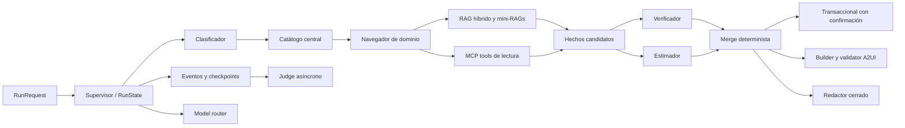
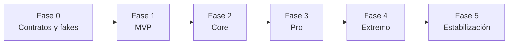

# Plan de implementación por fases de Diego hasta nivel Extremo

> **Estado:** plan de trabajo; no representa funcionalidad implementada.
>
> **Alcance:** agentes, orquestación, model gateway/router, RAG, MCP, dominios, A2UI server-side, evaluaciones, guardrails y eventos.
>
> **Responsable principal:** Diego.
>
> **Fecha base del plan:** 2026-07-30.
>
> **Fuentes de alcance:** [`diego_agentes.md`](./diego_agentes.md), [`Nexo_IA_Propuesta_Completa.md`](../../Nexo_IA_Propuesta_Completa.md) y [`Nexo_IA_Arquitectura_y_Plan.md`](../../Nexo_IA_Arquitectura_y_Plan.md).

## 1. Propósito del documento

Este documento convierte el alcance asignado a Diego en una secuencia implementable, verificable y ordenada por dependencias. Cubre desde la preparación de contratos y dobles de prueba hasta todas las capacidades comprometidas en los niveles MVP, Core, Pro y Extremo, y añade una fase final de estabilización para demostrar que el nivel Extremo es reproducible.

Este plan no autoriza ni incluye cambios de código en su creación. Cada ruta mencionada representa trabajo futuro.

El resultado final esperado es un núcleo inteligente que:

- reciba y entregue exclusivamente contratos tipados;
- clasifique solicitudes y coordine cinco dominios;
- recupere evidencia vigente, autorizada y citable;
- descubra y ejecute tools MCP con permisos y aislamiento de escrituras;
- mantenga estado serializable, eventos ordenados y checkpoints reanudables;
- construya A2UI declarativo, validado y con fallback seguro;
- seleccione modelos por política, salud, carga, costo y riesgo;
- ejecute verificación, estimación y consolidación determinista;
- detecte contradicciones y bloquee claims sin fundamento;
- mida calidad con gates deterministas y LLM-as-judge;
- genere borradores de prompts sin publicarlos automáticamente;
- demuestre paralelismo real, doble verificación y trazabilidad completa;
- pueda ejecutarse sin red mediante modelos, tools y respuestas grabadas equivalentes a los adapters reales.

## 2. Precedencia, supuestos y límites

### 2.1 Precedencia usada para resolver ambigüedades

1. `docs/team/diego_agentes.md` define la propiedad, los entregables y los criterios mínimos de Diego.
2. `Nexo_IA_Arquitectura_y_Plan.md` define los límites modulares, contratos técnicos, fases, pruebas y umbrales.
3. `Nexo_IA_Propuesta_Completa.md` amplía el comportamiento de producto, los casos de demostración y las capacidades Pro/Extremo.
4. Si dos fuentes dejan una decisión abierta, se elegirá la alternativa más segura, determinista, reversible y desacoplada de proveedor, y se documentará en un ADR.

### 2.2 Estado base observado

- Las carpetas bajo responsabilidad existen y contienen documentación de intención.
- No existen todavía los paquetes de implementación propuestos para `agents`, `orchestration`, `rag`, `mcp`, `a2ui`, `domains` y `evaluations`.
- Tampoco existen todavía los contratos, configuraciones, corpus, datasets y fixtures operativos propuestos en la arquitectura.
- Por lo anterior, el plan parte de una base documental y no presupone código funcional.

### 2.3 Supuestos no negociables

- La arquitectura inicial será un monolito modular; MCP conservará una frontera de proceso/protocolo.
- A2UI usará la versión 0.9.1 y catálogos cerrados. Nunca se ejecutará HTML, JavaScript, SQL ni código generado por un modelo.
- PostgreSQL con pgvector será la persistencia objetivo de RAG y checkpoints, pero las primeras interfaces podrán operar con almacenamiento fake.
- Los cinco namespaces iniciales serán `vehiculos`, `ayuntamiento_empresas`, `registro_civil`, `salud` y `ganaderia`.
- Los dos recorridos profundos del MVP serán vehículos y apertura de empresas.
- Registro civil, salud y ganadería se completarán en Core.
- Salud se limitará a orientación y navegación de servicios; no diagnosticará ni prescribirá.
- Las integraciones institucionales permanecerán mock mientras no existan acceso, contrato y credenciales. El mock conservará exactamente el wire shape del adapter futuro.
- Los proveedores y modelos concretos se configurarán mediante aliases; ningún agente dependerá directamente de un SDK de proveedor.
- No se introducirá Redis antes de que una medición y una topología distribuida lo justifiquen.
- Los montos se representarán en unidades menores más moneda; las fechas se normalizarán a UTC; los IDs serán opacos.
- El redactor solo recibirá `VerifiedFacts` cerrados y no podrá consultar RAG ni MCP.
- Solo el agente transaccional podrá solicitar tools de escritura.
- El judge nunca autorizará una acción ni sustituirá los gates deterministas.

### 2.4 Fuera del alcance directo de Diego

Diego define o consume contratos para estas capacidades, pero no es su propietario único:

- API HTTP, autenticación, RBAC de aplicación, SSE, webhooks y canales: Dani.
- Persistencia, migraciones, constraints, repositorios, vector schema y checkpoints físicos: Daher.
- Renderer A2UI, portal, workflow viewer y dashboard visual: Cris.
- Citas transaccionales, holds y restricciones de concurrencia: Dani y Daher.
- Deploy, healthchecks globales, CI/CD y release: Dani.

El trabajo de Diego no deberá invadir esos módulos. Cuando una dependencia no esté lista, se usará un puerto tipado y un fake contractual.

## 3. Definición global de terminado

El alcance de Diego se considerará completo hasta Extremo únicamente cuando se cumplan todos los gates siguientes.

| Área | Condición de aceptación |
|---|---|
| Clasificación | Dominio y trámite correctos en al menos 4 de los 5 casos oficiales. |
| Grounding | 100% de los claims críticos de requisitos, costos, ubicación y vigencia incluyen `source_id` y `fragment_id` activos. |
| Alucinación | 0 claims críticos inventados en el dataset oficial y la suite adversarial. |
| RAG | Recall@5 ≥ 0.80 y citation precision ≥ 0.90; no hay cruces de institución, dominio o vigencia. |
| Tools | Tool selection ≥ 0.90 y tool permitida para actor, dominio, operación y estado del run. |
| Escrituras | 100% de éxitos tienen identificador/folio verificable; ninguna escritura ocurre desde agentes no transaccionales. |
| Idempotencia | Repetir una confirmación o reanudar un run no duplica efectos. |
| Grafo | Estado serializable, checkpoints reproducibles, eventos secuenciados y merge independiente del orden. |
| Paralelismo | Verificador y estimador presentan solapamiento medido; el resultado equivale al baseline secuencial. |
| Contradicciones | Las contradicciones se conservan, explican y resuelven mediante reglas; ningún hecho rechazado alimenta una acción. |
| A2UI | 100% de las superficies aceptadas validan; todo componente, binding o action inválido produce fallback sin ejecución. |
| Trazabilidad | 100% de los runs reconstruibles por `trace_id`, incluyendo agentes, modelos, fuentes, tools, costo, latencia, errores y decisiones. |
| Model routing | Fallback por indisponibilidad, contrato inválido, contexto, presupuesto y salud; motivo y costo registrados. |
| Evaluación | Dataset versionado, evaluadores deterministas, judge con modelo distinto y promedio objetivo ≥ 4/5 sin reemplazar gates. |
| MCP Mapper | Una integración completa el ciclo `draft → validated → tested → approved → published` con auditoría y rollback/deprecación. |
| Seguridad | Prompt injection, tool injection, escalamiento de permisos y A2UI malicioso quedan bloqueados en pruebas. |
| Rendimiento | p95 end-to-end de demo ≤ 20 s y primer evento ≤ 2 s en el perfil acordado; todos los runs registran costo/tokens. |
| Reproducibilidad | Los cinco casos y los fallos críticos se ejecutan localmente sin proveedor externo usando fakes/recordings. |

## 4. Arquitectura objetivo bajo responsabilidad de Diego

### 4.1 Límites que deberán quedar protegidos

- `agents` razona sobre modelos Pydantic; no abre DB, no conoce FastAPI y no importa SDKs de canal.
- `orchestration` coordina y emite eventos; no renderiza UI, no contiene SQL y no llama Twilio.
- `rag` ingiere y recupera evidencia; no ejecuta tools ni redacta respuestas.
- `mcp` publica capacidades y ejecuta adapters; no almacena conocimiento documental ni decide el plan del run.
- `a2ui` construye y valida superficies; no consulta tablas ni autoriza acciones.
- `domains` contiene configuración, conocimiento, reglas y fixtures específicos; no duplica infraestructura transversal.
- `evaluations` mide salidas congeladas; no forma parte del camino de autorización de una escritura.
- `config` contiene políticas versionadas y no secretas; una configuración inválida detiene el arranque.
- `integrations/models` implementa adapters de proveedor detrás del gateway; los agentes solo conocen aliases y capacidades.

## 5. Contratos que deben congelarse antes del vertical slice

Los contratos son entregables compartidos. Dani custodia `contracts`, pero Diego deberá proponer, revisar y aprobar los campos de sus fronteras.

### 5.1 Contratos de ejecución

- `RunRequest`: run, trace, conversación, mensaje, canal, identidad, institución, roles, permisos, perfil, contexto deducido y budgets.
- `RunState`: estado del run, revisión de schema, tareas, intentos, hechos candidatos, hechos verificados, contradicciones, estimación, acciones, A2UI, respuesta, métricas y cursor de eventos.
- `RunResult`: estado final/parcial, `VerifiedFacts`, respuesta, A2UI, fuentes, acciones, warnings y métricas.
- `AgentTask`: objetivo, referencias de entrada, sources/tools permitidas, deadline, política de modelo, intento y presupuesto.
- `AgentResult`: estado, facts, citations, proposed tools, warnings, self-check y error normalizado.
- `ActionRequest`/`ActionResult`: action opaca, schema de input, versión esperada, consentimiento, idempotency key y confirmación verificable.

### 5.2 Contratos de hechos y evidencia

- `CandidateFact`: claim, valor tipado, dominio, origen, confianza, deducción y dependencias.
- `VerifiedFact`: claim aceptado, valor, citations, resultado de verificación, confianza y elegibilidad de escritura.
- `VerifiedFacts`: snapshot inmutable que recibe estimación final, A2UI y redactor.
- `SourceCitation`: `source_id`, `fragment_id`, versión, vigencia y posición relevante.
- `Contradiction`: facts implicados, fuentes/tools en conflicto, severidad, regla aplicada y estado.
- `Deduction`: valor, fuente, confianza, confirmación de usuario y `write_eligible`.

### 5.3 Contratos RAG

- `Source`, `Document`, `DocumentVersion`, `Chunk` y `CorpusVersion`.
- `RetrievalQuery`: consulta, dominio/mini-RAG, institución, roles, estado, vigencia, top-k y modo.
- `RetrievalResult`: fragmento, score lexical/vectorial/fusionado, metadata y citation.
- `IngestionResult`: altas, sin cambios, sustituciones, rechazos, checksums y versión de corpus.

### 5.4 Contratos MCP

- `ToolMetadata`: nombre, versión, dominio, modo, riesgo, roles, confirmación, idempotencia, timeout, reintentos y schemas.
- `ToolCall`: identidad/permiso efectivo, parámetros, deadline, action/trace/run ID e idempotency key cuando aplique.
- `ToolResult`: status, data tipada, provider, duración, replay de idempotencia y error normalizado.
- `ToolError`: código estable, retryable, outcome conocido/desconocido y detalles seguros.
- `IntegrationDraft`, `MapperValidation`, `ControlledTestResult`, `Approval` y `PublishedToolVersion`.

### 5.5 Contratos A2UI

- `CatalogDescriptor` y `ComponentDescriptor` versionados.
- Mensajes A2UI v0.9.1: `createSurface`, `updateDataModel` y `updateComponents`.
- `A2UISurface`, `A2UIAction`, `A2UIValidationResult` y `ChannelFallback`.
- Catálogo negociado por `catalog_id`; actions opacas y ligadas a schema/versión.

### 5.6 Contratos de modelos y evaluación

- `ModelTask`, `ModelPolicy`, `ModelCapabilities`, `ModelCandidate`, `ModelDecision` y `ModelInvocation`.
- Estados de salud `healthy`, `degraded`, `down` y `unknown`.
- `SelfCheckResult`, `DeterministicEvaluationResult`, `JudgeRequest`, `JudgeResult` y `EvaluationReport`.
- Cada resultado registra versión de dataset, rúbrica, prompts, aliases, seed/configuración y timestamps.

### 5.7 Contratos de skills operativas

- `SkillManifest`: ID, versión, objetivo, dominio, entradas, salidas y dueño.
- Fuentes y tools autorizadas, secuencia recomendada y ramas paralelizables.
- Datos reutilizables, condiciones de pregunta/deducción y requisitos de confirmación.
- Timeouts, retries, budgets, política de errores/escalamiento y criterios de éxito.
- Reglas de self-check/verificación y componentes A2UI recomendados.
- Referencias inmutables a prompts, schemas, policies y fixtures compatibles.

### 5.8 Contratos de eventos

Todos los eventos incluirán `event_id`, `trace_id`, `run_id`, `sequence`, timestamp UTC, actor, status y datos minimizados.

Familias mínimas:

- `run.queued`, `run.planning`, `run.started`, `run.waiting_confirmation`, `run.resumed`, `run.partial`, `run.completed`, `run.failed`, `run.cancelled`;
- `classification.started/completed/failed`;
- `plan.created/updated`;
- `agent.started/completed/retried/failed`;
- `rag.started/completed/filtered/failed`;
- `tool.requested/authorized/denied/started/completed/replayed/failed`;
- `model.selected/fallback/completed/failed`;
- `verification.completed` y `contradiction.detected/resolved/unresolved`;
- `checkpoint.saved/restored`;
- `a2ui.generated/validated/validation_failed/fallback`;
- `evaluation.started/completed/failed`;
- `prompt.drafted/validated/approved/rejected/published`;
- `corpus.drafted/validated/activated/rolled_back`.

## 6. Secuencia general y gates

No se iniciará una fase como línea principal hasta cumplir el gate de la anterior. Sí se permite preparar corpus, prompts y fixtures en paralelo cuando consuman contratos congelados y no comprometan decisiones pendientes.

## 7. Fase 0 — contratos, fakes y esqueleto verificable

### 7.1 Objetivo

Crear una base tipada y reproducible que permita trabajar sin DB, proveedores, canales ni sistemas institucionales reales. La fase termina cuando un `RunRequest` atraviesa un grafo mínimo con modelo falso, emite eventos válidos y produce un `RunResult` determinista.

### 7.2 Prerrequisitos

- Aprobación del alcance de este plan.
- Acuerdo con Dani, Daher y Cris sobre fronteras de propiedad.
- Confirmación de A2UI v0.9.1, cinco slugs de dominio y nombres iniciales de eventos.

### 7.3 Paquete F0.1 — decisiones y convenciones

- [ ] `DIE-F0-001` Crear un inventario de módulos y confirmar que cada responsabilidad tiene un único dueño.
- [ ] `DIE-F0-002` Registrar ADR de grafo LangGraph, estado serializable y política de checkpoints.
- [ ] `DIE-F0-003` Registrar ADR de model gateway por aliases y adapters.
- [ ] `DIE-F0-004` Registrar ADR de RAG híbrido PostgreSQL FTS + pgvector con repositorio inyectable.
- [ ] `DIE-F0-005` Registrar ADR de MCP como frontera de capacidades y aislamiento de writes.
- [ ] `DIE-F0-006` Registrar ADR de A2UI 0.9.1, catálogo cerrado y fallback seguro.
- [ ] `DIE-F0-007` Definir reglas de compatibilidad: cambios aditivos en v1 y versión nueva para cambios incompatibles.
- [ ] `DIE-F0-008` Definir convención de IDs, UTC, montos, errores, nombres de tools y namespaces.
- [ ] `DIE-F0-009` Definir política de PII para prompts, eventos, datasets, recordings y reportes.
- [ ] `DIE-F0-010` Documentar qué condiciones detienen el run, cuáles producen `partial` y cuáles permiten fallback.

**Evidencia:** ADR aprobados, glosario común, matriz de propiedad y lista de decisiones pendientes sin ambigüedad bloqueante.

### 7.4 Paquete F0.2 — schemas Pydantic y ejemplos de contrato

- [ ] `DIE-F0-011` Especificar todos los contratos de la sección 5 en Pydantic y JSON Schema compartido.
- [ ] `DIE-F0-012` Evitar tipos libres para estados, dominios, modos, riesgos, errores y eventos; usar enums versionados.
- [ ] `DIE-F0-013` Marcar qué campos son wire format y cuáles son exclusivamente internos.
- [ ] `DIE-F0-014` Añadir validadores para IDs opacos, timestamps UTC, montos y scores acotados.
- [ ] `DIE-F0-015` Definir invariantes de `RunState`: serializable, sin clientes/handles/coroutines y sin secretos.
- [ ] `DIE-F0-016` Definir invariantes de `VerifiedFacts`: snapshot inmutable, citations obligatorias para facts críticos y dependencias explícitas.
- [ ] `DIE-F0-017` Definir invariantes de actions: confirmación, versión esperada, permiso e idempotency key.
- [ ] `DIE-F0-018` Crear ejemplos válidos e inválidos de cada contrato.
- [ ] `DIE-F0-019` Crear fixtures de compatibilidad que puedan consumir backend, agentes, MCP, A2UI y frontend sin traducción implícita.
- [ ] `DIE-F0-020` Acordar changelog y proceso de aprobación de contratos con los otros propietarios.

**Evidencia:** schemas versionados, ejemplos y contract tests que fallan de forma accionable.

### 7.5 Paquete F0.3 — puertos y dobles de prueba

- [ ] `DIE-F0-021` Definir puertos para chat model, embeddings, retriever, tool registry/executor, checkpoint store, event sink, clock e ID factory.
- [ ] `DIE-F0-022` Crear fake chat model programable por escenario, sin matching frágil de texto completo.
- [ ] `DIE-F0-023` Permitir que el fake produzca success, salida inválida, timeout, rate limit y provider down.
- [ ] `DIE-F0-024` Crear fake embeddings determinista y documentar que solo sirve para pruebas.
- [ ] `DIE-F0-025` Crear retriever en memoria que aplique los mismos filtros lógicos que el repositorio final.
- [ ] `DIE-F0-026` Crear tool executor en memoria con success, timeout, schema error, permission denied y outcome desconocido.
- [ ] `DIE-F0-027` Crear checkpoint store y event sink en memoria con secuencia estricta.
- [ ] `DIE-F0-028` Inyectar clock e ID factory controlables para snapshots reproducibles.
- [ ] `DIE-F0-029` Crear fixtures mínimos de vehículos y apertura de empresas sin PII.
- [ ] `DIE-F0-030` Confirmar que sustituir un fake por un adapter no cambia los casos de uso ni los contratos.

**Evidencia:** unit tests sin red ni DB y tabla fake ↔ adapter real esperado.

### 7.6 Paquete F0.4 — configuración segura

- [ ] `DIE-F0-031` Diseñar schemas para `model_router`, `tool_registry`, `permissions`, catálogos y policies.
- [ ] `DIE-F0-032` Definir defaults que nieguen writes, proveedores desconocidos y tools sin versión.
- [ ] `DIE-F0-033` Separar configuración no secreta de referencias a secretos.
- [ ] `DIE-F0-034` Definir budgets por run, agente y llamada: deadline, costo, tokens, reintentos y concurrencia.
- [ ] `DIE-F0-035` Definir timeouts y retry policy por operación; prohibir retry automático de writes ambiguos.
- [ ] `DIE-F0-036` Hacer que configuración inválida falle al inicio con ruta, campo y motivo.
- [ ] `DIE-F0-037` Versionar políticas y propagar su versión a eventos/evaluaciones.

### 7.7 Paquete F0.5 — grafo mínimo y eventos

- [ ] `DIE-F0-038` Implementar conceptualmente la ruta `start → classify_fake → finalize_fake`.
- [ ] `DIE-F0-039` Definir reducers sin mutación compartida y con orden determinista.
- [ ] `DIE-F0-040` Emitir eventos al iniciar/terminar/fallar cada nodo.
- [ ] `DIE-F0-041` Guardar checkpoint después de transiciones significativas.
- [ ] `DIE-F0-042` Reanudar desde checkpoint y comprobar que no se repiten nodos ya confirmados.
- [ ] `DIE-F0-043` Aplicar deadline del run y producir error normalizado.
- [ ] `DIE-F0-044` Construir `RunResult` desde estado sin exponer datos internos.

### 7.8 Pruebas de Fase 0

- [ ] Round-trip JSON para cada schema.
- [ ] Rechazo de estado no serializable.
- [ ] Rechazo de tool write sin confirmación/idempotencia.
- [ ] Secuencia de eventos monotónica.
- [ ] Fake model con salida válida, inválida, timeout y fallback.
- [ ] Checkpoint y reanudación del grafo mínimo.
- [ ] Configuración inválida falla al arranque.
- [ ] Ejecuciones con reloj/IDs congelados producen snapshots idénticos.

### 7.9 Gate de salida de Fase 0

- [ ] Contratos v1 aceptados por consumidores.
- [ ] Un modelo falso recorre el grafo mínimo.
- [ ] El run emite eventos válidos y reanudables.
- [ ] Ninguna prueba requiere red, DB o credenciales.
- [ ] Los fakes y adapters previstos comparten contratos.
- [ ] Riesgos y decisiones abiertas tienen dueño y fecha de resolución por fase.

## 8. Fase 1 — MVP con dos recorridos completos

### 8.1 Objetivo

Completar vehículos y apertura de empresas de extremo a extremo con RAG híbrido, MCP mock, grafo secuencial, confirmación de escritura, folio, A2UI ciudadano, fuentes y trazabilidad. Web y WhatsApp son consumidores del mismo resultado; Diego entrega el núcleo y los contratos de canal, no los clientes.

### 8.2 Prerrequisitos

- Gate de Fase 0 en verde.
- Schemas de persistencia acordados con Daher.
- Contrato de `RunRequest`/`RunResult` y eventos acordado con Dani.
- Catálogo ciudadano mínimo acordado con Cris.

### 8.3 Paquete F1.1 — gateway básico de modelos

- [ ] `DIE-F1-001` Implementar interfaz única para chat estructurado y embeddings.
- [ ] `DIE-F1-002` Resolver aliases a un adapter sin exponer proveedor a los agentes.
- [ ] `DIE-F1-003` Validar siempre la salida contra el schema solicitado.
- [ ] `DIE-F1-004` Registrar alias solicitado/usado, tokens, costo estimado, duración, intento y error.
- [ ] `DIE-F1-005` Añadir un fallback simple por timeout, indisponibilidad o salida inválida.
- [ ] `DIE-F1-006` Respetar deadline y presupuesto restante antes de cada invocación.
- [ ] `DIE-F1-007` Mantener fake model como perfil obligatorio de pruebas y demo offline.
- [ ] `DIE-F1-008` Redactar logs para impedir exposición de prompts con PII o credenciales.

### 8.4 Paquete F1.2 — corpus e ingesta de los dos dominios

- [ ] `DIE-F1-009` Definir manifests de fuentes para vehículos y ayuntamiento/empresas.
- [ ] `DIE-F1-010` Exigir institución, origen, versión, publicación, vigencia, verificación, dominio, responsable, licencia, hash y estado.
- [ ] `DIE-F1-011` Separar claramente contenido sintético de contenido institucional autorizado.
- [ ] `DIE-F1-012` Normalizar archivos preservando original y trazabilidad de fragmentos.
- [ ] `DIE-F1-013` Definir chunking estable por tipo documental y guardar offsets/encabezados.
- [ ] `DIE-F1-014` Calcular checksum antes de ingerir y omitir versiones sin cambios.
- [ ] `DIE-F1-015` Crear nueva versión cuando cambia el contenido; nunca sobrescribir evidencia histórica.
- [ ] `DIE-F1-016` Marcar fuentes vencidas/sustituidas y excluirlas del retrieval activo.
- [ ] `DIE-F1-017` Generar embeddings mediante adapter y registrar modelo/dimensión/versión.
- [ ] `DIE-F1-018` Coordinar con Daher constraints e índices de documentos/chunks.
- [ ] `DIE-F1-019` Probar reingesta idempotente y ausencia de chunks duplicados.

### 8.5 Paquete F1.3 — retriever híbrido

- [ ] `DIE-F1-020` Implementar búsqueda lexical y vectorial detrás de un repositorio.
- [ ] `DIE-F1-021` Definir fusión/reranking determinista y estable ante empates.
- [ ] `DIE-F1-022` Aplicar filtros obligatorios de institución, dominio, estado, vigencia y permiso antes de devolver texto al agente.
- [ ] `DIE-F1-023` Limitar top-k, tamaño total y presupuesto de contexto.
- [ ] `DIE-F1-024` Devolver siempre citations completas y `corpus_version`.
- [ ] `DIE-F1-025` Tratar el contenido recuperado como datos no confiables, no como instrucciones.
- [ ] `DIE-F1-026` Detectar patrones de prompt injection documental y registrar señal sin obedecerlos.
- [ ] `DIE-F1-027` Implementar fallback cuando no existe evidencia suficiente: warning, pregunta mínima o respuesta parcial.
- [ ] `DIE-F1-028` Crear dataset de retrieval con fragmentos esperados, negativos y fuentes vencidas.
- [ ] `DIE-F1-029` Medir baseline recall@5 y citation precision.

### 8.6 Paquete F1.4 — clasificador

- [ ] `DIE-F1-030` Definir prompt versionado y entrada/salida estricta.
- [ ] `DIE-F1-031` Extraer dominios, múltiples intenciones, ubicación, perfil, urgencia operativa, entidades, faltantes y confianza.
- [ ] `DIE-F1-032` Conservar por separado `renovar_licencia` y `consultar_adeudo`.
- [ ] `DIE-F1-033` Impedir que el clasificador consulte RAG, invoque tools o produzca respuesta final.
- [ ] `DIE-F1-034` Aplicar fallback determinista para casos oficiales cuando la salida del modelo sea inválida.
- [ ] `DIE-F1-035` Marcar ambigüedad material sin inventar dominio.
- [ ] `DIE-F1-036` Ejecutar self-check de schema, dominio permitido y ausencia de acciones.
- [ ] `DIE-F1-037` Evaluar paráfrasis, múltiples intenciones, ruido y solicitudes fuera de alcance.

### 8.7 Paquete F1.5 — navegadores de vehículos y empresas

- [ ] `DIE-F1-038` Crear manifest `domain.yaml` de cada dominio con intents, agents, sources, tools, políticas y A2UI recomendado.
- [ ] `DIE-F1-039` Definir prompts versionados por dominio sin duplicar reglas transversales.
- [ ] `DIE-F1-040` Limitar cada navegador a su namespace, skills y tool allowlist.
- [ ] `DIE-F1-041` Recuperar requisitos, dependencias, ubicaciones, vigencia y relaciones como facts candidatos.
- [ ] `DIE-F1-042` Proponer tools; no ejecutarlas directamente si requieren coordinación o escritura.
- [ ] `DIE-F1-043` Registrar datos deducidos con fuente, confianza, confirmación y elegibilidad de write.
- [ ] `DIE-F1-044` Preguntar solo si falta un dato obligatorio, hay ambigüedad material, consentimiento o riesgo de operación incorrecta.
- [ ] `DIE-F1-045` Ejecutar self-check de sources, dominio, permisos, schema y unsupported claims.
- [ ] `DIE-F1-046` Crear fixtures golden estructurales, evitando snapshots de prosa completa.
- [ ] `DIE-F1-110` Crear skills operativas versionadas para los dos recorridos MVP.
- [ ] `DIE-F1-111` Declarar en cada skill qué pasos son secuenciales/paralelos, qué datos se reutilizan y cuándo se permite preguntar.
- [ ] `DIE-F1-112` Validar referencias de la skill contra catálogo, sources, tools, prompts, schemas y catálogo A2UI.
- [ ] `DIE-F1-113` Probar que una skill no amplía permisos y que una versión incompatible no puede activarse.

### 8.8 Paquete F1.6 — verificador secuencial

- [ ] `DIE-F1-047` Recibir hechos candidatos, citas y resultados de tools como snapshot.
- [ ] `DIE-F1-048` Verificar requisitos, costos, ubicaciones, fechas y resultado de acciones.
- [ ] `DIE-F1-049` Confirmar que cada citation soporta el claim específico.
- [ ] `DIE-F1-050` Rechazar fuentes vencidas, institución incorrecta o fragmentos inexistentes.
- [ ] `DIE-F1-051` Comparar evidencia documental con resultados de tools cuando ambos existan.
- [ ] `DIE-F1-052` Marcar `accepted`, `rejected` o `uncertain` con razón estable.
- [ ] `DIE-F1-053` Bloquear facts críticos sin evidencia y cualquier write basado en ellos.
- [ ] `DIE-F1-054` Verificar que una acción solo sea exitosa si existe folio/UUID/identificador verificable o mock explícito.
- [ ] `DIE-F1-055` Emitir `VerifiedFacts` sin permitir que el verificador redacte respuesta final.

### 8.9 Paquete F1.7 — estimador secuencial y determinista

- [ ] `DIE-F1-056` Definir reglas tipadas para pasos, dependencias, documentos faltantes, tiempos y costos.
- [ ] `DIE-F1-057` Representar montos en minor units y sumar con código.
- [ ] `DIE-F1-058` Construir un DAG de permisos para apertura de empresas con IDs estables.
- [ ] `DIE-F1-059` Detectar ciclos o dependencias faltantes y fallar de manera segura.
- [ ] `DIE-F1-060` Ordenar trámites topológicamente con desempate determinista.
- [ ] `DIE-F1-061` Calcular visitas/interacciones únicamente cuando existan reglas respaldadas.
- [ ] `DIE-F1-062` Registrar qué facts alimentan cada cálculo para poder invalidarlo después.
- [ ] `DIE-F1-063` Usar LLM solo para explicar resultados ya calculados, nunca para modificar valores.

### 8.10 Paquete F1.8 — MCP server, registry y policies

- [ ] `DIE-F1-064` Inicializar server MCP con initialize, list tools y call tool.
- [ ] `DIE-F1-065` Cargar tool registry versionado y validarlo al arranque.
- [ ] `DIE-F1-066` Filtrar tools por institución, rol, dominio, modo, riesgo y versión.
- [ ] `DIE-F1-067` Validar input antes del adapter y output después del adapter.
- [ ] `DIE-F1-068` Aplicar timeout por tool y retry solo a lecturas seguras/idempotentes.
- [ ] `DIE-F1-069` Normalizar errores de red, schema, permiso, timeout y provider.
- [ ] `DIE-F1-070` Registrar `tool.requested`, autorización, ejecución y resultado sin secretos.
- [ ] `DIE-F1-071` Impedir que una descripción/tool response modifique la allowlist o el plan.
- [ ] `DIE-F1-072` Mantener adapters mock con el mismo contrato de los futuros adapters reales.

### 8.11 Paquete F1.9 — tools mock del MVP

Vehículos:

- [ ] `vehiculos.consultar_adeudo` — lectura, datos sintéticos y resultado tipado.
- [ ] `vehiculos.localizar_modulo` — lectura, ubicación filtrada.
- [ ] `vehiculos.buscar_citas` — lectura, slots versionados.
- [ ] `vehiculos.reservar_cita` — escritura, confirmación e idempotencia obligatorias.

Ayuntamiento/empresas:

- [ ] `ayuntamiento.consultar_uso_suelo` — lectura.
- [ ] `ayuntamiento.calcular_costos` — cálculo determinista o adapter de lectura validado.
- [ ] `ayuntamiento.consultar_requisitos_negocio` — lectura cuando no provenga del RAG.
- [ ] `ayuntamiento.consultar_citas` — lectura.
- [ ] `ayuntamiento.registrar_solicitud` — escritura confirmada y con folio.

Para cada tool:

- [ ] Definir schema input/output, versión, modo, riesgo, roles, timeout, reintentos y errores.
- [ ] Crear success, not-found, permission-denied, timeout, malformed y provider-down.
- [ ] Añadir contract test mock ↔ schema.
- [ ] Confirmar que datos sintéticos se identifican como `is_mock`.

### 8.12 Paquete F1.10 — agente transaccional

- [ ] `DIE-F1-073` Recibir únicamente action autorizada, `VerifiedFacts`, consentimiento e idempotency key.
- [ ] `DIE-F1-074` Revalidar permiso, versión esperada y schema en el momento de ejecutar.
- [ ] `DIE-F1-075` Rechazar tools que no estén marcadas `write`.
- [ ] `DIE-F1-076` Ejecutar exactamente una tool por action confirmada salvo saga explícitamente diseñada.
- [ ] `DIE-F1-077` No reintentar un write con outcome desconocido.
- [ ] `DIE-F1-078` Considerar éxito solo un resultado con folio/UUID/ID verificable.
- [ ] `DIE-F1-079` Marcar el resultado mock de forma visible.
- [ ] `DIE-F1-080` Propagar replay idempotente sin emitir una segunda escritura.
- [ ] `DIE-F1-081` Producir `partial` si el outcome no puede verificarse.
- [ ] `DIE-F1-082` Emitir auditoría y eventos con parámetros minimizados.

### 8.13 Paquete F1.11 — grafo MVP secuencial

- [ ] `DIE-F1-083` Implementar nodos `normalize`, `classify`, `plan`, `retrieve`, `navigate`, `read_tools`, `verify`, `estimate`, `merge`, `build_a2ui`, `write_answer` y `finalize`.
- [ ] `DIE-F1-084` Mantener verificador y estimador secuenciales en MVP, conservando contratos aptos para fan-out posterior.
- [ ] `DIE-F1-085` Crear interrupt antes de toda escritura.
- [ ] `DIE-F1-086` Persistir action pendiente con schema y versión esperada.
- [ ] `DIE-F1-087` Reanudar con confirmación y ejecutar agente transaccional.
- [ ] `DIE-F1-088` No reejecutar retrieval, tools de lectura o redacción si el checkpoint ya contiene resultados válidos.
- [ ] `DIE-F1-089` Aplicar budgets y deadlines en supervisor y nodos.
- [ ] `DIE-F1-090` Emitir eventos en cada transición y conservar sequence monotónica.
- [ ] `DIE-F1-091` Manejar estados `queued`, `planning`, `running`, `waiting_confirmation`, `partial`, `succeeded`, `failed` y `cancelled`.
- [ ] `DIE-F1-092` Probar orden alterno de eventos externos sin corromper el estado.

### 8.14 Paquete F1.12 — redactor cerrado

- [ ] `DIE-F1-093` Aceptar solo `VerifiedFacts`, canal, locale y perfil.
- [ ] `DIE-F1-094` Prohibir puertos RAG/MCP en su constructor o dependencias.
- [ ] `DIE-F1-095` Adaptar tono para ciudadano sin añadir requisitos, montos, ubicaciones ni promesas.
- [ ] `DIE-F1-096` Incluir warnings, naturaleza mock y siguiente acción.
- [ ] `DIE-F1-097` Generar representación breve para WhatsApp desde los mismos facts.
- [ ] `DIE-F1-098` Ejecutar self-check de hechos nuevos mediante comparación estructural.
- [ ] `DIE-F1-099` Usar plantilla determinista si falla el modelo.

### 8.15 Paquete F1.13 — A2UI ciudadano mínimo

- [ ] `DIE-F1-100` Definir catálogo citizen v1 con texto, tarjeta, lista, checklist, alerta, resumen de costos, fuentes, slots y botón de confirmación.
- [ ] `DIE-F1-101` Versionar schemas de superficie, data model, component tree y action.
- [ ] `DIE-F1-102` Separar datos de estructura y prohibir propiedades desconocidas.
- [ ] `DIE-F1-103` Construir superficies desde templates/policies y facts, no desde código arbitrario generado.
- [ ] `DIE-F1-104` Validar versión, `catalog_id`, componentes, bindings, URLs y actions.
- [ ] `DIE-F1-105` Verificar que action IDs existan, estén visibles y correspondan al run/usuario.
- [ ] `DIE-F1-106` Crear fallback estático seguro por tipo de contenido.
- [ ] `DIE-F1-107` Crear fallback de lista numerada para WhatsApp.
- [ ] `DIE-F1-108` Emitir evento de validación/fallback con errores seguros.
- [ ] `DIE-F1-109` Entregar a Cris fixtures JSONL válidos e inválidos para el renderer.

### 8.16 Recorrido oficial `CAP-VEH-01`

- [ ] Detectar renovación y adeudo como intenciones distintas.
- [ ] Reutilizar perfil/vehículo sintético autorizado.
- [ ] Recuperar requisitos vigentes con citations.
- [ ] Consultar adeudo, módulos y citas mediante tools autorizadas.
- [ ] Calcular costo y documentos faltantes de forma determinista.
- [ ] Verificar hechos y resultados.
- [ ] Construir checklist, adeudo, módulos, slots, costos, fuentes y confirmación A2UI.
- [ ] Interrumpir antes de reservar.
- [ ] Reanudar con consentimiento e idempotency key.
- [ ] Obtener cita y folio mock verificable.
- [ ] Repetir confirmación sin crear otra cita.
- [ ] Reconstruir el run completo mediante `trace_id`.

### 8.17 Recorrido oficial `CAP-EMP-01`

- [ ] Clasificar “abrir una taquería en Durango”.
- [ ] Relacionar permisos con IDs y dependencias estables.
- [ ] Recuperar requisitos y costos con sources vigentes.
- [ ] Ordenar trámites y sumar costos mediante código.
- [ ] Identificar documentos, tiempos y dependencias.
- [ ] Consultar oficinas/citas cuando aplique.
- [ ] Mostrar flujo, checklist, tabla de costos, timeline y fuentes.
- [ ] Interrumpir antes de iniciar solicitud.
- [ ] Ejecutar registro mock únicamente tras confirmación.
- [ ] Devolver folio verificable e idempotente.

### 8.18 Pruebas de Fase 1

- [ ] Unitarias de schemas, reducers, policies, cálculos y validadores.
- [ ] Contract tests de agentes, RAG, MCP, eventos y A2UI.
- [ ] Retrieval de fragmento esperado, fuente vencida y namespace incorrecto.
- [ ] Tool selection, permiso denegado, timeout y schema malformado.
- [ ] Inyección dentro de documento y dentro de tool response.
- [ ] Reanudación antes y después de la confirmación.
- [ ] Confirmación duplicada y outcome desconocido.
- [ ] A2UI válido, componente no permitido, binding roto y action falsificada.
- [ ] Golden structural tests con fake model.
- [ ] E2E offline de ambos recorridos.

### 8.19 Gate de salida de Fase 1

- [ ] Los dos casos concluyen con respuesta, fuentes, A2UI y traza.
- [ ] Cada acción mock devuelve folio/ID verificable.
- [ ] No existe write sin agente transaccional, permiso, confirmación e idempotencia.
- [ ] Fuentes vencidas y cruces de namespace están bloqueados.
- [ ] Reanudar no duplica efectos.
- [ ] La demo offline no necesita proveedor, canal ni sistema institucional.
- [ ] Cris, Dani y Daher disponen de fixtures/contratos para integrar sus módulos.

## 9. Fase 2 — Core con cinco dominios y evaluación base

### 9.1 Objetivo

Extender el patrón estable del MVP a registro civil, salud y ganadería; completar el catálogo central, permisos por tool, corpus versionado, eventos de workflow y el dataset de evaluación de los cinco casos.

### 9.2 Prerrequisitos

- Gate MVP en verde.
- Baselines de RAG, clasificación y tool selection almacenados.
- Patrón de dominio documentado y repetible.
- Integración de eventos disponible para replay aunque el viewer final aún no exista.

### 9.3 Paquete F2.1 — catálogo central

- [ ] `DIE-F2-001` Definir entidades de dependencia, dominio, módulo, servicio, trámite, fuente, agente, tool, skill, política, modelo y componente A2UI.
- [ ] `DIE-F2-002` Definir relaciones entre trámites y dependencias con IDs estables.
- [ ] `DIE-F2-003` Cargar manifests de dominio mediante schema versionado.
- [ ] `DIE-F2-004` Validar que sources/tools/prompts referenciados existan y sean compatibles.
- [ ] `DIE-F2-005` Resolver capabilities permitidas por institución, dominio, rol y estado.
- [ ] `DIE-F2-006` Hacer que el supervisor consulte el catálogo antes de delegar.
- [ ] `DIE-F2-007` Fallar de forma segura ante referencias huérfanas, versiones incompatibles o dominio desconocido.
- [ ] `DIE-F2-008` Registrar versión del catálogo en plan, eventos y evaluación.
- [ ] `DIE-F2-009` Definir proceso de draft, review, activate y deprecate del catálogo.

### 9.4 Paquete F2.2 — permisos completos de tools

- [ ] `DIE-F2-010` Materializar matriz institución × rol × dominio × tool × operación.
- [ ] `DIE-F2-011` Separar descubrimiento, propuesta, lectura, confirmación y ejecución de write.
- [ ] `DIE-F2-012` Filtrar la lista de tools antes de presentarla al modelo.
- [ ] `DIE-F2-013` Revalidar autorización dentro del executor para evitar confiar en el agente.
- [ ] `DIE-F2-014` Denegar por default tools y versiones no registradas.
- [ ] `DIE-F2-015` Añadir reason codes auditables sin filtrar información sensible.
- [ ] `DIE-F2-016` Probar escalamiento horizontal entre dominios y roles.

### 9.5 Paquete F2.3 — corpus versionado de cinco dominios

- [ ] `DIE-F2-017` Crear manifests y corpus demo autorizado para registro civil, salud y ganadería.
- [ ] `DIE-F2-018` Completar los cinco namespaces con activos, vencidos, sustituidos y casos negativos.
- [ ] `DIE-F2-019` Generar `CorpusVersion` por dominio y snapshot global.
- [ ] `DIE-F2-020` Registrar lineage documento → versión → chunks → embeddings.
- [ ] `DIE-F2-021` Crear diff entre versiones y reporte de reingesta.
- [ ] `DIE-F2-022` Bloquear activación si faltan metadata, licencia, responsable, hash o vigencia.
- [ ] `DIE-F2-023` Ejecutar evaluation smoke antes de activar una versión.
- [ ] `DIE-F2-024` Coordinar con Daher persistencia, aislamiento e índices.

### 9.6 Paquete F2.4 — dominio registro civil

- [ ] `DIE-F2-025` Crear manifest, prompts, fuentes, decision rules, fixtures y allowlist.
- [ ] `DIE-F2-026` Distinguir copia, aclaración y corrección.
- [ ] `DIE-F2-027` Formular como máximo la pregunta indispensable cuando existan procedimientos igualmente probables.
- [ ] `DIE-F2-028` Recuperar requisitos, costos, tiempos y oficialía con fuentes.
- [ ] `DIE-F2-029` Implementar tools `registro_civil.clasificar_tipo_correccion`, `localizar_oficialia`, `consultar_disponibilidad` y solicitud mock si aplica.
- [ ] `DIE-F2-030` Impedir modificación real de actas y asesoría jurídica.
- [ ] `DIE-F2-031` Construir ruta A2UI y fallback de canal.
- [ ] `DIE-F2-032` Completar `CAP-RC-01`.

### 9.7 Paquete F2.5 — dominio salud

- [ ] `DIE-F2-033` Crear manifest, prompts, fuentes, safety policy, fixtures y allowlist.
- [ ] `DIE-F2-034` Clasificar siempre el caso como orientación/navegación, no diagnóstico.
- [ ] `DIE-F2-035` Prohibir diagnóstico, prescripción, interpretación clínica y sustitución profesional en prompts y gates deterministas.
- [ ] `DIE-F2-036` Definir respuestas seguras ante contenido clínico fuera del alcance.
- [ ] `DIE-F2-037` Recuperar institución/unidad, servicios, requisitos, canales y horarios con sources.
- [ ] `DIE-F2-038` Implementar tools `salud.localizar_unidad_salud`, `consultar_servicios`, `consultar_requisitos` y `buscar_horarios`.
- [ ] `DIE-F2-039` Permitir cita solo si la integración/autorización existe; de otro modo orientar claramente.
- [ ] `DIE-F2-040` Crear evaluaciones adversariales de diagnóstico, medicación y urgencia no autorizada.
- [ ] `DIE-F2-041` Completar `CAP-SAL-01` sin ninguna afirmación clínica.

### 9.8 Paquete F2.6 — dominio ganadería

- [ ] `DIE-F2-042` Crear manifest, prompts, movement rules, fuentes, animal sintético, fixtures y allowlist.
- [ ] `DIE-F2-043` Identificar animal únicamente con datos sintéticos/autorizados.
- [ ] `DIE-F2-044` Recuperar historial sanitario y requisitos de movilización.
- [ ] `DIE-F2-045` Implementar tools `ganaderia.consultar_animal`, `consultar_historial`, `registrar_vacuna`, `validar_movilizacion` y alerta autorizada.
- [ ] `DIE-F2-046` Exigir confirmación, actor, regla, idempotencia y folio para registrar vacuna.
- [ ] `DIE-F2-047` Rastrear decisión de movilización hasta una regla vigente.
- [ ] `DIE-F2-048` Prohibir diagnóstico veterinario o alerta sin regla/fuente autorizada.
- [ ] `DIE-F2-049` Completar `CAP-GAN-01`.

### 9.9 Paquete F2.7 — preguntas mínimas y contexto deducido

- [ ] `DIE-F2-050` Centralizar precedencia de fuentes de contexto: mensaje, historial autorizado, perfil, ubicación, documentos, tools, catálogo, defaults seguros y confirmaciones.
- [ ] `DIE-F2-051` No volver a preguntar datos ya confirmados o recuperables por tool autorizada.
- [ ] `DIE-F2-052` Mantener deducciones separadas de facts explícitos.
- [ ] `DIE-F2-053` Prohibir usar en writes una deducción no confirmada o no elegible.
- [ ] `DIE-F2-054` Registrar cantidad de preguntas y porcentaje de deducciones correctas.
- [ ] `DIE-F2-055` Crear tests multi-turn y de contexto obsoleto/contradictorio.

### 9.10 Paquete F2.8 — eventos para workflow visual

- [ ] `DIE-F2-056` Emitir eventos suficientes para reconstruir nodos, ramas, RAG, tools, modelos, latencias, errores y reintentos.
- [ ] `DIE-F2-057` Separar payload público del workflow y payload restringido de auditoría.
- [ ] `DIE-F2-058` Mantener secuencia por run y correlación parent/child.
- [ ] `DIE-F2-059` Incluir estado inicial/final de cada nodo y motivo de routing.
- [ ] `DIE-F2-060` Crear replay fixtures con success, partial, retry, permission denied y confirmación.
- [ ] `DIE-F2-061` Entregar a Cris un event mapping estable para grafo/timeline.
- [ ] `DIE-F2-062` Probar reconexión lógica desde una sequence conocida con Dani.

### 9.11 Paquete F2.9 — dataset y evaluadores deterministas

- [ ] `DIE-F2-063` Crear `capstone_v1` con los cinco casos oficiales y paráfrasis.
- [ ] `DIE-F2-064` Guardar dominio/trámite esperado, facts críticos, fragments esperados, tools, preguntas máximas, actions y A2UI requerido.
- [ ] `DIE-F2-065` Añadir casos negativos, fuera de dominio, fuente vencida y permiso insuficiente.
- [ ] `DIE-F2-066` Añadir ataques de prompt injection en mensaje, documento y tool response.
- [ ] `DIE-F2-067` Implementar métricas de domain/trámite exact match.
- [ ] `DIE-F2-068` Implementar source coverage, citation precision y unsupported critical claims.
- [ ] `DIE-F2-069` Implementar tool selection y permission compliance.
- [ ] `DIE-F2-070` Implementar A2UI schema validity y required-component coverage.
- [ ] `DIE-F2-071` Implementar escritura verificable, preguntas mínimas y trazabilidad.
- [ ] `DIE-F2-072` Congelar fake/recordings, configuración y versión de corpus por baseline.
- [ ] `DIE-F2-073` Producir reporte JSON y Markdown comparable entre commits/releases.
- [ ] `DIE-F2-074` Completar skills operativas de registro civil, salud y ganadería.
- [ ] `DIE-F2-075` Añadir casos de prueba por secuencia, pregunta mínima, timeout, escalamiento y fallback de cada skill.
- [ ] `DIE-F2-076` Registrar versión de skill utilizada en el plan, los eventos y el reporte de evaluación.

### 9.12 Pruebas de Fase 2

- [ ] Matriz 5 dominios × intenciones oficiales y paráfrasis.
- [ ] Aislamiento de namespaces, institución, roles y tools.
- [ ] Fuente sustituida/vencida con score alto no se entrega.
- [ ] Registro civil pregunta solo el diferenciador.
- [ ] Salud rechaza diagnóstico/prescripción y conserva utilidad.
- [ ] Ganadería no duplica vacuna y cita regla vigente.
- [ ] Replay de eventos reconstruye el mismo workflow.
- [ ] Todos los corpus pueden reingerirse sin duplicar chunks.
- [ ] Reporte eval reproducible con fake model.

### 9.13 Gate de salida de Fase 2

- [ ] Los cinco casos son demostrables y al menos 4/5 clasifican dominio y trámite correctamente.
- [ ] Todos devuelven ruta, fuentes y tool mock cuando aplica.
- [ ] El catálogo central gobierna dominios, fuentes, agents y tools.
- [ ] El corpus es versionado, auditable e idempotente.
- [ ] El workflow se reconstruye solo desde eventos.
- [ ] El baseline Core queda almacenado y comparable.

## 10. Fase 3 — Pro: routing automático, MCP Mapper, voz y A2UI avanzado

### 10.1 Objetivo

Demostrar integración dinámica y generación controlada: router automático de modelos, MCP Mapper, contexto de voz, formularios A2UI, superficies administrativas iniciales y adapters reales/sandbox sin romper la ruta offline.

### 10.2 Prerrequisitos

- Gate Core en verde.
- Contratos y catálogo sin cambios incompatibles pendientes.
- Dataset base, trazas y presupuestos disponibles.
- Sandbox/credenciales solo si fueron entregados por sus dueños; de lo contrario se usan recordings.

### 10.3 Paquete F3.1 — model router automático

- [ ] `DIE-F3-001` Definir políticas por tipo de tarea: clasificación, extracción, navegación, supervisor, verificación, redacción, visión y judge.
- [ ] `DIE-F3-002` Evaluar complejidad, riesgo, privacidad, modalidad, longitud de contexto, costo y latencia.
- [ ] `DIE-F3-003` Filtrar candidatos que no soporten schema, modalidad, contexto o política de datos.
- [ ] `DIE-F3-004` Ordenar candidatos con score/policy explicable y estable.
- [ ] `DIE-F3-005` Reservar presupuesto antes de invocar y reconciliar costo al terminar.
- [ ] `DIE-F3-006` Escalar precisión tras salida inválida solo si existe deadline/costo.
- [ ] `DIE-F3-007` Aplicar fallback a fake/template para demo cuando proveedores se agoten.
- [ ] `DIE-F3-008` Registrar decisión, alternativas consideradas y motivo sin revelar secretos.
- [ ] `DIE-F3-009` Crear policy tests por tarea, riesgo, privacidad, contexto y presupuesto.
- [ ] `DIE-F3-010` Mantener health/load-aware routing avanzado reservado para Fase 4.

### 10.4 Paquete F3.2 — ciclo de vida del MCP Mapper

- [ ] `DIE-F3-011` Definir estados `draft`, `parsed`, `validated`, `tested`, `approved`, `published`, `deprecated` y `rejected`.
- [ ] `DIE-F3-012` Importar OpenAPI 3.x o configuración manual con límites de tamaño/recursión.
- [ ] `DIE-F3-013` Resolver referencias de forma segura y bloquear referencias/URLs no permitidas.
- [ ] `DIE-F3-014` Seleccionar explícitamente operaciones; nunca publicar todas por default.
- [ ] `DIE-F3-015` Normalizar operation ID, nombre de tool, descripción, parámetros y respuesta.
- [ ] `DIE-F3-016` Generar schemas cerrados y rechazar tipos ambiguos o payloads arbitrarios.
- [ ] `DIE-F3-017` Clasificar lectura/escritura y riesgo; exigir revisión humana para writes.
- [ ] `DIE-F3-018` Asignar dominio, agentes, roles, permisos, timeout, retries, rate limit y datos sensibles.
- [ ] `DIE-F3-019` Referenciar autenticación/secretos; nunca copiarlos a prompts, config o tool metadata visible.
- [ ] `DIE-F3-020` Definir egress allowlist y bloquear hosts privados/no autorizados según entorno.
- [ ] `DIE-F3-021` Ejecutar prueba de conectividad sin efectos cuando sea posible.
- [ ] `DIE-F3-022` Ejecutar prueba controlada con datos sintéticos y sandbox.
- [ ] `DIE-F3-023` Validar resultado contra schema y registrar evidencia.
- [ ] `DIE-F3-024` Requerir aprobación con actor, timestamp, diff y versión.
- [ ] `DIE-F3-025` Publicar versión inmutable en registry sin reemplazar silenciosamente una versión activa.
- [ ] `DIE-F3-026` Probar deprecación/rollback y comportamiento de runs que referencian una versión anterior.

### 10.5 Paquete F3.3 — seguridad del Mapper

- [ ] `DIE-F3-027` Probar OpenAPI malformado, referencias circulares y schema bombs.
- [ ] `DIE-F3-028` Probar descripciones con prompt injection o instrucciones de escalamiento.
- [ ] `DIE-F3-029` Probar operación presentada como lectura que produce efectos.
- [ ] `DIE-F3-030` Probar hosts/redirects no autorizados y exfiltración de headers.
- [ ] `DIE-F3-031` Probar schemas con campos secretos o PII excesiva.
- [ ] `DIE-F3-032` Verificar que draft/test no hacen la tool visible a agentes.
- [ ] `DIE-F3-033` Verificar que ninguna tool se publica sin test y aprobación.

### 10.6 Paquete F3.4 — integración de un adapter real o sandbox

- [ ] `DIE-F3-034` Elegir con Dani una operación de bajo riesgo y contrato estable.
- [ ] `DIE-F3-035` Crear recording sanitizado antes de depender de red.
- [ ] `DIE-F3-036` Ejecutar los mismos contract tests contra mock y adapter.
- [ ] `DIE-F3-037` Normalizar timeout, auth error, rate limit, schema drift y provider error.
- [ ] `DIE-F3-038` Añadir circuit breaker básico en la frontera correspondiente.
- [ ] `DIE-F3-039` Confirmar que cambiar provider no modifica supervisor, agentes o dominio.
- [ ] `DIE-F3-040` Conservar ruta de demo offline.

### 10.7 Paquete F3.5 — contexto de voz

- [ ] `DIE-F3-041` Definir `VoiceTurn` normalizado y su mapping a `RunRequest`.
- [ ] `DIE-F3-042` Tratar transcripción como input no confiable con confianza y timestamps.
- [ ] `DIE-F3-043` Manejar turnos parciales, interrupciones, silencio, repetición y timeout.
- [ ] `DIE-F3-044` Evitar confirmar writes con una transcripción ambigua.
- [ ] `DIE-F3-045` Exigir confirmación verbal explícita y registrar evidencia de consentimiento sin audio sensible.
- [ ] `DIE-F3-046` Producir respuesta breve y enumerada desde `VerifiedFacts`.
- [ ] `DIE-F3-047` Definir fallback a texto/WhatsApp cuando falla STT/TTS o se excede latencia.
- [ ] `DIE-F3-048` Crear fixtures grabados/sintéticos para ejecutar pruebas sin Twilio.

### 10.8 Paquete F3.6 — formularios A2UI

- [ ] `DIE-F3-049` Ampliar catálogo con form, field, date, select, validation summary y confirmación.
- [ ] `DIE-F3-050` Generar campos únicamente desde un action/input schema autorizado.
- [ ] `DIE-F3-051` Minimizar campos y prellenar solo datos confirmados/permitidos.
- [ ] `DIE-F3-052` No exponer secretos, campos internos, IDs de provider ni PII no necesaria.
- [ ] `DIE-F3-053` Validar tipos, required, formatos, límites y opciones en servidor.
- [ ] `DIE-F3-054` Enviar solo `action_id`, expected version y campos definidos.
- [ ] `DIE-F3-055` Mantener fallback multicanal para formularios no renderizables.
- [ ] `DIE-F3-056` Probar field injection, overposting, action swapping y schema version mismatch.

### 10.9 Paquete F3.7 — A2UI administrativo y analítica controlada inicial

- [ ] `DIE-F3-057` Definir catálogo admin separado del ciudadano.
- [ ] `DIE-F3-058` Permitir tabla, métrica, gráfica, filtros y panel de fuentes dentro de allowlist.
- [ ] `DIE-F3-059` Convertir lenguaje natural a una intención analítica tipada, no a SQL libre.
- [ ] `DIE-F3-060` Validar dimensión, métrica, filtros, periodo, institución y rol.
- [ ] `DIE-F3-061` Delegar consulta parametrizada y transformación determinista a la capa autorizada.
- [ ] `DIE-F3-062` Construir A2UI solo a partir del resultado agregado validado.
- [ ] `DIE-F3-063` Limitar filas, granularidad, rango temporal y posibilidad de reidentificación.
- [ ] `DIE-F3-064` Auditar intención, consulta autorizada, agregación y superficie.
- [ ] `DIE-F3-065` Completar “consultas más frecuentes por dominio” con fixture/datos de demo.

### 10.10 Paquete F3.8 — observabilidad de agentes

- [ ] `DIE-F3-066` Mapear eventos de dominio a spans sin cambiar el contrato del workflow.
- [ ] `DIE-F3-067` Propagar trace/span context hacia modelos, RAG y MCP.
- [ ] `DIE-F3-068` Registrar duración, tokens, costo, retry, cache/fallback y outcome.
- [ ] `DIE-F3-069` Aplicar masking antes de exportar.
- [ ] `DIE-F3-070` Verificar paridad suficiente entre JSONL y OTel para reconstrucción.

### 10.11 Pruebas de Fase 3

- [ ] Routing por tarea, riesgo, privacidad, contexto y presupuesto.
- [ ] Fallback por timeout, rate limit, salida inválida y provider down.
- [ ] Importación Mapper válida, inválida, maliciosa y con operación write.
- [ ] Draft no visible, aprobación obligatoria y publicación versionada.
- [ ] Mock y sandbox producen resultados contractualmente equivalentes.
- [ ] Voz ambigua no confirma una acción.
- [ ] Formularios bloquean overposting/action swapping.
- [ ] Analítica NL no produce SQL arbitrario ni cruza institución.
- [ ] Eventos y spans correlacionan el mismo `trace_id`.

### 10.12 Gate de salida de Fase 3

- [ ] Una integración completa draft → test → aprobación → publicación.
- [ ] Un adapter sandbox/real conserva la misma traza y contrato que el mock, o existe replay equivalente documentado si faltan credenciales.
- [ ] El router selecciona modelos por política y respeta budgets.
- [ ] Voz conserva contexto, seguridad y fallback.
- [ ] Formularios y dashboard NL generan A2UI validado.
- [ ] La ruta offline sigue completamente funcional.

## 11. Fase 4 — Extremo

### 11.1 Objetivo

Añadir capacidades diferenciales sin debilitar los gates existentes: paralelismo real, merge determinista, contradicciones, mini-RAGs, doble verificación, LLM-as-judge, prompt assistant, actualización controlada de corpus, personalización avanzada, routing por salud/carga y generación administrativa segura.

### 11.2 Prerrequisitos

- Gate Pro en verde.
- Baselines de precisión, costo y latencia disponibles.
- Eventos, checkpoints, corpus versions, model invocations y reportes eval persistibles.
- Configuración y datasets congelables para comparaciones.

### 11.3 Paquete F4.1 — fan-out verificador/estimador

- [ ] `DIE-F4-001` Crear snapshot inmutable de hechos candidatos para ambas ramas.
- [ ] `DIE-F4-002` Iniciar verificador y estimador desde el mismo checkpoint lógico.
- [ ] `DIE-F4-003` Asegurar que ninguna rama muta objetos compartidos.
- [ ] `DIE-F4-004` Asignar task IDs, deadlines y budgets independientes.
- [ ] `DIE-F4-005` Emitir eventos de inicio/fin suficientes para medir solapamiento.
- [ ] `DIE-F4-006` Esperar ambas ramas o aplicar política explícita de partial/deadline.
- [ ] `DIE-F4-007` Implementar merge determinista independiente del orden de llegada.
- [ ] `DIE-F4-008` Invalidar cálculos que dependan de facts rechazados.
- [ ] `DIE-F4-009` Definir comportamiento si verifier falla, estimator falla o ambos fallan.
- [ ] `DIE-F4-010` Guardar checkpoint antes del fan-out y después del merge.
- [ ] `DIE-F4-011` Reanudar una sola rama fallida sin repetir la completada.
- [ ] `DIE-F4-012` Comparar resultado estructural con baseline secuencial.
- [ ] `DIE-F4-013` Demostrar solapamiento real y mejora/impacto de p50/p95.

### 11.4 Paquete F4.2 — modelo de contradicciones

- [ ] `DIE-F4-014` Detectar contradicción de valor, vigencia, jurisdicción, identidad, tool vs documento y source vs source.
- [ ] `DIE-F4-015` Conservar ambos hechos y evidencias; no sobrescribir silenciosamente.
- [ ] `DIE-F4-016` Asignar severidad según impacto informativo/transaccional.
- [ ] `DIE-F4-017` Aplicar precedencia determinista por autoridad, vigencia, institución y resultado verificable.
- [ ] `DIE-F4-018` Reconsultar evidencia solo cuando la policy y budget lo permitan.
- [ ] `DIE-F4-019` Pedir confirmación al usuario solo cuando sea resoluble por dato personal/autorizado.
- [ ] `DIE-F4-020` Bloquear write si permanece una contradicción crítica.
- [ ] `DIE-F4-021` Permitir respuesta parcial con warning para contradicción no crítica.
- [ ] `DIE-F4-022` Invalidar estimates/actions dependientes y recalcular determinísticamente.
- [ ] `DIE-F4-023` Emitir eventos detectada/resuelta/no resuelta con referencias.
- [ ] `DIE-F4-024` Crear fixtures de costo distinto, fuente vencida, tool divergente y jurisdicción incorrecta.

### 11.5 Paquete F4.3 — mini-RAGs especializados

- [ ] `DIE-F4-025` Definir registry de mini-RAGs por dominio, intención, permisos y corpus version.
- [ ] `DIE-F4-026` Dividir primero el dominio con mayor ganancia medida; para ganadería: sanidad, movilización, inventario, trazabilidad y propietarios.
- [ ] `DIE-F4-027` Añadir subíndices solo con dataset, metadata y criterio de routing verificable.
- [ ] `DIE-F4-028` Implementar router de retrieval determinista/catalog-driven antes de usar LLM.
- [ ] `DIE-F4-029` Permitir multi-retrieval cuando la solicitud cubra más de un mini-RAG.
- [ ] `DIE-F4-030` Mantener filtros de institución, vigencia y roles en cada subíndice.
- [ ] `DIE-F4-031` Consolidar resultados y deduplicar por source/fragment sin perder scores.
- [ ] `DIE-F4-032` Detectar contradicciones entre mini-RAGs.
- [ ] `DIE-F4-033` Comparar recall, precision, latencia y tokens contra el namespace general.
- [ ] `DIE-F4-034` Conservar fallback al namespace general si el mini-RAG no tiene cobertura.
- [ ] `DIE-F4-035` Evitar reindexar otros dominios al actualizar uno.

### 11.6 Paquete F4.4 — doble verificación

- [ ] `DIE-F4-036` Hacer obligatorio el self-check tipado de cada agente.
- [ ] `DIE-F4-037` Ejecutar validación estructural inmediata y rechazar output incompleto.
- [ ] `DIE-F4-038` Ejecutar verificador independiente sobre el consolidado.
- [ ] `DIE-F4-039` Ejecutar evaluadores deterministas de claims críticos, permisos y writes.
- [ ] `DIE-F4-040` Ejecutar judge después de responder o en modo offline, nunca antes de autorizar una acción.
- [ ] `DIE-F4-041` Evitar repetir trabajo completo; asignar una verificación específica a cada capa.
- [ ] `DIE-F4-042` Registrar qué gate aceptó/rechazó cada fact/action.
- [ ] `DIE-F4-043` Definir fallback seguro cuando las capas discrepan.
- [ ] `DIE-F4-044` Medir falsos positivos/negativos y costo adicional de la doble verificación.

### 11.7 Paquete F4.5 — LLM-as-judge

- [ ] `DIE-F4-045` Versionar rúbrica de dominio, trámite, tool, fidelidad, completitud, claridad, facts inventados, perfil, acción, A2UI, preguntas y permisos.
- [ ] `DIE-F4-046` Usar preferentemente un proveedor/modelo diferente al generador.
- [ ] `DIE-F4-047` Entregar al judge solicitud, respuesta, facts, citations y policy minimizados.
- [ ] `DIE-F4-048` Exigir salida `JudgeResult` tipada con evidencia breve.
- [ ] `DIE-F4-049` Impedir que el judge invoque tools, modifique facts o cambie status de la acción.
- [ ] `DIE-F4-050` Ejecutar de forma asíncrona/post-response o en batch offline.
- [ ] `DIE-F4-051` Calibrar con casos positivos, negativos y deliberadamente ambiguos.
- [ ] `DIE-F4-052` Medir repetibilidad y discrepancia contra revisión humana/gates.
- [ ] `DIE-F4-053` Registrar generator/judge model, rúbrica, costo, latencia y corpus.
- [ ] `DIE-F4-054` Tratar discrepancia como dato analítico, no como autorización.

### 11.8 Paquete F4.6 — prompt assistant

- [ ] `DIE-F4-055` Limitar salida a drafts de prompt, tool description, JSON Schema, casos, reglas y templates de skill.
- [ ] `DIE-F4-056` Recibir solo contexto aprobado y objetivo explícito.
- [ ] `DIE-F4-057` Generar artefactos tipados con versión y provenance.
- [ ] `DIE-F4-058` Ejecutar validación de schema y lint de instrucciones.
- [ ] `DIE-F4-059` Escanear intento de exfiltración, escalamiento de tools y conflicto con policies.
- [ ] `DIE-F4-060` Generar automáticamente casos positivos, negativos y adversariales.
- [ ] `DIE-F4-061` Ejecutar el draft en sandbox con fake/recordings.
- [ ] `DIE-F4-062` Comparar contra baseline antes de proponer aprobación.
- [ ] `DIE-F4-063` Exigir revisión/approval administrativa.
- [ ] `DIE-F4-064` Publicar como versión inmutable; conservar rollback.
- [ ] `DIE-F4-065` Prohibir publicación automática bajo cualquier score del propio agente.

### 11.9 Paquete F4.7 — routing por salud, carga y precisión

- [ ] `DIE-F4-066` Recibir señales de health, latencia, rate limit, error rate y capacidad.
- [ ] `DIE-F4-067` Usar ventanas/TTL para evitar decisiones con health obsoleto.
- [ ] `DIE-F4-068` Implementar circuit breaker y periodo de recuperación por adapter.
- [ ] `DIE-F4-069` Considerar carga/concurrencia junto con riesgo, contexto, modalidad, costo y deadline.
- [ ] `DIE-F4-070` Aplicar hysteresis/cooldown para evitar cambio oscilante de modelo.
- [ ] `DIE-F4-071` No bajar de una clase mínima de precisión para tareas críticas.
- [ ] `DIE-F4-072` Respetar residencia/privacidad aunque el proveedor alterno esté healthy.
- [ ] `DIE-F4-073` Registrar requested/selected/fallback model y motivo.
- [ ] `DIE-F4-074` Simular proveedores healthy/degraded/down y picos de carga.
- [ ] `DIE-F4-075` Comparar costo, latencia, schema success y precisión por policy.
- [ ] `DIE-F4-076` Producir scorecard reproducible de routing.

### 11.10 Paquete F4.8 — personalización avanzada segura

- [ ] `DIE-F4-077` Definir perfiles de ciudadano, adulto mayor, productor, empresa, servidor público, técnico y baja alfabetización digital.
- [ ] `DIE-F4-078` Adaptar orden, longitud, vocabulario, canal y componentes A2UI.
- [ ] `DIE-F4-079` Mantener invariantes de facts, montos, requisitos, fuentes y acciones entre perfiles.
- [ ] `DIE-F4-080` No inferir atributos sensibles no declarados/autorizados.
- [ ] `DIE-F4-081` Aplicar preferencias solo cuando no reduzcan seguridad o exactitud.
- [ ] `DIE-F4-082` Comparar outputs estructuralmente para detectar hechos nuevos u omitidos.
- [ ] `DIE-F4-083` Evaluar claridad y accesibilidad sin usar personalización como fuente factual.

### 11.11 Paquete F4.9 — actualización controlada del corpus

- [ ] `DIE-F4-084` Ingresar nueva fuente/versión en estado draft.
- [ ] `DIE-F4-085` Verificar origen, licencia, institución, hash, metadata, vigencia y responsable.
- [ ] `DIE-F4-086` Detectar duplicados, sustituciones y cambios materiales.
- [ ] `DIE-F4-087` Ejecutar sanitización y análisis de prompt injection.
- [ ] `DIE-F4-088` Chunk/embed en staging sin afectar corpus activo.
- [ ] `DIE-F4-089` Generar diff de documentos, fragmentos y retrieval esperado.
- [ ] `DIE-F4-090` Ejecutar eval de retrieval y casos de dominio contra staging.
- [ ] `DIE-F4-091` Bloquear activación ante regresión, metadata faltante o security finding.
- [ ] `DIE-F4-092` Exigir aprobación y activar una versión atómicamente con Daher.
- [ ] `DIE-F4-093` Registrar `corpus_version` en nuevos runs.
- [ ] `DIE-F4-094` Conservar runs históricos vinculados a su versión.
- [ ] `DIE-F4-095` Permitir rollback a versión anterior sin borrar la fallida.

### 11.12 Paquete F4.10 — A2UI administrativo seguro y builder visual

- [ ] `DIE-F4-096` Completar catálogo admin con timelines, métricas, gráficas, tablas, comparadores y estados técnicos.
- [ ] `DIE-F4-097` Representar workflow real desde eventos, no desde una explicación inventada.
- [ ] `DIE-F4-098` Mostrar ramas paralelas, retries, fallos, modelo, RAG, tools, latencia y verificación.
- [ ] `DIE-F4-099` Separar datos públicos, operativos y técnicos según rol.
- [ ] `DIE-F4-100` Convertir solicitud NL a `AnalyticsIntent` permitida.
- [ ] `DIE-F4-101` Resolver métricas/dimensiones desde un registry, no desde nombres libres de tabla/campo.
- [ ] `DIE-F4-102` Ejecutar transformación agregada determinista con límites y anonimización.
- [ ] `DIE-F4-103` Validar superficie contra catálogo admin y budget de componentes/datos.
- [ ] `DIE-F4-104` Implementar fallback seguro ante consulta, transformación o componente inválido.
- [ ] `DIE-F4-105` Permitir al builder visual componer solo nodos/edges declarativos permitidos.
- [ ] `DIE-F4-106` Prohibir que editar la representación visual modifique una policy/tool activa sin flujo draft/review.
- [ ] `DIE-F4-107` Auditar intención, datos, transformación, surface y acciones administrativas.
- [ ] `DIE-F4-108` Probar prompt injection, SQL/code request, agregados pequeños y cruce de institución.

### 11.13 Paquete F4.11 — analista de señales

- [ ] `DIE-F4-109` Definir inputs únicamente agregados y autorizados.
- [ ] `DIE-F4-110` Calcular tendencias, tasas, umbrales y deduplicación con código.
- [ ] `DIE-F4-111` Permitir al agente interpretar sin alterar valores.
- [ ] `DIE-F4-112` Incluir provenance de métrica, periodo, filtros y versión.
- [ ] `DIE-F4-113` Bloquear conclusiones cuando la muestra sea insuficiente.
- [ ] `DIE-F4-114` Generar reports/A2UI sin exponer PII o grupos reidentificables.

### 11.14 Pruebas de Fase 4

- [ ] Fan-out presenta solapamiento y merge idéntico bajo órdenes de finalización distintos.
- [ ] Reanudación ejecuta solo la rama pendiente.
- [ ] Un fact rechazado invalida estimates/actions dependientes.
- [ ] Contradicción crítica bloquea write; no crítica produce warning trazable.
- [ ] Mini-RAG mejora o mantiene métricas y nunca reduce aislamiento.
- [ ] Self-check, schema gate, verifier, deterministic eval y judge quedan diferenciados.
- [ ] Judge diferente al generador y sin permisos de tools.
- [ ] Prompt assistant no puede autoaprobar ni autopublicar.
- [ ] Health/load routing evita provider down y respeta privacidad/riesgo.
- [ ] Corpus staging con regresión o injection no se activa.
- [ ] A2UI admin rechaza SQL, código, campo no permitido y grupos pequeños.
- [ ] Personalización no añade ni modifica facts.
- [ ] Scorecards comparan secuencial/paralelo y routing por costo/latencia/precisión.

### 11.15 Gate de salida de Fase 4

- [ ] Paralelismo medido y determinista.
- [ ] Contradicciones resueltas o bloqueadas según severidad.
- [ ] Mini-RAGs evaluados contra baseline.
- [ ] Doble verificación completa y judge calibrado.
- [ ] Prompt assistant produce un draft que atraviesa test y aprobación humana.
- [ ] Router cambia de modelo ante salud/carga y registra el motivo.
- [ ] Una actualización de corpus atraviesa staging, eval, approval, activate y rollback.
- [ ] Builder/workflow y A2UI admin son declarativos, autorizados y auditables.
- [ ] Todas las métricas globales de la sección 3 están en verde.

## 12. Fase 5 — estabilización y cierre defendible

### 12.1 Objetivo

Cerrar el trabajo hasta Extremo con evidencia reproducible, documentación, seguridad, rendimiento y handoff. No se añadirán capacidades nuevas durante esta fase.

### 12.2 Paquete F5.1 — feature freeze y trazabilidad de entregables

- [ ] `DIE-F5-001` Congelar contratos, prompts, corpus, tools, catálogo, policies, dataset y rúbricas candidatos a release.
- [ ] `DIE-F5-002` Asignar versión a cada artefacto y documentar compatibilidad.
- [ ] `DIE-F5-003` Mapear cada requisito de `diego_agentes.md` a implementación, prueba y evidencia.
- [ ] `DIE-F5-004` Resolver o documentar explícitamente cualquier excepción.
- [ ] `DIE-F5-005` Confirmar que no existen rutas ocultas de write fuera del agente transaccional.

### 12.3 Paquete F5.2 — regresión y seguridad

- [ ] `DIE-F5-006` Ejecutar unit, contract, integration, agent, eval, security y E2E.
- [ ] `DIE-F5-007` Ejecutar fresh install con perfil offline.
- [ ] `DIE-F5-008` Repetir suite con reloj/IDs controlados para reproducibilidad.
- [ ] `DIE-F5-009` Ejecutar prompt/tool/A2UI injection corpus completo.
- [ ] `DIE-F5-010` Ejecutar matriz de permisos por rol/dominio/tool/operación.
- [ ] `DIE-F5-011` Verificar logs, eventos, datasets y reports sin secretos/PII.
- [ ] `DIE-F5-012` Validar dependencies/budgets/timeouts/retries/fallbacks en configuración final.
- [ ] `DIE-F5-013` Registrar riesgos residuales, impacto, mitigación y aceptación.

### 12.4 Paquete F5.3 — performance y resiliencia

- [ ] `DIE-F5-014` Medir p50/p95 end-to-end y primer evento en perfil documentado.
- [ ] `DIE-F5-015` Medir por nodo, agente, RAG, tool y modelo.
- [ ] `DIE-F5-016` Comparar secuencial contra paralelo con la misma configuración.
- [ ] `DIE-F5-017` Comparar policies de routing por costo, latencia y precisión.
- [ ] `DIE-F5-018` Inyectar timeout, provider down, tool malformed, checkpoint failure y event sink retry.
- [ ] `DIE-F5-019` Confirmar partial/fallback sin éxito falso.
- [ ] `DIE-F5-020` Reanudar runs interrumpidos y verificar cero duplicados.
- [ ] `DIE-F5-021` Confirmar budgets de costo/tokens en 100% de runs.

### 12.5 Paquete F5.4 — documentación y handoff

- [ ] `DIE-F5-022` Actualizar README de cada módulo con propósito, fronteras, contratos, ejecución y pruebas.
- [ ] `DIE-F5-023` Documentar cómo añadir un dominio, fuente, tool, modelo, prompt, componente A2UI y caso eval.
- [ ] `DIE-F5-024` Documentar lifecycle y rollback de corpus, prompts y tools.
- [ ] `DIE-F5-025` Documentar run states, eventos, errores y procedimiento de replay.
- [ ] `DIE-F5-026` Documentar políticas de writes, idempotencia y outcome desconocido.
- [ ] `DIE-F5-027` Entregar a Dani mapping de orquestación/API/canales y runbook de fallos.
- [ ] `DIE-F5-028` Entregar a Daher schemas/repositorios requeridos y queries de evaluación.
- [ ] `DIE-F5-029` Entregar a Cris catálogos, fixtures A2UI y event replay.
- [ ] `DIE-F5-030` Preparar guion técnico de demo y fallback offline.

### 12.6 Paquete F5.5 — reporte final

- [ ] `DIE-F5-031` Generar reporte de métricas contra umbrales.
- [ ] `DIE-F5-032` Adjuntar matriz de cinco casos y escenarios adversariales.
- [ ] `DIE-F5-033` Adjuntar scorecards de RAG, routing, paralelismo y judge.
- [ ] `DIE-F5-034` Adjuntar inventario/versiones de prompts, corpus, tools y catálogos.
- [ ] `DIE-F5-035` Adjuntar lista de riesgos aceptados y capacidades posteriores a Extremo.
- [ ] `DIE-F5-036` Ejecutar ensayo completo desde cero y conservar evidencia.

### 12.7 Gate de salida de Fase 5

- [ ] Suite completa y métricas globales en verde.
- [ ] Demo reproducible desde cero y con fallback offline.
- [ ] Handoffs aceptados por Dani, Daher y Cris.
- [ ] Documentación permite mantener y extender el núcleo sin conocimiento tácito.
- [ ] Riesgos residuales explícitos y sin bloqueadores críticos abiertos.
- [ ] El checklist final de la sección 19 está completo.

## 13. Matriz de agentes y criterios individuales

| Agente/capacidad | Entrada | Salida | Acceso permitido | Prohibiciones | Fase |
|---|---|---|---|---|---|
| Clasificador | Solicitud y contexto mínimo | Dominio, intents, entidades, faltantes, confianza | Modelo | RAG, tools, write, respuesta final | MVP |
| Supervisor | RunRequest, catálogo, permisos | Plan, tareas, estado consolidado | Agentes y puertos inyectados | SDK canal, SQL, render | MVP |
| Navegador de dominio | Tarea, perfil, catálogo | CandidateFacts, sources, tools propuestas | RAG del dominio y lecturas permitidas | Writes y otros namespaces | MVP/Core |
| Verificador | Facts, sources, tool results | Accepted/rejected/uncertain y contradicciones | RAG/MCP de verificación acotada | Redacción y autorización | MVP/Extremo |
| Estimador | Facts/reglas | Pasos, costos, tiempos, dependencias | Código determinista | Inventar valores o fuentes | MVP/Extremo |
| Transaccional | Action autorizada y confirmada | Folio/ID/status/error verificable | Tool write exacta | Planear, redactar, retry ambiguo | MVP |
| Redactor | VerifiedFacts, canal, perfil | Texto adaptado | Modelo/plantilla | RAG, MCP, hechos nuevos | MVP |
| Analista de señales | Agregados autorizados | Interpretación/report | Métricas tipadas | SQL libre, PII, alterar valores | Extremo |
| Judge | Run/response/sources/policy | JudgeResult | Modelo distinto | Tools, writes, cambiar facts | Extremo |
| Prompt assistant | Objetivo/contexto aprobado | Draft versionado + tests | Sandbox | Publicar/aprobar por sí mismo | Extremo |

Cada agente deberá tener:

- [ ] modelo de entrada/salida;
- [ ] prompt con ID y versión;
- [ ] descripción de fuentes y tools permitidas;
- [ ] deadline, budget y retry policy;
- [ ] self-check tipado;
- [ ] errores normalizados;
- [ ] fake/recorded response;
- [ ] tests de schema, permisos, injection y fallos;
- [ ] README de límites;
- [ ] métricas de latencia, costo y calidad.

## 14. Matriz de dominios completa

| Dominio | Caso oficial | RAG | Tools clave | Write | Guardrail principal | Fase |
|---|---|---|---|---|---|---|
| Vehículos | Renovar licencia + adeudo | Requisitos, costos, módulos | Adeudo, módulos, citas, reservar | Reservar cita | Dos intents separados; facts citados | MVP |
| Ayuntamiento/empresas | Abrir taquería | Permisos y dependencias | Uso de suelo, costos, citas, registrar | Iniciar solicitud | DAG y sumas deterministas | MVP |
| Registro civil | Corregir acta | Copia/aclaración/corrección | Clasificar, oficialía, disponibilidad | Solicitud mock | Pregunta mínima diferenciadora | Core |
| Salud | Consulta para hija sin IMSS | Servicios/unidades/requisitos | Localizar, servicios, horarios | Cita solo autorizada | Cero diagnóstico/prescripción | Core |
| Ganadería | Vacuna + movilización | Sanidad/movilización | Historial, registrar vacuna, validar | Registrar vacuna | Regla vigente, actor, folio | Core/Extremo |

Para declarar un dominio terminado:

- [ ] `domain.yaml` válido y versionado;
- [ ] sources manifest y corpus con provenance;
- [ ] prompts y policies;
- [ ] intents y reglas;
- [ ] tool allowlist y schemas;
- [ ] fixtures success/failure/adversarial;
- [ ] pregunta mínima esperada;
- [ ] A2UI recomendado y fallback;
- [ ] caso oficial E2E;
- [ ] evaluación de dominio, trámite, facts, tools, permisos y sources.

## 15. Matriz de pruebas y ubicación futura

| Tipo | Alcance de Diego | Resultado esperado |
|---|---|---|
| Unitarias | Schemas, policies, reducers, cálculo, chunking, fusion, validators | Deterministas, rápidas, sin I/O externo |
| Contrato | Agentes, RAG, MCP, eventos, A2UI, modelos | Fixtures válidos compartidos; inválidos rechazados |
| Integración | pgvector, checkpoints, MCP/adapters, events | Misma semántica que los fakes |
| Agent tests | Fake/recorded models | Tool selection, sources, self-check, budgets |
| Evaluaciones | Dataset versionado | Métricas y diff de regresión |
| Seguridad | Injection, permisos, tool/A2UI/Mapper | Ninguna elevación o ejecución arbitraria |
| Concurrencia | Fan-out, checkpoints, confirmations | Merge determinista y cero efectos duplicados |
| Fault injection | Model/tool/RAG/event failures | Partial/fallback correcto, sin éxito falso |
| E2E compartido | Cinco casos y acciones mock | Run trazable y reproducible |
| Rendimiento | RAG, modelos, tools, grafo | p50/p95, costo y solapamiento medidos |

Escenarios críticos obligatorios:

1. fuente vencida con similitud alta;
2. documento con prompt injection;
3. tool response con instrucciones maliciosas;
4. agente intenta invocar una tool fuera de allowlist;
5. agente no transaccional intenta escribir;
6. write timeout con outcome desconocido;
7. confirmación repetida;
8. reanudación después de checkpoint;
9. ramas paralelas terminan en orden inverso;
10. verificador rechaza un fact usado por el estimador;
11. provider primario cae;
12. budget se agota antes de fallback;
13. Mapper recibe OpenAPI malicioso;
14. A2UI incluye script/componente/action no permitido;
15. judge discrepa con gate determinista;
16. corpus candidato causa regresión;
17. salud recibe petición de diagnóstico;
18. analytics intenta consultar campo o institución no autorizada.

## 16. Dependencias, handoffs y desbloqueos

| Entregable Diego | Requiere | Se entrega a | Desbloquea |
|---|---|---|---|
| Schemas de agentes/RunState | Contratos v1 | Dani/Daher/Cris | API, checkpoints, fixtures |
| Event schema/replay | RunState | Dani/Cris/Daher | SSE, workflow, persistencia |
| Source/Chunk/Retrieval | Vector schema | Daher | RAG real y corpus |
| Catálogo A2UI/fixtures | Casos y actions | Cris | Renderer y E2E |
| MCP registry/tools | Adapters y audit port | Dani/Daher | Confirmaciones y transacciones |
| Action/transaccional | Idempotencia/citas | Dani/Daher | Folios y writes E2E |
| Model gateway/router | Adapters/telemetría | Dani | Pro y Extremo |
| Mapper | Sandbox/secret refs/approval | Dani/Cris/Daher | Integración dinámica/admin |
| Eval datasets/reports | Fixtures de todos | Equipo | Gates de release |
| Judge/prompt versions | Persistencia | Daher/Cris | Scorecards y admin review |

### 16.1 Contratos de colaboración con Dani

- Diego entrega puertos de ejecución, tool schemas, action semantics, context de voz y eventos.
- Dani entrega ejecución API, identidad/permisos efectivos, webhooks, adapters, confirmaciones, idempotencia y health.
- Ninguno duplica autorización: el supervisor filtra y el executor/backend revalida.
- Un write con resultado ambiguo se resuelve conjuntamente como `partial`, nunca como éxito inferido.

### 16.2 Contratos de colaboración con Daher

- Diego entrega Source/Chunk/CorpusVersion, RunState serializable, eventos, tool metadata, judge/prompt schemas y patrones de consulta.
- Daher entrega repositorios, migraciones, aislamiento, índices, constraints y almacenamiento de checkpoints/auditoría.
- Las pruebas en memoria deben reutilizar las mismas invariantes del repositorio.
- La activación de corpus y writes que requieran atomicidad se diseñan conjuntamente.

### 16.3 Contratos de colaboración con Cris

- Diego entrega catálogos A2UI, schemas, validadores de servidor, action contract y fixtures JSONL.
- Cris entrega renderer, validación cliente, accesibilidad, workflow viewer y superficies admin.
- El servidor nunca asumirá que una surface fue segura solo porque el cliente la renderizó.
- El workflow mostrará eventos reales y respetará el nivel de visibilidad del usuario.

## 17. Riesgos y mitigaciones operativas

| Riesgo | Señal temprana | Prevención | Fallback |
|---|---|---|---|
| Prompts frágiles | Schema failures/regresiones | Fakes, outputs estructurados, versiones y eval | Template/regla determinista |
| Alucinaciones | Claim sin citation | VerifiedFacts, verifier y source coverage | Omitir claim/pedir dato |
| Corpus pobre | Recall bajo | Golden queries, metadata y revisión | Respuesta parcial |
| Prompt injection | Contenido instruccional | Separación datos/instrucciones y allowlists | Bloquear/aislar source |
| Tool peligrosa | Write amplio o ambiguo | Mapper review, risk/mode, schema y permisos | No publicar/solo mock |
| Estado no serializable | Checkpoint falla | Contratos puros y lint/tests | Fallar antes del run |
| Reanudación duplica | Segundo folio/call | Checkpoints + idempotencia | Estado partial y audit |
| Provider cambia/cae | Errores/latencia | Gateway, aliases y contract tests | Fallback/fake/template |
| Judge sesgado | Score inestable | Modelo distinto, calibración y gates | Revisión humana |
| A2UI inválido | Validation failures | Catálogo cerrado y doble validación | Fallback estático |
| Scope excesivo | Vertical incompleto | Gates y un patrón por dominio | Mantener mock equivalente |
| Integración bloqueada | Sin credenciales/contrato | Adapter port + recordings | Demo offline |
| Latencia alta | p95 fuera de objetivo | Budgets, paralelismo y router | Partial/modelo menor |
| PII en trazas | Campos sensibles | Minimización/masking/tests | Bloquear export y corregir |

## 18. Orden recomendado de lotes de implementación

Cada lote futuro deberá ser pequeño, revisable, tener pruebas y preservar un estado ejecutable. El orden recomendado es:

1. `DIE-PR-01` Contratos de agentes, facts, RAG, MCP, A2UI y eventos.
2. `DIE-PR-02` Puertos, fakes, clock/IDs y config validation.
3. `DIE-PR-03` RunState, reducers, grafo mínimo y event sink.
4. `DIE-PR-04` Corpus/ingesta de vehículos y empresas.
5. `DIE-PR-05` Retriever híbrido y eval RAG baseline.
6. `DIE-PR-06` Clasificador y navegadores MVP.
7. `DIE-PR-07` Verificador, estimador y redactor.
8. `DIE-PR-08` MCP server, registry, permissions y tools de lectura.
9. `DIE-PR-09` Transaccional, tools write, interrupt y reanudación.
10. `DIE-PR-10` A2UI ciudadano, validator, fallbacks y fixtures.
11. `DIE-PR-11` Vertical `CAP-VEH-01`.
12. `DIE-PR-12` Vertical `CAP-EMP-01` y gate MVP.
13. `DIE-PR-13` Catálogo central y tool permissions completos.
14. `DIE-PR-14` Registro civil.
15. `DIE-PR-15` Salud y safety evals.
16. `DIE-PR-16` Ganadería.
17. `DIE-PR-17` Workflow events/replay y preguntas mínimas.
18. `DIE-PR-18` Dataset/evaluadores Core y gate Core.
19. `DIE-PR-19` Model gateway/router Pro.
20. `DIE-PR-20` MCP Mapper parser/normalizer.
21. `DIE-PR-21` Mapper sandbox/approval/publication.
22. `DIE-PR-22` Voice context, forms y admin A2UI inicial.
23. `DIE-PR-23` Adapter sandbox/OTel y gate Pro.
24. `DIE-PR-24` Fan-out/fan-in y checkpoint resume.
25. `DIE-PR-25` Contradicciones y dependent-fact invalidation.
26. `DIE-PR-26` Mini-RAG registry/routing/evals.
27. `DIE-PR-27` Doble verificación y LLM-as-judge.
28. `DIE-PR-28` Prompt assistant y lifecycle.
29. `DIE-PR-29` Health/load-aware routing y scorecards.
30. `DIE-PR-30` Corpus controlled update.
31. `DIE-PR-31` Personalización, analista y A2UI admin/builder.
32. `DIE-PR-32` Gate Extremo, hardening, documentación y reporte final.

Cada lote deberá incluir:

- contrato/fixture antes o junto al producer;
- pruebas de success y failure;
- métricas/eventos si añade una ejecución;
- actualización de documentación y changelog;
- revisión de seguridad cuando toque RAG, tools, prompts o A2UI;
- compatibilidad con el perfil offline.

## 19. Checklist final de cobertura

### 19.1 Contratos y base

- [ ] Inputs/outputs Pydantic-only.
- [ ] RunState serializable.
- [ ] Contratos y fixtures versionados.
- [ ] Model, RAG, MCP, events y A2UI detrás de puertos.
- [ ] Fakes deterministas equivalentes.
- [ ] Budgets, timeouts y retries explícitos.
- [ ] Configuración inválida falla al inicio.

### 19.2 MVP

- [ ] Clasificador.
- [ ] Navegadores de vehículos y empresas.
- [ ] Verificador/estimador secuenciales.
- [ ] Agente transaccional mock.
- [ ] Redactor cerrado.
- [ ] RAG híbrido y corpus MVP.
- [ ] MCP server y tools mock.
- [ ] Grafo reanudable con confirmación.
- [ ] A2UI citizen builder/validator/fallback.
- [ ] Eventos y fixtures.
- [ ] `CAP-VEH-01` y `CAP-EMP-01`.

### 19.3 Core

- [ ] Cinco dominios.
- [ ] Catálogo central.
- [ ] Tool permissions completos.
- [ ] Workflow events y replay.
- [ ] Dataset/rúbrica base.
- [ ] Corpus versionado.
- [ ] Preguntas mínimas y deducciones trazables.
- [ ] Baseline ≥ 4/5.

### 19.4 Pro

- [ ] Router automático por tarea/riesgo/contexto/costo.
- [ ] MCP Mapper.
- [ ] Ciclo de aprobación/publicación de tools.
- [ ] Contexto de voz y fallback.
- [ ] Formularios A2UI.
- [ ] A2UI administrativo inicial.
- [ ] Adapter sandbox/real equivalente al mock.
- [ ] Observabilidad correlacionada.

### 19.5 Extremo

- [ ] Paralelismo verifier/estimator medido.
- [ ] Merge determinista y reanudación por rama.
- [ ] Detección/resolución de contradicciones.
- [ ] Mini-RAGs evaluados.
- [ ] Doble verificación.
- [ ] LLM-as-judge distinto al generador.
- [ ] Prompt assistant sin autopublicación.
- [ ] Routing por salud/carga.
- [ ] Comparación costo/latencia/precisión.
- [ ] Personalización sin hechos nuevos.
- [ ] Actualización controlada/rollback de corpus.
- [ ] Analista sobre agregados deterministas.
- [ ] Builder/workflow y A2UI admin seguros.

### 19.6 Calidad, seguridad y entrega

- [ ] Claims críticos 100% citados.
- [ ] Cero claims críticos inventados.
- [ ] Tool correcta y autorizada.
- [ ] Ningún agente no transaccional ejecuta writes.
- [ ] Writes con confirmación, idempotencia y folio.
- [ ] Prompt/tool/A2UI injection bloqueados.
- [ ] 100% A2UI válido o fallback.
- [ ] 100% runs trazables y con costo.
- [ ] Evals y scorecards reproducibles.
- [ ] README, ADR, runbooks y handoffs completos.
- [ ] Demo offline desde cero.

## 20. Capacidades posteriores que no deben retrasar Extremo

Estas capacidades quedan explícitamente fuera del cierre descrito:

- alta disponibilidad y operación 24/7;
- workers distribuidos y cola/Redis;
- autoscaling y routing multi-región;
- múltiples instituciones reales con contratos productivos;
- object storage y secret manager administrados a escala;
- actualización totalmente automática del corpus sin aprobación;
- fine-tuning de modelos;
- diagnóstico clínico o asesoría legal/fiscal;
- ejecución de código, SQL o UI arbitraria generada por IA;
- publicación automática de prompts, tools o policies.

Si alguna se propone durante la implementación, deberá registrarse como trabajo posterior y no mezclarse con el gate actual.

## 21. Resultado final esperado

Al completar este plan, Nexo IA contará con un núcleo multiagente desacoplado y verificable que resuelve cinco dominios, ejecuta acciones mock o sandbox de forma segura, recupera conocimiento vigente con citas, genera interfaces declarativas, se reanuda sin duplicar efectos y demuestra las capacidades Extremo con métricas reproducibles.

La evidencia final no será solo una demostración visual: incluirá contratos, fixtures, datasets, eventos, reportes, scorecards, pruebas adversariales, versiones de corpus/prompts/tools y handoffs suficientes para auditar cómo se obtuvo cada respuesta y cada acción.
